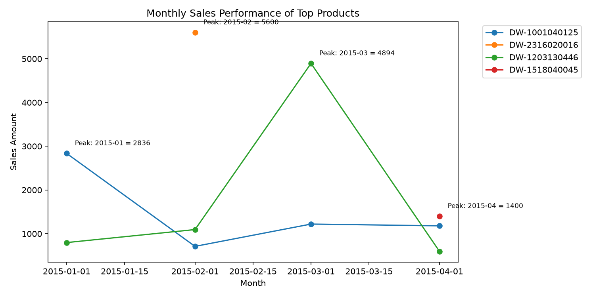
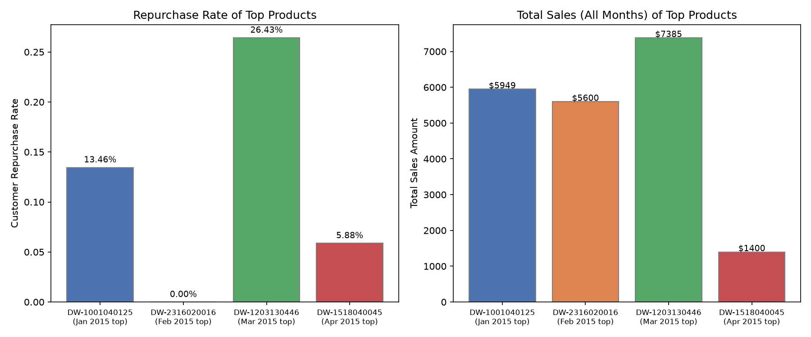
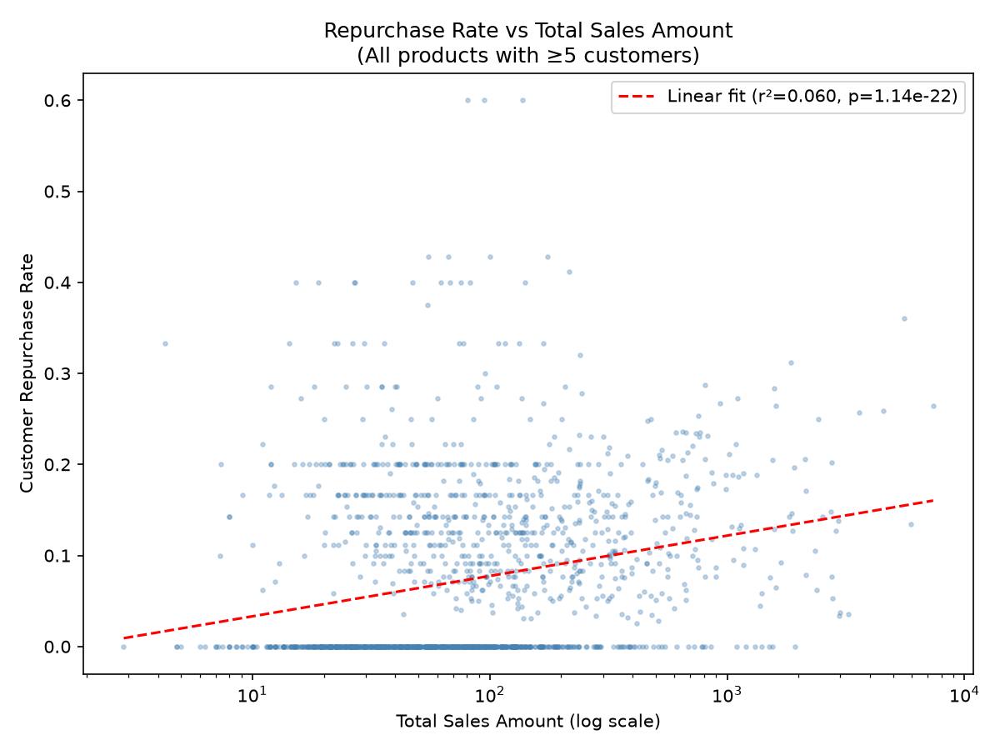

# Monthly Top-Selling Products, Cross-Month Performance & Repurchase–Sales Relationship

## 1. Highest-Sales-Amount Product per Month

The dataset covers 4 months (Jan–Apr 2015) with 42,816 transactions, 6,142 distinct products, and total sales of $457,390.39. Ranking each product's monthly Sales Amount (window rank over month-partitioned sums):

| Sales Month | Product Code | Sales Amount | Product Description |
|---|---|---|---|
| 2015-01 | **DW-1001040125** | $2,836.46 | Pork bones (meat & poultry › pork); fresh food, sold loose by weight |
| 2015-02 | **DW-2316020016** | $5,600.00 | Domestic cigarettes, out-of-province, 20 sticks |
| 2015-03 | **DW-1203130446** | $4,893.62 | Other fruits (Fruits & Vegetables); fresh food, sold loose by weight |
| 2015-04 | **DW-1518040045** | $1,400.30 | Tetra Pak brick acidified milk drink, 205 ml |

Note: the February winner (cigarettes, DW-2316020016) is a bulk one-off purchase (only 2 transactions, avg $2,800/transaction), and the April winner has the lowest monthly top amount of the four.

## 2. Cross-Month Performance of the Monthly Top Products

- **DW-1001040125** – present in all 4 months: Jan $2,836.46 (peak), Feb $711.01, Mar $1,220.88, Apr $1,180.53. Lifetime total **$5,948.88** over 119 transactions / 104 customers. A steady seller whose peak was its month of first place.
- **DW-2316020016** – appears **only in Feb** (2 transactions). No other monthly presence; purely a one-off bulk purchase.
- **DW-1203130446** – present in all 4 months with a strong March spike: Jan $797.79, Feb $1,095.26, **Mar $4,893.62 (222 transactions, 161 customers)**, Apr $598.16. Lifetime total **$7,384.83**, the **highest of all products** in the dataset. Its March spike exceeded the monthly total of any other product in the dataset (except the Feb cigarette bulk buy).
- **DW-1518040045** – appears **only in Apr** (36 transactions, 34 customers), $1,400.30 lifetime.

So the four monthly winners fall into two distinct patterns: *sustained* sellers (DW-1001040125, DW-1203130446, which appear every month) and *one-time* appearances (DW-2316020016, DW-1518040045).

## 3. Repurchase Rate vs. Sales Amount

**Definitions:** *Customer repurchase rate* = share of a product's customers who made more than one purchase of that product (across all observed months); *repeat-transaction share* = share of transactions that are not a customer's first purchase of the product.

### Top-4 products compared

| Product | Customers | Repeat customers | Repurchase rate | Total sales (all months) |
|---|---|---|---|---|
| DW-1203130446 | 227 | 60 | **26.4%** | **$7,384.83** |
| DW-1001040125 | 104 | 14 | 13.5% | $5,948.88 |
| DW-1518040045 | 34 | 2 | 5.9% | $1,400.30 |
| DW-2316020016 | 2 | 0 | 0.0% | $5,600.00 |

DW-1203130446 (March winner) is the clear stand-out: it has **both** the highest lifetime sales **and** the highest repurchase rate among the four winners. In its peak month (March), repeat purchases made up 27.5% of its transactions — its sales spike was substantially driven by returning customers.

### Relationship across all products

For the 1,565 products with ≥5 customers (to avoid one-off noise):

- Repurchase is **rare overall**: median repurchase rate = 0% (more than half of products have no repeat customers), mean 7.4%, 75th percentile 13.9%, max 60%.
- There is a **positive but weak-to-moderate** correlation between repurchase rate and Sales Amount:
  - vs total sales: Pearson **r = 0.196** (p ≈ 5×10⁻¹⁵), Spearman **ρ = 0.298** (p ≈ 2×10⁻³³)
  - vs transaction count: Spearman **ρ = 0.520** (p ≈ 6×10⁻¹⁰⁹) — the number of purchases matters more than the dollar amount.
- High sales does **not guarantee** repurchase: the Feb winner (cigarettes) reached $5,600 with a 0% repurchase rate because it was a one-off bulk buy, while several mid-sales products have high repurchase rates.

**Conclusion:** Sales Amount and repurchase rate are positively associated, but the link is moderate at best — driven mostly by repeat-buying convenience products (e.g., DW-1203130446), while bulk/one-time products (e.g., cigarettes) can have high sales with zero repurchase. The product with the best combination of both metrics is **DW-1203130446**.

## Limitations

- Only 4 months of data (Jan–Apr 2015) are available, so repurchase rates may be understated (repeat purchases occurring after April are unobserved) and month-to-month "performance" conclusions are short-horizon.
- Results depend on the repurchase definition used (customer-level repeat purchase across all observed months); within-month repeat-transaction shares give slightly different numbers.
- DW-2316020016 is an extreme bulk-transaction outlier (2 transactions, ~$2,800 each), which inflates its monthly ranking; interpretation for that product should account for this.
- Units vary across products (kg, box, bag), so Sales Amount is not quantity-normalized; cross-category comparisons are approximate.
