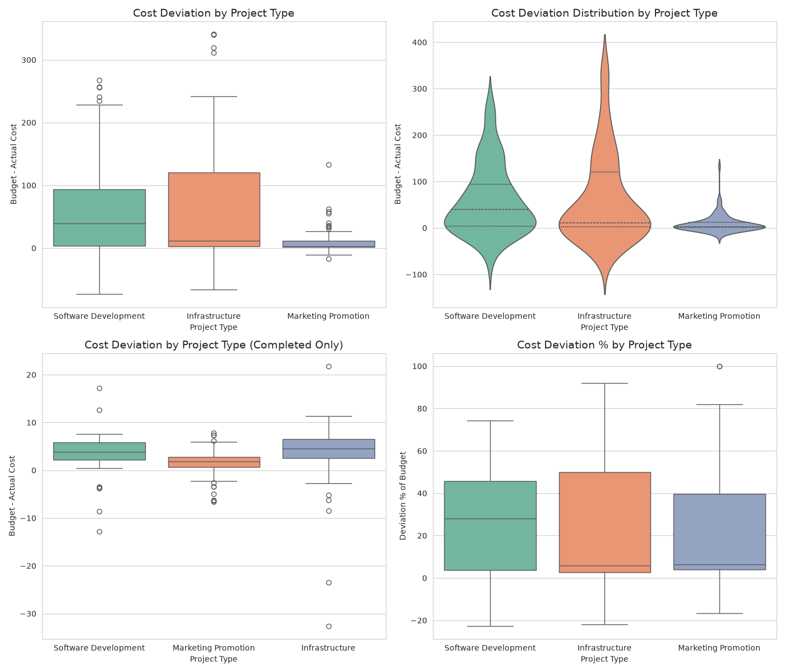
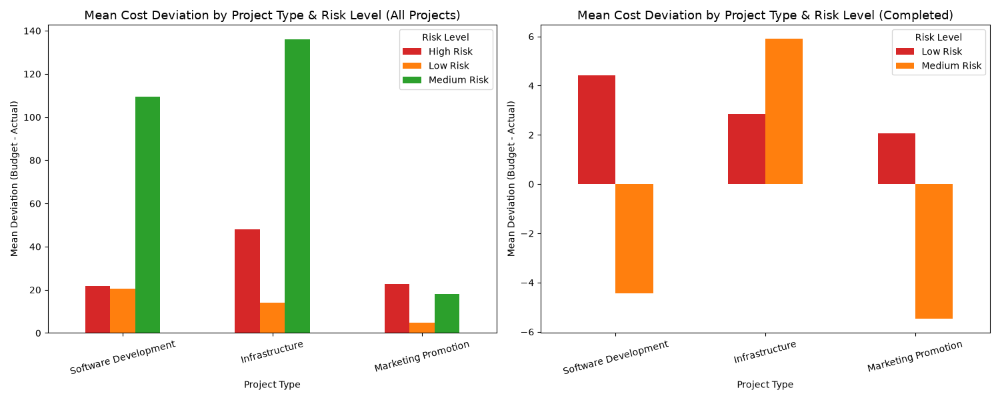
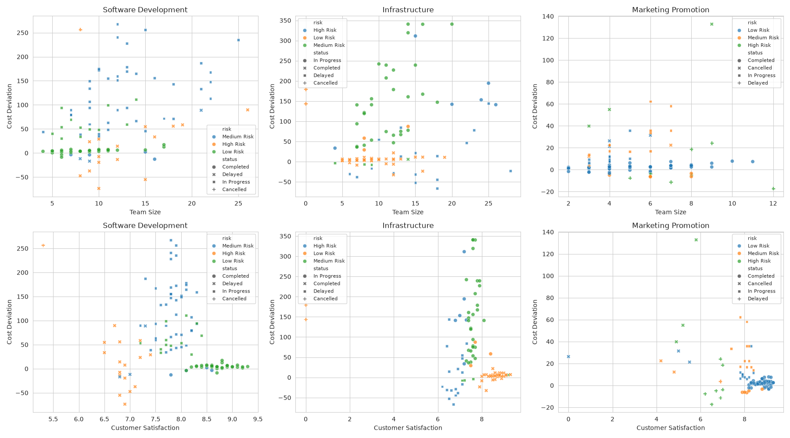
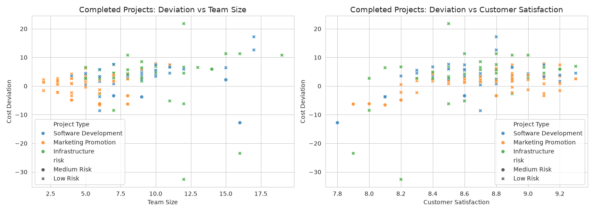

# Cost Deviation Analysis by Project Type and Related Factors

## Data Overview
- **Dataset**: 299 projects across 3 project types (Software Development: 107, Infrastructure: 99, Marketing Promotion: 93), 3 risk levels, 4 statuses.
- **Cost Deviation** = `Budget Amount − Actual Cost`. Positive deviation = under spent; negative deviation = over budget.
- Overall mean deviation: **+45.03** (median +7.60); for **Completed** projects only: **+2.39** (median +2.80).

---

## 1. Average Cost Deviation & Distribution by Project Type

### All projects (raw view)
| Project Type | n | Mean | Median | Std | P10 | P25 | P75 | P90 | Min | Max | % Under Budget |
|---|---|---|---|---|---|---|---|---|---|---|---|
| Infrastructure | 99 | **62.57** | 11.30 | 95.64 | −17.88 | 2.75 | 120.40 | 197.00 | −66.30 | 340.70 | 81.8% |
| Software Development | 107 | **59.71** | 39.50 | 74.86 | −5.28 | 3.85 | 93.95 | 168.20 | −73.60 | 267.70 | 86.9% |
| Marketing Promotion | 93 | **9.45** | 2.80 | 19.21 | −3.40 | 1.30 | 11.60 | 30.38 | −17.10 | 132.80 | 80.6% |

- The differences across project types are **statistically significant** (Kruskal-Wallis: H = 32.15, p < 0.001).
- Distributions are strongly **right-skewed** (mean ≫ median for Infrastructure and Software Development): most projects are slightly under budget, while a tail of high-deviation projects drives the mean up.

### The critical confound — Project Status
The large means are driven almost entirely by **In Progress** projects, which have only partially spent their budget:
| Status | n | Mean Deviation | Median Deviation |
|---|---|---|---|
| In Progress | 112 | **106.68** | 79.60 |
| Cancelled | 11 | 83.75 | 44.30 |
| Delayed | 47 | 6.06 | −4.70 |
| Completed | 129 | **2.39** | 2.80 |

For in-progress projects, deviation is almost exactly the **unspent remaining budget**: Spearman ρ = **0.969** between deviation and `Budget × (100 − Completion%)`. Thus a large "deviation" for unfinished projects is an artifact, not a cost problem.

### Completed projects only (true final cost performance)
| Project Type | n | Mean | Median | Std | Min | Max | % Over Budget |
|---|---|---|---|---|---|---|---|
| Software Development | 35 | **3.41** | 3.80 | 5.31 | −12.80 | 17.20 | 14.3% |
| Infrastructure | 39 | 2.92 | 4.50 | 8.98 | −32.60 | 21.80 | 15.4% |
| Marketing Promotion | 55 | 1.37 | 1.90 | 3.23 | −6.60 | 7.80 | 23.6% |

- Completed projects finish remarkably close to budget (all three types average within ~0.7–3.4 units of budget; differences still significant, Kruskal-Wallis H = 17.33, p < 0.001).
- **Marketing Promotion** has the highest share of over-budget completions (23.6%) but the smallest absolute deviations (smallest budgets).
- Overall, only **18.6%** of completed projects finished over budget.

*Box/violin plots of deviation and deviation % by Project Type (all and completed).*

---

## 2. Relationship with Risk Level, Team Size, Customer Satisfaction & Other Factors

### Risk Level
| Risk Level | n | Mean Deviation | Std | Notes |
|---|---|---|---|---|
| **Medium Risk** | 99 | **100.73** | 89.53 | 80/99 are In Progress → drives the high mean |
| High Risk | 50 | 33.97 | 79.82 | 40/50 are Delayed, **zero completed** |
| Low Risk | 150 | 11.95 | 26.62 | 119/150 Completed |

- Kruskal-Wallis across risk levels: H = 73.09, p < 0.001 (all projects); H = 13.65, p < 0.001 (completed).
- Risk level is a **compositional proxy**: Medium Risk projects are predominantly in-progress (high artificial deviation), High Risk projects are predominantly delayed, and Low Risk projects are mostly completed.
- Among **completed** projects, Low Risk mean deviation = +2.93 vs Medium Risk = −3.93 (n = 10 only); **no High Risk project has ever been completed** (all are Delayed/In Progress/Cancelled).

### Team Size
- Spearman correlation with deviation: **ρ = 0.40** (all, p < 0.001); **ρ = 0.48** (completed, p < 0.001).
- Completed projects: mean deviation grows with team size buckets (≤5: 1.51 → 11–15: 3.69), and each additional team member adds ~**+0.5** in deviation (OLS coefficient).
- Interpretation: larger teams are associated with larger *absolute* budget deviations (projects with bigger teams/scope are also larger-budget).

### Customer Satisfaction
- Overall: **ρ = −0.32** (p < 0.001) — projects with large positive deviations (mostly unfinished) have lower satisfaction, consistent with the status artifact.
- Completed projects: **ρ = +0.23** (p = 0.008) — among finished projects, slightly higher satisfaction coincides with *larger* (more under-budget) outcomes, though the effect is weak.
- OLS (all): satisfaction coefficient ≈ **−11.7** per point, i.e. higher satisfaction is tied to lower observed deviation after controlling for other factors.

### Budget Size & Priority
- **Budget** is the strongest correlate of absolute deviation: ρ = **0.50** (all) and **0.57** (completed). Larger-budget projects show larger absolute swings (a scaling effect, since relative % deviation is modest).
- **Priority**: For completed projects the differences are small (High: +3.55, Medium: +2.10, Low: +1.83); over-budget shares range 13.5% (Low) to 22% (Medium). Kruskal-Wallis significant overall (p < 0.001) but driven by status composition (High priority projects are more often in-progress).

### Multivariate regression (OLS)
- **All projects**: `Deviation ≈ 80.1 − 0.68·TeamSize + 0.32·Budget − 11.7·Satisfaction + 47.4·MediumRisk − 43.3·HighRisk` → **R² = 0.58** (adj. 0.57). Budget and Medium Risk are the dominant positive drivers; satisfaction is a negative driver.
- **Completed projects only**: R² drops to **0.24** (adj. 0.20). Effects are weak: TeamSize +0.50, Satisfaction +6.4, Budget ≈ 0, Medium Risk −4.8, High priority −3.7. **No strong factor explains the small completed-project deviations** — most completed projects simply land near budget.

---

## 3. Delayed Projects & Cost Overruns
- Delayed projects are the only group with meaningful **negative** median deviation (−4.70) and a **55.3% over-budget share** — cost overruns are more frequent in delayed projects, though average deviation is small (+6.06).
- High Risk projects are overwhelmingly delayed (40 of 50), tying high risk to schedule slippage rather than to large absolute budget deviations at completion.

---

## Key Conclusions
1. **Apparent average deviation differs by project type** (Infrastructure ≈ Software Development ≈ 60; Marketing ≈ 9), but this is **dominated by unfinished projects**; among the 129 completed projects all three types finish within ~1.4–3.4 units of budget (≈2–3% of budget on average), with Software Development highest and Marketing Promotion lowest.
2. **Project status is the single strongest factor** (Kruskal-Wallis H = 184.6, p < 0.001): In Progress projects show +106.7 mean "deviation" because their budgets are unspent (deviation ≈ remaining budget, ρ = 0.97); cancelled projects show +83.8.
3. **Risk Level** acts mainly through composition: Medium Risk → mostly in-progress (high apparent deviation); High Risk → mostly delayed (55% over budget, never completed); Low Risk → mostly completed and on budget.
4. **Team Size and Budget** are positively correlated with absolute deviation (ρ ≈ 0.40–0.57); **Customer Satisfaction** correlates negatively overall (ρ = −0.32) but weakly positive among completed projects (ρ = 0.23).
5. In practice, cost overruns are rare at completion (18.6% of completed projects), so the headline "average cost deviation" is meaningful only after separating in-progress/cancelled projects from truly completed ones.

## Limitations
- ~37% of projects are still in progress or cancelled, so their deviation is not a final cost outcome; conclusions about "true" cost deviation rely on the 129 completed projects.
- No completed High-Risk projects exist, so the risk–deviation interaction for high risk at completion cannot be directly measured.
- Data is cross-sectional; relationships are associational, not causal, and residual confounding (e.g., status ↔ risk ↔ type) is possible.

**Figures** (relative paths): `work/fig1_deviation_by_project_type.png`, `work/fig2_scatter_factors.png`, `work/fig3_completed_scatter.png`, `work/fig4_risk_interaction.png`, `work/fig5_status_interaction.png`.
