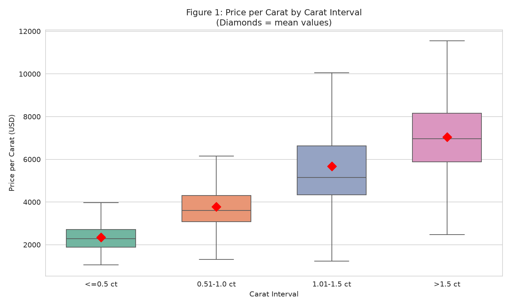
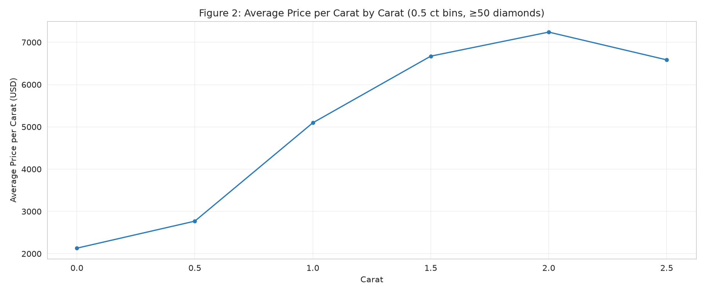
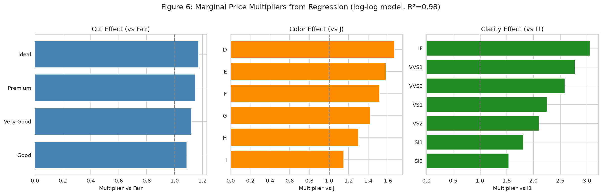
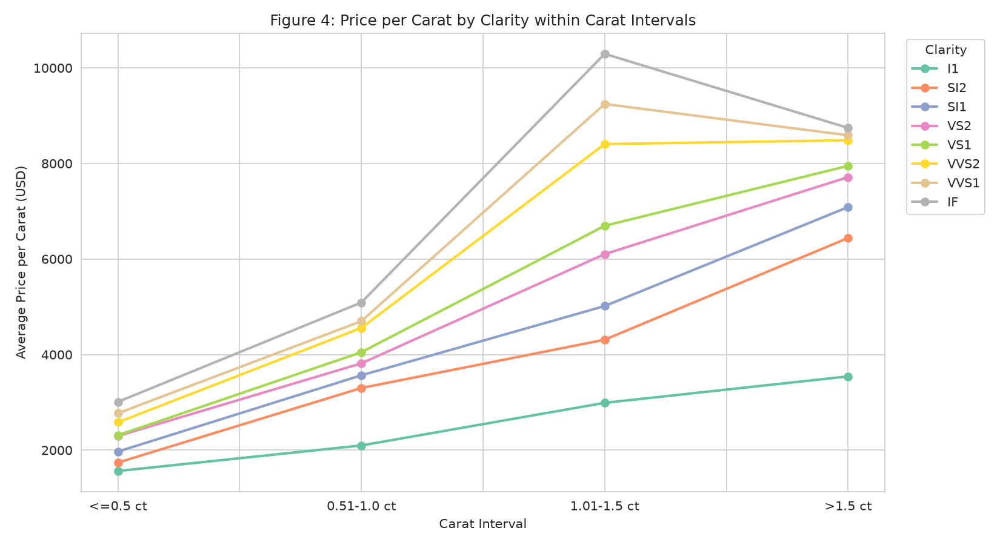
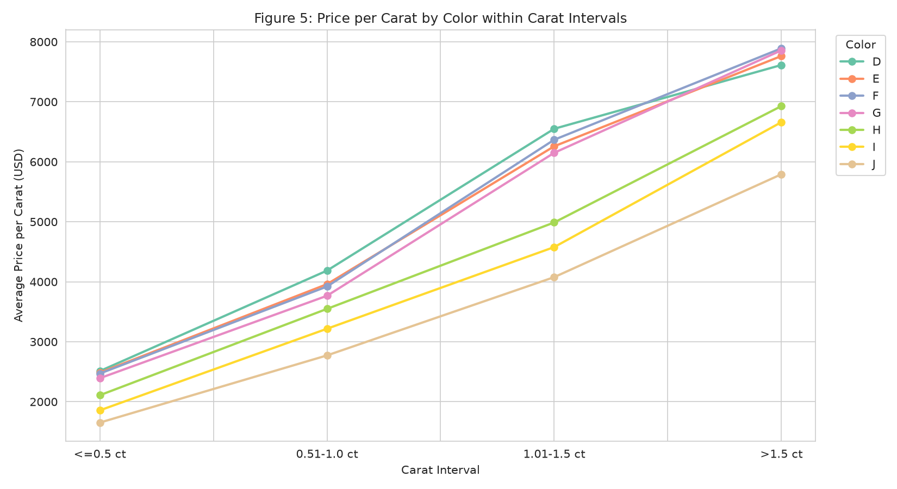
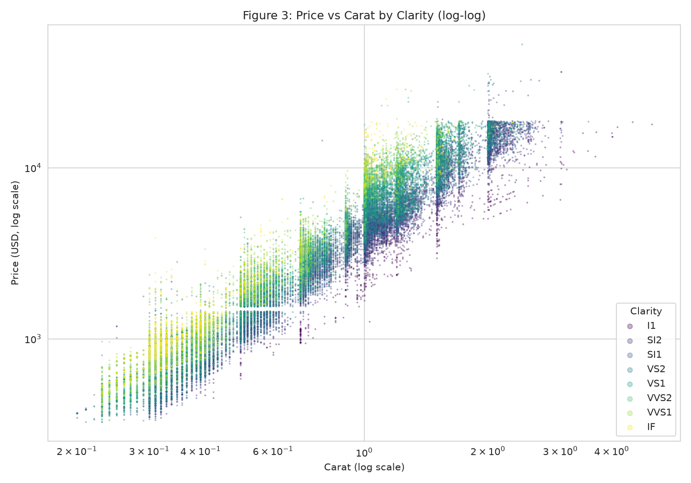

# Diamond Price Dynamics: Analysis of Price per Carat and Factor Effects

## 1. Dataset Overview

The analysis uses the classic diamonds dataset (53,595 stones, sourced from ggplot2) with no missing values. Key variables: carat weight, cut quality, color grade, clarity grade, depth %, table %, physical dimensions (x, y, z mm), and price in USD.

---

## 2. Price per Carat Across Carat Intervals

Diamonds were divided into four carat intervals:

| Interval | Count | Avg Carat | Avg Price | **Avg Price/Carat** | **Median PPC** | Std Dev PPC |
|----------|------:|----------:|----------:|--------------------:|---------------:|------------:|
| ≤0.5 ct | 18,793 | 0.35 | $846 | **$2,354** | $2,279 | $642 |
| 0.51–1.0 ct | 17,431 | 0.72 | $2,823 | **$3,786** | $3,610 | $1,133 |
| 1.01–1.5 ct | 11,985 | 1.15 | $6,554 | **$5,674** | $5,148 | $1,921 |
| >1.5 ct | 5,386 | 1.81 | $12,712 | **$7,051** | $6,964 | $1,767 |

**Key finding:** Price per carat *increases* with carat weight — larger diamonds command a premium per carat, not just a linear scaling. The average PPC rises from $2,354 (≤0.5 ct) to $7,051 (>1.5 ct), a 3× increase.

The trend is not smooth — there are visible jumps at round carat thresholds (0.5, 1.0, 1.5, 2.0 ct), indicating a "round-number premium" in diamond pricing.

---

## 3. Correlation Analysis (Numeric Variables)

| Variable | Correlation with Price |
|----------|----------------------:|
| Carat | **0.9155** |
| log(Carat) vs log(Price) | **0.9647** |
| X-axis length | 0.8777 |
| Y-axis width | 0.8583 |
| Z-axis depth | 0.8545 |
| Table percentage | 0.1265 |
| Depth percentage | **−0.0098** |

Carat weight dominates price determination. The log-log correlation (0.96) is even stronger, confirming a power-law relationship. Physical dimensions (x, y, z) are proxies for carat. Depth percentage has virtually no linear relationship with price.

---

## 4. Regression Analysis — Quantifying Marginal Effects

A multivariate OLS was fitted:

**log(Price) ~ log(Carat) + Cut + Color + Clarity + Depth + Table**

**Model R² = 0.9799** (vs. 0.9306 for log(Carat) alone)

The model explains ~98% of price variance, confirming that cut, color, and clarity provide significant additional explanatory power beyond carat.

### 4.1 Carat Effect
- Elasticity (log-log slope) = **1.88** — a 1% increase in carat is associated with a ~1.88% increase in price, consistent with the price-per-carat premium.

### 4.2 Cut Effect (Multiplier vs. Fair, holding all else constant)

| Cut | Multiplier |
|---------|-----------:|
| Fair | 1.00 (ref) |
| Good | 1.09× |
| Very Good | 1.12× |
| Premium | 1.15× |
| **Ideal** | **1.17×** |

**Interpretation:** Ideal-cut diamonds sell for ~17% more than Fair-cut diamonds of identical carat, color, and clarity.

### 4.3 Color Effect (Multiplier vs. J, holding all else constant)

| Color | Multiplier |
|-------|-----------:|
| J (worst) | 1.00 (ref) |
| I | 1.15× |
| H | 1.30× |
| G | 1.42× |
| F | 1.52× |
| E | 1.58× |
| **D (best)** | **1.67×** |

**Interpretation:** D-color diamonds command ~67% more than J-color diamonds of otherwise identical specifications.

### 4.4 Clarity Effect (Multiplier vs. I1, holding all else constant)

| Clarity | Multiplier |
|---------|-----------:|
| I1 (worst) | 1.00 (ref) |
| SI2 | 1.54× |
| SI1 | 1.81× |
| VS2 | 2.10× |
| VS1 | 2.26× |
| VVS2 | 2.59× |
| VVS1 | 2.78× |
| **IF (best)** | **3.06×** |

**Interpretation:** Clarity has the strongest categorical effect — IF (Internally Flawless) diamonds command ~206% more than I1 diamonds of identical carat, cut, and color.

### 4.5 Depth and Table
Both were **not statistically significant** (p > 0.05) in the log-log model, suggesting their role is captured by other correlated variables or is negligible after controlling for carat and clarity.

---

## 5. Factor Effects Within Carat Intervals

Controlling for carat by examining each interval separately confirms the monotonic patterns:

### Price per Carat by Clarity within Intervals

Clarity has its strongest relative impact in the 1.01–1.5 ct range: IF diamonds average $10,294/ct vs. I1 at $2,990/ct (3.4×). The effect is consistent across all intervals.

### Price per Carat by Color within Intervals

Color premiums are monotonic: D-color diamonds consistently command higher PPC than J-color within every carat interval. The gap widens in larger stones.

### Price per Carat by Cut within Intervals

| Interval | Fair | Good | Very Good | Premium | Ideal |
|----------|:----:|:----:|:---------:|:-------:|:-----:|
| ≤0.5 ct | $2,451 | $2,119 | $2,169 | $2,382 | $2,453 |
| 0.51–1.0 ct | $3,340 | $3,787 | $3,843 | $3,764 | $3,813 |
| 1.01–1.5 ct | $4,285 | $5,148 | $5,652 | $5,435 | $6,172 |
| >1.5 ct | $5,387 | $6,674 | $7,102 | $7,055 | $7,411 |

Cut effects are most pronounced in larger stones. For ≤0.5 ct stones, Good and Very Good cuts actually show *lower* PPC than Fair, but this reverses for larger stones.

---

## 6. The Log-Log Relationship

The log-log scatter clearly shows the clarity bands (vertical separation) and the overall power-law trend (slope ≈ 1.88). The bands are parallel, confirming that clarity acts roughly as a multiplicative factor on price, consistent with the regression model.

---

## 7. Summary of Key Findings

1. **Price per carat increases with carat weight** — from ~$2,354 (≤0.5 ct) to ~$7,051 (>1.5 ct), a 3× increase driven by a price elasticity of ~1.88.

2. **Carat is the dominant factor** (r = 0.92), with log-log correlation of 0.96.

3. **Clarity has the strongest marginal effect** among categorical factors: IF diamonds command ~3× the price of I1 diamonds, holding all else equal.

4. **Color has a strong monotonic effect**: D-color (best) commands ~67% more than J-color (worst), all else equal.

5. **Cut has a meaningful but smaller effect**: Ideal cuts command ~17% more than Fair cuts.

6. **Depth percentage and table percentage** do not significantly affect price after controlling for carat, cut, color, and clarity (p > 0.05).

7. **Round-number premiums** exist at 0.5, 1.0, 1.5, and 2.0 carat thresholds, where price per carat exhibits noticeable jumps.

---

## 8. Limitations

- The dataset is well-known but may not reflect current market conditions (data from ~2008 vintage).
- The regression assumes a log-linear structure; interaction effects (e.g., cut × clarity) were not modeled.
- The categorical variables (cut, color, clarity) are treated as ordinal; finer granularity within each grade could exist.
- Physical dimensions (x, y, z) are highly collinear with carat and were not separately analyzed.