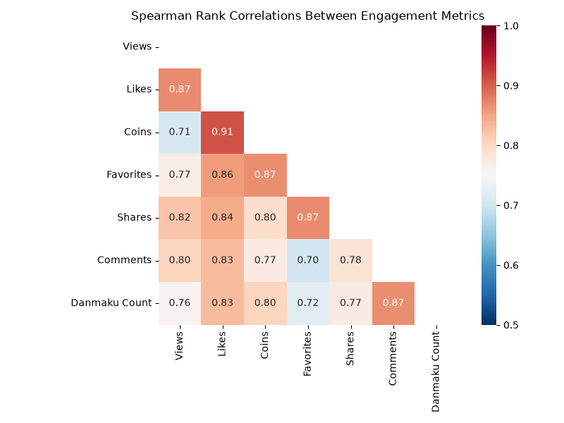
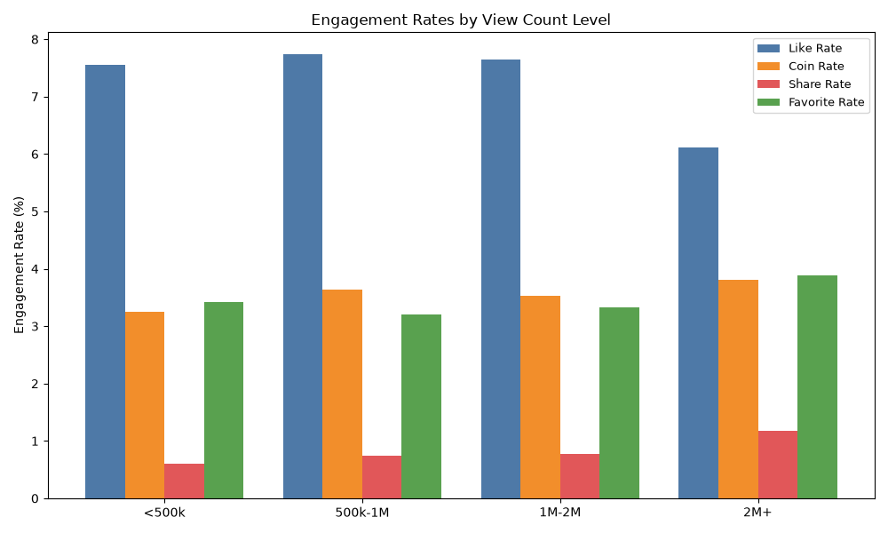
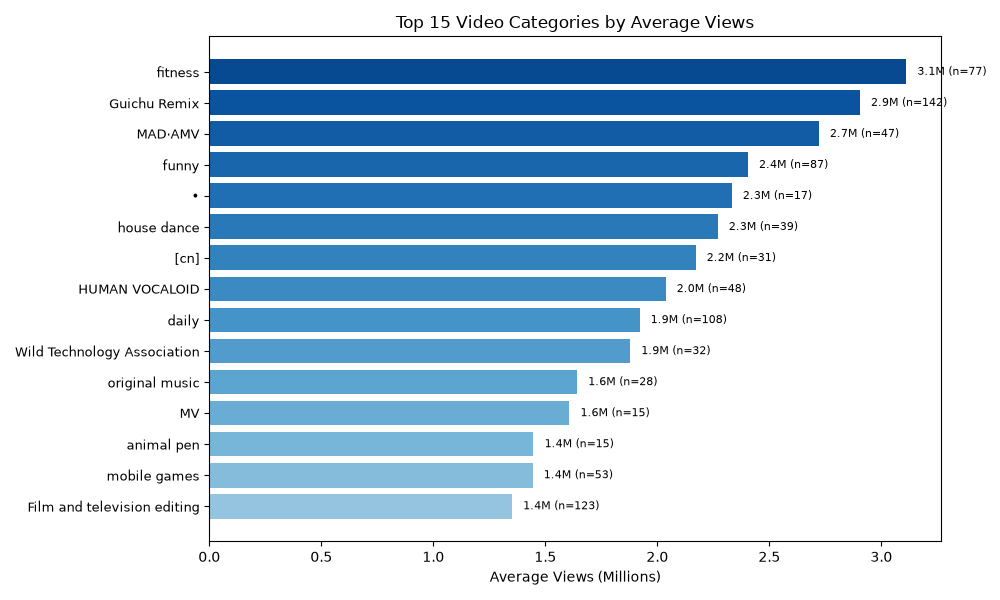
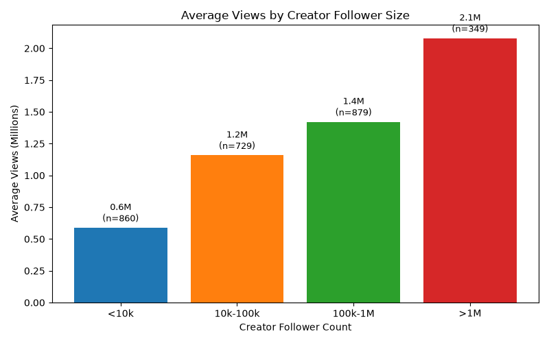

# How to Make Viral Videos on Bilibili — Analysis of Monthly Ranking Data

## 1. Data at a glance
- **5,200 ranked entries** (monthly top‑100 lists across 13 main category boards, May‑2020 snapshot), covering **2,816 unique videos** from **2,368 creators**.
- Ranked videos average **~1.69M views**, but the distribution is heavy‑tailed: only **18.3%** of ranked videos exceed **2M views** and **6.3%** exceed **5M views** — that is the practical "viral" bar in this dataset.
- The **Overall Score** that determines rank is essentially a composite of engagement: a multiple linear regression (R²≈0.24 with all metrics collinear) shows **Likes, Comments, Favorites and Shares are the strongest positive drivers** of the score, while raw follower count is nearly irrelevant.

## 2. The #1 lesson: engagement drives views, followers don't
Spearman rank correlations with Views (statistics in Python):

| Metric | Correlation with Views |
|---|---|
| Likes | 0.88 |
| Shares | 0.84 |
| Comments | 0.81 |
| Favorites | 0.79 |
| Danmaku (bullet comments) | 0.78 |
| Coins | 0.74 |
| **Creator Followers** | **0.27** |

- **Shares are the strongest behavioral differentiator.** Viral videos (2M+ views) have a **1.18% share‑to‑view rate** versus **0.60%** for low‑view videos — roughly **double**. Like rate, coin rate and favorite rate are also higher among viral videos (see chart).

**Practical takeaway:** design every video to earn *shares* (clips people want to send to friends, meme/remix humor, satisfying/impressive content, music covers) and *favorites* (useful/instructional content). These are the metrics most correlated with big view counts.

## 3. Choose the right content category
Average views by category (unique videos, n≥10):

**Highest average reach (views):**
- **fitness** (~3.1M avg views, also #1 in favorite rate ≈10.5%) — workout/tutorial content gets watched AND saved
- **Guichu Remix** (bizarre/funny remix humor, ~2.9M, high share rate)
- **MAD·AMV** (editing/fan music videos, ~2.7M)
- **funny** (~2.4M, top share rate ~1.56%)
- **house dance / dance** (~2.3M)
- **daily / vlog** (~1.9M), **HUMAN VOCALOID / original music** (~2.0M, highest like & coin rates)

**Highest engagement quality (likes/views, %):** Short Film·Hand‑drawn·Voice Acting (~11.7%), VOCALOID·UTAU (~11.9%), Food Circle (~10.8%), original music (~10.4%), comprehensive (~10.1%).

**Content that spreads (top share rates):** original music, VOCALOID·UTAU, Guichu Remix, funny, fitness.
**Content people save (top favorite rates):** fitness, MMD·3D, dance tutorial, photography/videography, MAD·AMV, original music.

## 4. You don't need a big following — beginners can go viral

- Average views rise with followers (from ~0.69M for <10k‑follower creators to ~2.9M for >1M‑follower creators), **but the effect is small (ρ=0.27)** and there are many exceptions.
- **54 unique videos from creators with <10k followers exceeded 2M views**; **141 exceeded 1M views**. **~75% of all 2M+ viral videos came from creators with fewer than 1M followers.**
- The most viral "small creator" videos span dance, film/TV editing, celebrity clips, live music, funny and daily content (e.g., an 8.5M‑view house‑dance video from a creator with ~7.6k followers).
- **Most beginner‑friendly categories** (based on small‑creator successes): **star/celebrity clips, Film & TV editing, funny, daily/vlog, variety show, Live Music, Guichu Remix**.

**Practical takeaway:** don't wait to grow followers before posting your best work — great content on trending topics can break out on its own. Focus effort on the first‑day engagement loop (likes/shares/comments) rather than chasing follower counts.

## 5. Supporting creator factors
- **Verification helps but isn't required.** Verified creators average 1.95M views vs 1.50M for unverified, and hit 2M+ views 22.9% vs 15.1% of the time — but the majority of ranked videos (59%) are unverified. Apply for verification when you can; it's an edge, not a gate.
- **Consistency matters more than volume.** Creators with 50–100 videos on record average higher views than those with <10 videos; the top repeat performers (Laofanjie, Chinese BOY, Mouhuan Jun, LexBurner, etc.) rank highly month after month.
- **Trending topics and platform campaigns appear in top‑10 tags:** "Houlang" (Back‑Wave speech), "all‑round check‑in challenge", "bilibili Rising Star Project", Youth With You 2, celebrity moments, and childhood‑nostalgia themes.
- **Titles:** viral videos have shorter titles on average (~72 vs ~88 characters for low‑view videos) and are less likely to be bracket‑heavy. Make the title say quickly what the payoff is.

## 6. Recommended strategy for a new creator
1. **Pick a format with proven reach AND engagement**: fitness/dance tutorials, funny/remix (Guichu) humor, film/TV editing, daily vlogs, or original music/short films — these are the categories where both reach and engagement rates are highest.
2. **Engineer shareability**: use humor, shock/impress moments, meme formats (Guichu remix, MAD/AMV), and music covers — the categories with the highest share rates are also the ones that go most viral.
3. **Make it save‑worthy**: tutorials, "how‑to" fitness, photography and dance lessons get favorited heavily; favorites correlate 0.79 with views and keep videos resurfacing.
4. **Ride trends**: reference trending topics, platform challenges ("all‑round check‑in", Rising Star), popular songs and nostalgia themes (tags like Houlang, childhood nostalgia) — these appear repeatedly in top‑10 tags.
5. **Ignore the follower myth**: post your best content now; small creators accounted for 14% of 2M+ viral videos and 75% of viral videos came from sub‑million creators.
6. **Keep titles short and concrete** (under ~75 characters), minimize gimmicky brackets, and tag generously with high‑performing tags (funny, dance, MAD, Guichu, music).
7. **Consistency compounds**: aim for a steady cadence of videos and pursue verification once eligible.

## 7. Limitations
- Data is a **single month's snapshot (May 2020)** of Bilibili monthly rankings — trends may reflect that specific period and platform, not all time.
- The **Overall Score** formula is proprietary; conclusions about ranking drivers are based on statistical correlation, not the actual algorithm.
- **No upload dates, watch‑time, retention, or audience demographics** were available, so recommendations on pacing/retention are inferred from engagement metrics.
- Some rows are the same video appearing across multiple category boards; unique‑video analysis was used where noted to avoid double‑counting.
