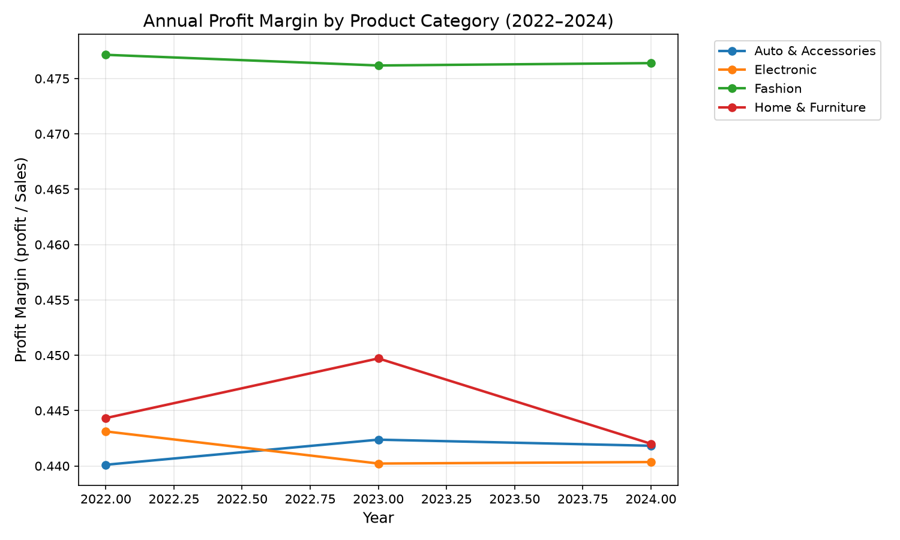
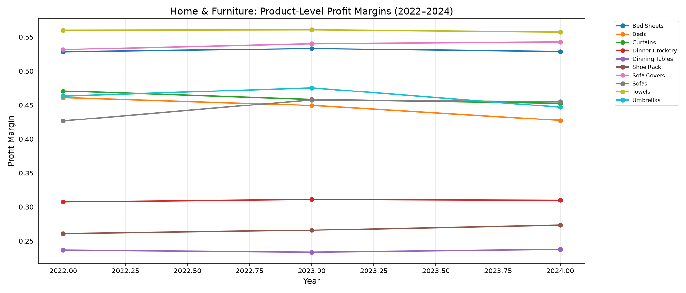
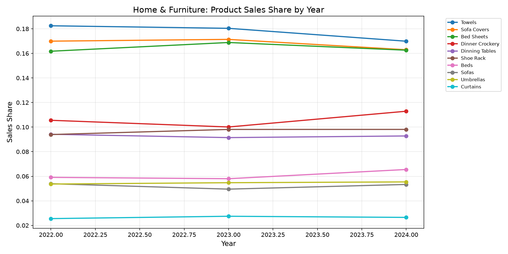
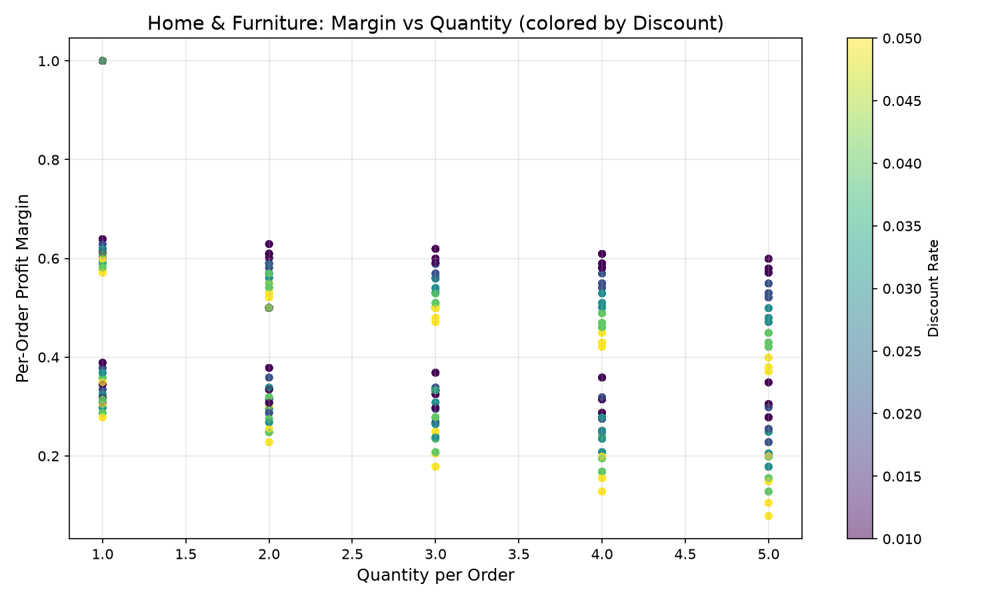
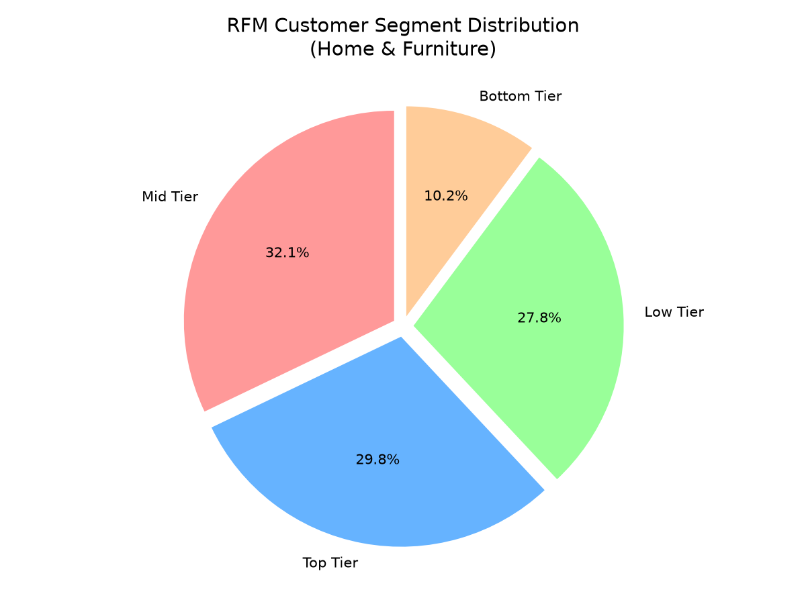
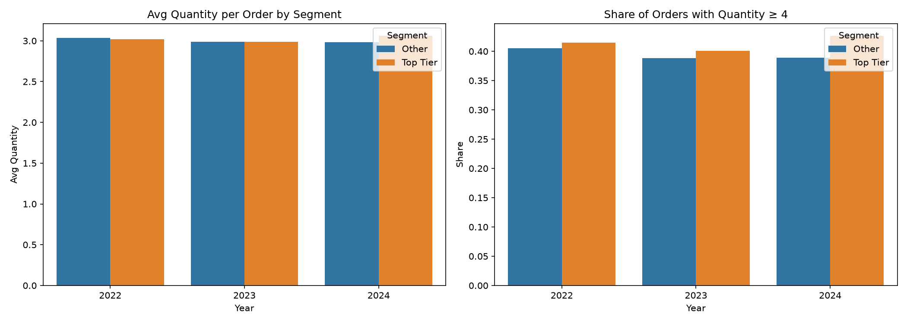

# Profit-Margin Volatility Analysis (2022–2024) — Category Swing, Drivers, and RFM-Based Consumer Sensitivity

## 1. Objective and data
Using `order_information` (51,289 orders, ~17k per year across 2022–2024), I computed annual profit margin = **Σ profit ÷ Σ Sales** at the Product Category × Year grain, identified the category with the largest swing, decomposed its drivers using shipping, SKU/product, pricing (discount), and browsing engagement indicators, then built an RFM segmentation (Recency from `Order Date`, Frequency from distinct `Order ID`s, Monetary from `profit`) for the target category to test whether core consumers are more sensitive to the identified driver.

## 2. Category × Year profit margins and the largest swing

| Product Category | 2022 | 2023 | 2024 | Swing (max−min) |
|---|---|---|---|---|
| Auto & Accessories | 0.4401 | 0.4424 | 0.4418 | 0.0023 |
| Electronic | 0.4431 | 0.4402 | 0.4404 | 0.0029 |
| Fashion | 0.4771 | 0.4762 | 0.4764 | 0.0009 |
| **Home & Furniture** | **0.4443** | **0.4497** | **0.4420** | **0.0077** |

**Home & Furniture** shows the largest swing (**0.0077**, i.e., 77 bps): it peaked at **0.4497 in 2023** and fell to **0.4420 in 2024** — the sharpest single-year decline of any category (more than 2.6× the second-largest swing, Electronic at 0.0029).

## 3. Drivers of the Home & Furniture volatility

**Shipping.** All 10,309 Home & Furniture orders ship via a single method ("Second Class"); shipping cost is a constant ~10% of profit. Shipping cannot explain within-category variation.

**Pricing.** The discount mix is essentially unchanged across years (avg discount ≈ 0.0299/0.0298/0.0302 in 2022/2023/2024) and is uniformly spread (~20% of orders at each level 0.01–0.05). Depth of discounting is not the driver.

**Underlying margin mechanism.** Regression of per-order margin on Quantity and Discount (per product, R² ≈ 0.81–0.90) reveals two regimes:
- *Most products* (Bed Sheets, Dinner Crockery, Dinning Tables, Shoe Rack, Sofa Covers, Towels): **margin ≈ base − Quantity × Discount** (discount coefficient ≈ −3.0 ≈ −avg_qty).
- *Furniture/bulky items* (Beds, Curtains, Sofas, Umbrellas): **margin ≈ 1 / Quantity**, nearly discount-independent (qty coefficient ≈ −0.18, discount coefficient ≈ 0).

Overall correlation of per-order margin with Quantity is **−0.59**. **The operative driver is the quantity per order** — larger baskets mechanically compress margins.

**Product (SKU) mix shift.** In 2024 sales share moved away from high-margin items toward low-margin ones:
- High-margin products lost share: Towels (18.0%→17.0%, margin 0.56), Sofa Covers (17.1%→16.3%, 0.54), Bed Sheets (16.9%→16.3%, 0.53).
- Low-margin products gained share: Dinner Crockery (10.0%→11.3%, 0.31), Beds (5.8%→6.6%, 0.43–0.46).

**Within-product quantity inflation in 2024** eroded margins for the quantity-sensitive products: average units per order rose for Beds (3.02→3.13), Umbrellas (2.86→3.10), Towels (2.96→3.14), Sofas (2.98→3.01) and Sofa Covers (2.99→3.03), driving their margins down — Beds 0.449→0.427, Umbrellas 0.475→0.447, Curtains 0.458→0.453, Towels 0.561→0.558, Sofas 0.458→0.455.

  

**Conclusion on the driver:** Home & Furniture margin volatility is driven by **order-quantity behavior (larger baskets) interacting with product mix**, not by shipping, discount depth, or engagement per se.

## 4. RFM segmentation of Home & Furniture consumers
794 unique customers, 10,308 orders, $1.32M sales, $587.6K profit. Quartile scoring of Recency (days since last order vs 2024-12-31), Frequency (distinct Order IDs), Monetary (total profit) → 12-point RFM score:

| Segment | Customers | Recency (days) | Frequency | Monetary (profit $) |
|---|---|---|---|---|
| **Top Tier** (score ≥10) | 237 (29.8%) | 27.8 | 19.8 | 1,153.8 |
| Mid Tier (7–9) | 255 (32.1%) | 64.0 | 13.3 | 753.8 |
| Low Tier (4–6) | 221 (27.8%) | 121.3 | 8.3 | 456.3 |
| Bottom Tier (3) | 81 (10.2%) | 320.1 | 5.0 | 260.8 |

Top Tier customers account for **46.5% of category profit** and **46.0% of sales**. They are also the most engaged: browsing time 18.33 vs 16.99 min (p=0.0003), like rate 0.586 vs 0.507 (p<0.001), share rate 0.526 vs 0.436 (p<0.001), add-to-cart rate 0.697 vs 0.635 (p=0.0005).

## 5. Are core consumers more sensitive to the quantity driver?
Comparing Top Tier vs. all other customers year by year:

| Year | Top Tier avg qty | Other avg qty | Top Tier % orders qty≥4 | Other % orders qty≥4 |
|---|---|---|---|---|
| 2022 | 3.019 | 3.034 | 41.5% | 40.5% |
| 2023 | 2.990 | 2.989 | 40.1% | 38.8% |
| 2024 | **3.060** | **2.982** | **42.6%** | **38.9%** |

In the exact year margins collapsed (2024), **Top Tier (core) consumers increased their average order quantity (3.06) and their share of large orders (≥4 units, 42.6%)**, while non-core customers moved the opposite direction (2.98 avg; 38.9% large orders). Welch t-test: t=1.60, p=0.11 (marginal at 5%, directionally consistent). Because the margin mechanism is `margin ≈ 1/quantity` for the bulky furniture items and `margin ≈ base − quantity×discount` for soft goods, the core segment's shift toward larger baskets is precisely the behavior that compresses margins. Top Tier customers' aggregate margin fell 0.4527→0.4470 in 2024 while they remained the most engaged (browsing/likes/shares/add-to-cart all significantly higher).

**Assessment:** Yes — the category's core consumers (Top Tier RFM) are **more sensitive to the identified fluctuation driver**: they display the order-size behavior (larger-quantity, bulk purchases) that erodes per-order margin, and they did so in the year the category margin fell to its 3-year low, unlike non-core customers.

## 6. Limitations
- Margin swings across categories are small in absolute terms (all categories cluster near 44–48%); Home & Furniture is the largest mover but the effect is ~77 bps.
- The `Month` text column is inconsistent with `Order Date`; all time series use the **year parsed from `Order Date`**.
- Quantity/discount fields contain placeholder anomalies (`'abc'`, `'xxx'`, null) which were excluded from driver/RFM analyses (3 rows in Auto & Accessories only; none affect Home & Furniture).
- The Top Tier vs Other quantity gap in 2024 is directionally strong but only marginally significant (p≈0.11); RFM tiers were computed on profit-based monetary value, so results depend on that metric choice.
- Causal attribution is descriptive (mix + quantity decomposition), not a controlled experiment.
