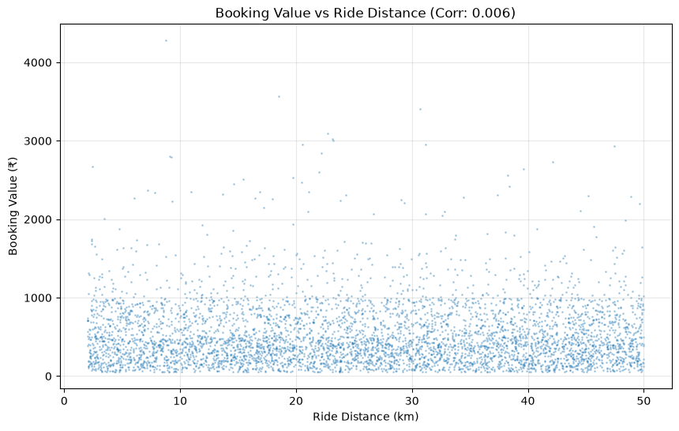
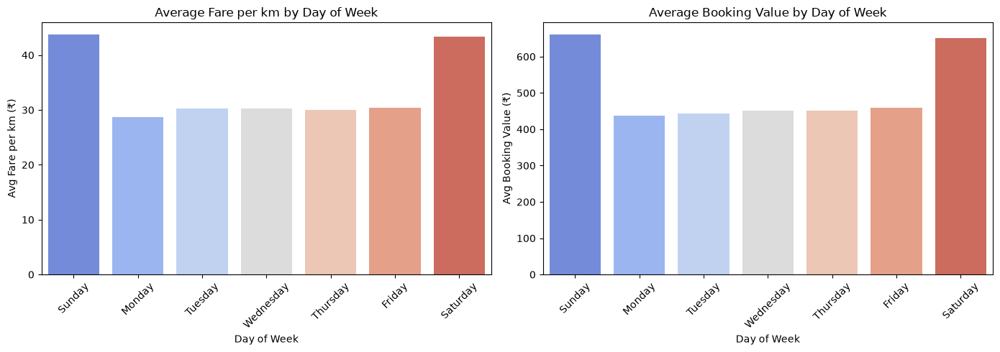
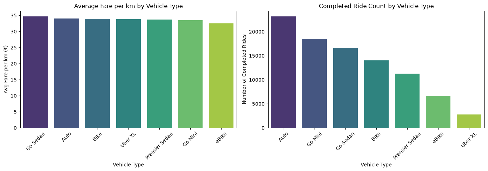
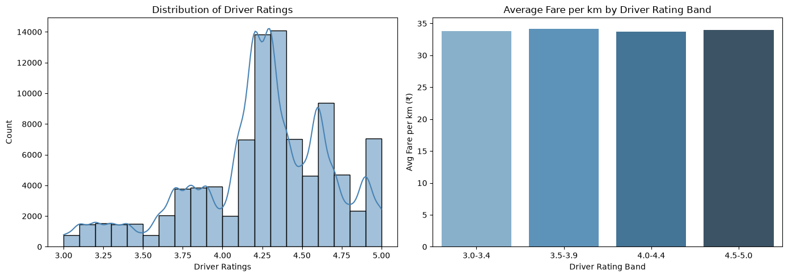
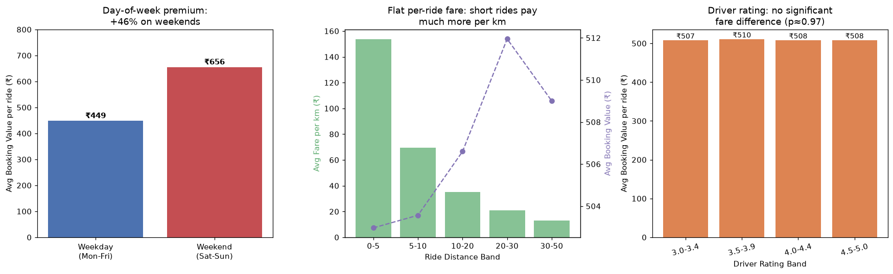

# Ride-Hailing Driver Earnings Strategy — 2024 Platform Data Analysis

## 1. Data Overview
The dataset contains **150,000 bookings** across all 365 days of 2024, of which **93,000 (62%) were completed** rides. Completed rides averaged **₹508.18 per ride**, **26.0 km** per trip, and **₹33.86 per km**. Seven vehicle types appear: Auto, Go Mini, Go Sedan, Bike, Premier Sedan, eBike, and Uber XL.

The analysis reveals that the most important earnings levers are **when** you drive (weekends), **how many** rides you complete (ride count over distance), and **where** you position (pickup zone). Vehicle type and driver rating have little direct effect on per-ride fare in this data.

## 2. Key Findings

### Finding 1 — The fare is flat: ride distance does NOT drive revenue
The correlation between Booking Value and Ride Distance is **0.006 (essentially zero)**. The average fare is ~₹508 for both a 0–5 km trip and a 40+ km trip:

| Distance band | Avg booking (₹) | Avg fare per km (₹) |
|---|---|---|
| 0–5 km | 503 | **153.5** |
| 5–10 km | 504 | 69.7 |
| 15–20 km | 510 | 29.4 |
| 30–40 km | 507 | 14.6 |
| 40+ km | 511 | 11.4 |

**Implication:** Earnings are driven by **ride count, not ride length**. Each completed ride pays ~₹508 regardless of distance, so accepting shorter rides maximizes both ₹/km and rides-per-hour.

### Finding 2 — Weekends are the single biggest earnings lever (+46%)
Saturday/Sunday rides pay **₹656 on average vs ₹449 on weekdays** (+46%), and ₹43.5/km vs ₹29.9/km. This difference is **statistically highly significant** (Mann-Whitney p < 0.0001). Weekends account for only 28.8% of rides but **37.1% of all platform earnings**.

**Implication:** Prioritize Saturday and Sunday shifts. Working weekends at higher intensity (e.g., 12 rides/day instead of 8) is the fastest path to higher annual earnings.

### Finding 3 — Vehicle Type: fares are statistically identical; choose by operating cost
Kruskal-Wallis tests show **no significant difference** in booking value (p=0.36) or fare per km (p=0.11) across vehicle types. All types pay ₹503–₹512 per completed ride.

| Vehicle Type | Avg ₹/ride | Avg ₹/km | Completed rides |
|---|---|---|---|
| Go Sedan | 512 | **34.66** | 16,676 |
| Auto | 506 | 34.00 | 23,155 |
| Bike | 509 | 33.89 | 14,034 |
| Uber XL | 505 | 33.85 | 2,783 |
| Premier Sedan | 510 | 33.73 | 11,252 |
| Go Mini | 507 | 33.49 | 18,549 |
| eBike | 503 | 32.47 | 6,551 |

**Implication:** Because gross fares are equal, the profitable choice is the vehicle with the **lowest running cost per km** (Auto/Bike/eBike for margin). Among cars, Go Sedan yields the best gross ₹/km. Note that Uber XL has very low ride volume (only 3% of completed rides) — likely lower demand.

### Finding 4 — Driver rating: no direct fare benefit, but protect platform access
There is **no significant relationship** between Driver Ratings and booking value or fare per km (correlation ≈ 0; Kruskal-Wallis p = 0.87–0.97). All rating bands earn ~₹508/ride:

| Rating band | Avg ₹/ride | Avg ₹/km |
|---|---|---|
| 3.0–3.4 | 509 | 33.9 |
| 3.5–3.9 | 508 | 33.7 |
| 4.0–4.4 | 508 | 33.9 |
| 4.5–5.0 | 508 | 33.9 |

**Implication:** A high rating does not raise fares, but it keeps you eligible for all ride categories and avoids deactivation. **Maintain 4.5+** as insurance, not as a revenue lever.

### Finding 5 — Completion rate is a major opportunity
Only **62%** of bookings become completed rides: 18% are cancelled by drivers, 7% by customers, 7% get "No Driver Found", and 6% become incomplete. Every driver-cancelled or incomplete ride is a **lost ~₹508** of revenue. Top driver cancellation reasons: "Customer related issue" and "Personal & Car related issues".

### Finding 6 — Location selection: ~36% zone premium
Top pickup zones pay far more per km than bottom zones (common zones, ≥300 rides): **Noida Sector 18 (₹39.97/km), Greater Noida (₹39.61), Noida Extension, Sarai Kale Khan, Indraprastha, Barakhamba Road** vs low-yield zones **Adarsh Nagar (₹27.14), Sikanderpur, Bhikaji Cama Place, Qutub Minar**. Top drop destinations include **Vasant Kunj, Palam Vihar, Maidan Garhi, Ambience Mall** (~₹39/km).

**Implication:** Positioning around the Noida–Greater Noida–Barakhamba corridor and accepting rides toward Vasant Kunj/Palam Vihar can raise effective ₹/km by ~30–40%.

### Finding 7 — Other factors: negligible
- **Payment method:** UPI/Cash/Card all ₹33.4–34.1/km — no meaningful lever.
- **Service metrics:** Voice Talk Time and Technical Assistance Time show no material impact on fares or ratings.
- **Seasonality:** Monthly variation is small (₹497–₹525/ride); Feb/Mar/Dec slightly above average.

## 3. Recommended Strategy (Priority Order)
1. **Work weekends (Sat–Sun) aggressively** — +46% per ride vs weekdays.
2. **Maximize completed ride count, favor short/medium rides** — fare is flat (~₹508/ride), so more rides = more income.
3. **Choose a low-operating-cost vehicle** — gross fares are equal across types; Go Sedan is best gross ₹/km (₹34.66) among cars; Auto/Bike/eBike minimize running costs.
4. **Maintain a 4.5+ driver rating** — no fare benefit, but protects access to all ride types.
5. **Position in high-yield zones** (Noida Sector 18, Greater Noida, Barakhamba Road; drops toward Vasant Kunj, Palam Vihar) to lift effective ₹/km.
6. **Minimize driver cancellations and incompletes** — each completed ride adds ~₹508.
7. **Align with peak demand hours (10:00 and 17:00–19:00)** where ride volume is highest (Fig 4).

## 4. Illustrative Annual Earnings (Gross Platform Fare)
Using an average of ₹508/completed ride and a realistic 10–12 rides/day (avg trip 26 km ≈ 45–50 min each):

| Scenario | Annual gross fare |
|---|---|
| 10 rides/day × 6 days/wk, weekday-only rates | ₹1.40 M |
| 10 rides/day × 6 days/wk, actual weekend mix | ₹1.59 M |
| Weekend-focused: 12 rides Sat–Sun + 8 rides weekdays | **₹1.75 M** |
| 12 rides/day × 6 days/wk, weekend mix | ₹1.90 M |

Shifting just the weekend workload from 8 to 12 rides/day adds roughly **₹150k–160k of gross fare per year**. These are gross platform fares — net take-home depends on platform commission, fuel, maintenance, and vehicle costs, which are not in this dataset.

## 5. Limitations
- **No driver IDs or cost data** — per-driver utilization, fuel/EMI/maintenance costs, and platform commission are unavailable, so annual figures are gross-fare estimates.
- **Driver ratings are recorded only on completed rides**, so rating-vs-cancellation analysis was not possible.
- The flat fare structure is unusual; if the platform pricing model changes, these conclusions (especially the short-ride preference) should be revalidated.
- Per-km fares are sensitive to distance mix; compare drivers on **₹/ride and rides-per-hour** rather than ₹/km alone.
