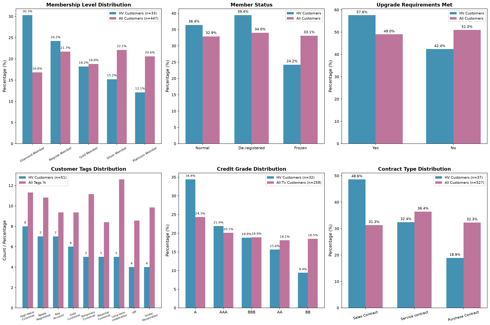
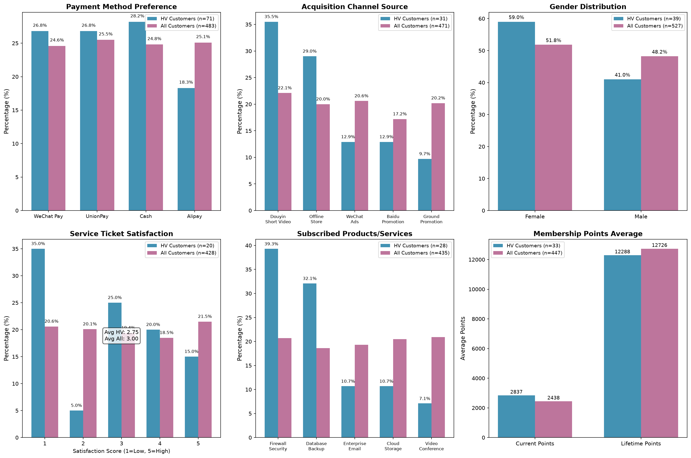

# Customer Characteristics of High-Value Customers (Cumulative Completed Transactions > 5000)

## 1. Executive Summary

This analysis profiles customers exhibiting **completed high-amount transaction behavior**, defined as customers whose cumulative **Paid** (completed) transaction amount exceeds **5,000 CNY**. Of 483 customers with transaction records, **71 customers (14.7%)** qualify as high-value (HV) customers. Their paid transactions total **481,739.59 CNY** with an average of **6,785.06 CNY** per customer (range: 5,014.63 – 8,924.35). Notably, each customer has exactly one transaction in the database, so the "cumulative" threshold is effectively a single completed transaction exceeding 5,000 CNY.

Key insight summary:
- **Membership**: HV customers are disproportionately **Diamond Members** (30.3% vs. 16.8% overall) and hold above-average current points (2,837 vs. 2,438).
- **Credit ratings**: HV customers skew toward **Grade A/AAA** (56.3% combined) with strong average credit scores (~740–750) and high credit limits (up to ~620,000 CNY).
- **Customer tags**: Most-frequent tags include High-Value Customer, Key Account, Gold Customer, and Long-term cooperation — consistent with an established, valuable customer base.
- **Acquisition channels**: **Douyin Short Video** (35.5% of tagged HV customers) and **Offline Store** (29%) are the dominant channels.
- **Risk watch**: HV customers show **lower average service-ticket satisfaction (2.75 vs. 3.00)** and **longer ticket resolution times (42.6 vs. 37.0 days)**, plus a notable share of Frozen/De-registered membership statuses (63.6% combined).

## 2. Methodology & Data Coverage

- **Cohort definition** (SQL): Customers where `SUM(Transaction Amount)` over records with `Transaction Payment Status = 'Paid'` exceeds 5,000.
- **Coverage of the 71 HV customers** across characteristic tables:

| Dimension table | HV customers matched | Match rate |
|---|---|---|
| Customer tags | 51 | 71.8% |
| Contact (gender) | 39 | 54.9% |
| Contracts | 37 | 52.1% |
| Financials | 34 | 47.9% |
| Membership | 33 | 46.5% |
| Channels | 31 | 43.7% |
| Product/Service orders | 28 | 39.4% |
| Credit ratings (via transaction account) | 32 | 45.1% |

**Linking notes**: Credit ratings were joined via `transaction_history.Account ID → customer_credit_rating_table.Account ID` (259 of 483 transaction accounts have ratings). Feedback/campaign data required a bridge through `customer_tag_table.Contact ID` (customer ID formats differ across tables; e.g., `customer_segments_table` uses "L"-prefixed IDs and could not be joined to customers).

## 3. Customer Tags

Among the 51 HV customers with tags, the most common tags (with average tag weight):

| Tag | HV count | Avg. weight |
|---|---|---|
| High-Value Customer | 8 | 6.02 |
| Newly Registered | 7 | 4.39 |
| Key Account | 7 | 5.60 |
| Gold Customer | 6 | 4.60 |
| Temporary Customer | 5 | 5.00 |
| Potential Customer | 5 | 6.63 |
| Long-term cooperation | 5 | 6.57 |
| VIP | 4 | 4.31 |
| Under Observation | 4 | 5.45 |

**Interpretation**: The tag mix is split between value/status tags (High-Value Customer, Key Account, Gold Customer, VIP, Long-term cooperation) and lifecycle tags (Newly Registered, Temporary Customer, Potential Customer). This suggests the HV cohort is **not a uniform group**: it contains both well-established key accounts and relatively recent customers who made a single large purchase. The presence of "Under Observation" tags indicates some HV customers warrant risk monitoring.

## 4. Membership System

Membership level comparison (HV n=33 with membership records vs. all 447 members):

| Membership Level | HV % | All % | Imbalance |
|---|---|---|---|
| Diamond Member | **30.3%** | 16.8% | **+13.5pp** |
| Regular Member | 24.2% | 21.7% | +2.5pp |
| Gold Member | 18.2% | 18.8% | −0.6pp |
| Silver Member | 15.2% | 22.1% | −7.0pp |
| Platinum Member | 12.1% | 20.6% | −8.5pp |

**Findings**:
- **Diamond membership is strongly overrepresented** among HV customers — the top-tier membership level is nearly twice as common as in the general base.
- HV customers have **higher average current points** (2,837 vs. 2,438) though slightly lower lifetime points (12,288 vs. 12,726).
- **Upgrade requirements met**: 57.6% of HV members meet upgrade requirements (vs. 49.0% overall).
- **Automatic renewal**: 60.6% of HV members have automatic renewal enabled.
- **Risk flag**: Among HV members, 13 are **De-registered** (39.4%), 8 are **Frozen** (24.2%), and only 12 (36.4%) are Normal — a concerning pattern suggesting some of the highest-spending customers have churned or been suspended. This deserves priority investigation.

## 5. Credit Ratings

Credit grade distribution for HV customers (n=32 with ratings via their transaction accounts):

| Credit Grade | HV % | All transaction customers % | Avg. score (HV) | Avg. credit limit (HV) |
|---|---|---|---|---|
| A | **34.4%** | 24.3% | 747.9 | 551,818 |
| AAA | **21.9%** | 20.1% | 750.0 | 355,714 |
| BBB | 18.8% | 18.9% | 770.7 | 536,667 |
| AA | 15.6% | 18.1% | 735.6 | 620,000 |
| BB | 9.4% | 18.5% | 698.3 | 366,667 |

**Findings**:
- HV customers are **concentrated in top credit grades**: 56.3% carry A or AAA grades (vs. 44.4% overall), while the speculative-grade BB share is roughly half the population rate (9.4% vs. 18.5%).
- Average credit scores are healthy (698–771), and average credit limits range from ~355K to ~620K CNY, indicating strong lending capacity.
- For the 7 HV customers with accounts in the account table, account credit ratings were AA (3), AAA (1), BBB (3) — again top-heavy.

## 6. Demographics, Channels & Contracts

- **Gender** (n=39): 59.0% Female, 41.0% Male — slightly more female-heavy than the overall base (51.8% female).
- **Acquisition channels** (n=31): **Douyin Short Video** (35.5%) is the leading channel, followed by **Offline Store** (29.0%), WeChat Ads (12.9%), Baidu Promotion (12.9%), and Ground Promotion (9.7%). Douyin's overrepresentation suggests digital/video marketing effectively attracts large-ticket customers.
- **Contract types** (n=37): **Sales Contracts** dominate at 48.6% (vs. 31.3% overall), followed by Service contracts (32.4%) and Purchase Contracts (18.9%). Contract performance status: In Performance (14), Completed (14), Terminated (9) — 24.3% of HV contracts are terminated, a risk signal.
- **Subscribed products** (n=28): **Firewall Security Service** (39.3% of HV orders) and **Database Backup Plan** (32.1%) are the leading products, indicating a B2B/enterprise IT-services orientation.

## 7. Transaction & Financial Behavior

- **Payment methods** (71 paid HV transactions): WeChat Pay (26.8%), Cash (28.2%), UnionPay (26.8%), Alipay (18.3%) — notably, **cash (28.2%) and WeChat Pay are the top methods**, with Alipay underused relative to its population share (25.1%).
- **Financials** (n=34): HV customers have lower average receivable amounts (4,289 vs. 4,973) but also a meaningfully lower average **amount received** (1,915 vs. 2,457), with an average outstanding balance of 2,374 CNY — suggesting payment collection is only partially complete for these large invoices.
- **Service experience** (n=20 tickets): HV customers' average ticket satisfaction is **2.75** (vs. 3.00 overall) and their tickets take longer to resolve (**42.6 vs. 37.0 days**). The score distribution is heavily skewed to score 1 (35% of HV tickets vs. 20.6% overall), indicating service-quality gaps among the highest-spending customers.

## 8. Conclusions & Recommendations

1. **Profile**: High-value customers are predominantly **top-tier Diamond members**, hold **A/AAA credit ratings**, are more often **female**, acquire through **Douyin/Offline channels**, and buy **enterprise IT services** (firewall security, database backup) via **sales contracts**.
2. **Opportunity — service quality**: Despite their value, HV customers report the **lowest ticket satisfaction** and **longest resolution times**. Improving service-ticket handling for this segment is the highest-leverage retention action.
3. **Risk — membership & contract churn**: 63.6% of HV members are Frozen or De-registered and 24.3% of HV contracts are terminated. Targeted win-back programs should prioritize these accounts.
4. **Cash-flow watch**: Partially collected receivables (avg. outstanding 2,374 CNY) warrant focused collections follow-up.
5. **Segmentation**: The tag mix (Key Account/VIP vs. Newly Registered/Temporary) implies two sub-cohorts — established enterprise accounts and new large-ticket buyers — which should be managed differently (loyalty vs. onboarding/upsell).

## 9. Limitations

- Each customer has exactly one transaction, so "cumulative" equals a single paid transaction > 5,000 CNY; multi-transaction behavior cannot be assessed.
- Cross-table ID systems are inconsistent (`customer_segments_table` uses "L"-prefixed customer IDs; feedback/campaign tables link via contact IDs), so segments could not be joined, and feedback/campaign analyses rely on the tag bridge (partial coverage).
- Only 32–51 of 71 HV customers have records in each characteristic table; percentages are computed on available records, which may not fully represent the cohort.
- Credit-rating linkage is based on transaction accounts (259 of 483 accounts have ratings); only a subset of HV customers is covered.

## Figures

