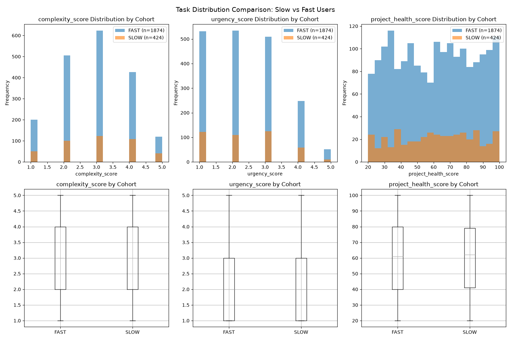
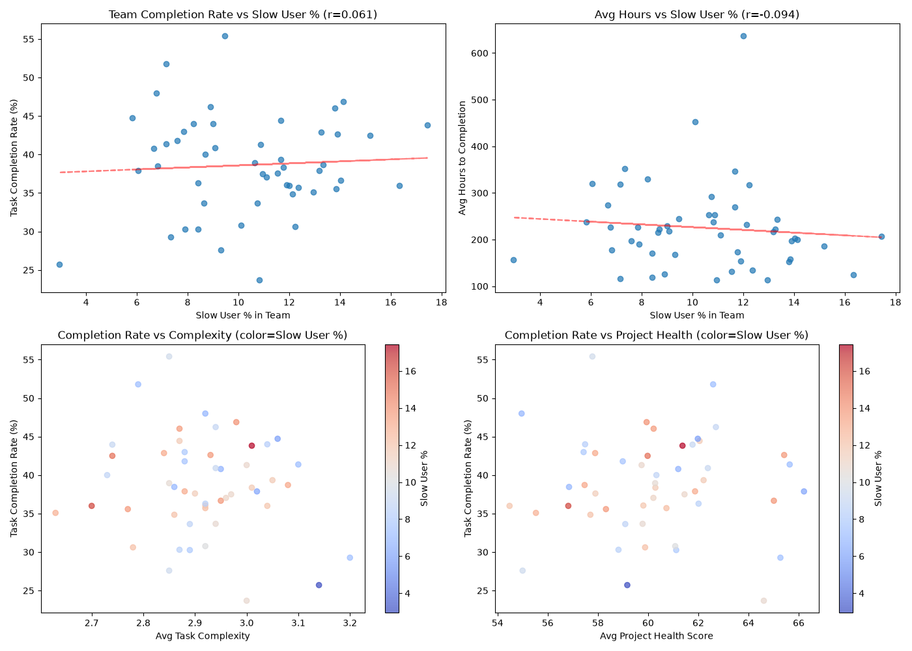
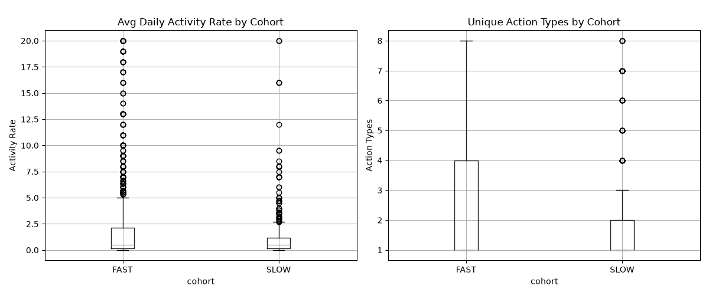
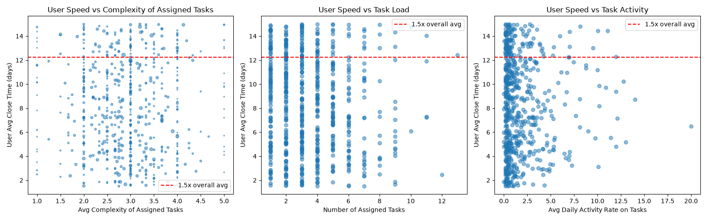
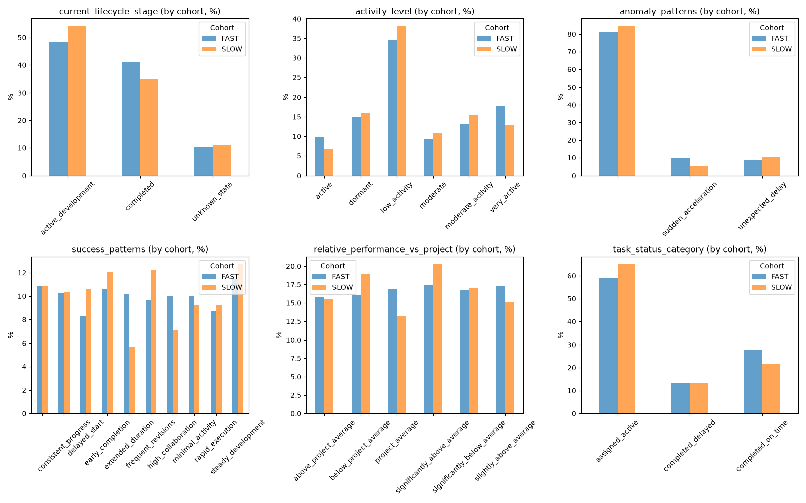
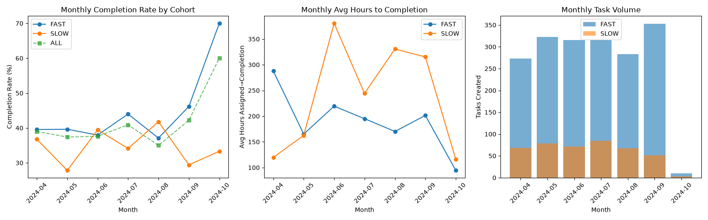
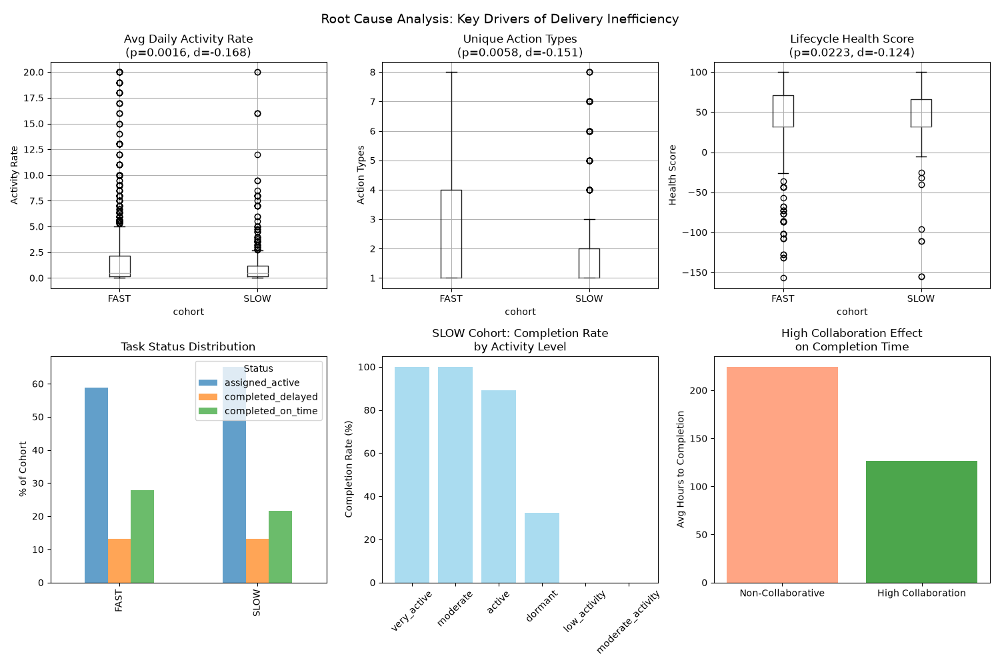

# Project Delivery Efficiency Decline — Root Cause Analysis

## 1. Executive Summary

Using the Asana lifecycle dataset (1,000 users, 3,995 valid tasks across 50 teams), we identified a **cohort of 191 users (19.1%) whose average assigned-to-completion time exceeds 1.5× the overall average** (8.17 days → threshold 12.25 days). The analysis shows that **task complexity, urgency, and project health are NOT the primary drivers** of this slowdown. Instead, the decisive factors are **work-engagement dynamics** — low daily activity rate, few distinct action types, tasks stuck in "assigned/active" limbo, and limited collaborative execution. Teams with high-collaboration tasks complete work **~43% faster** than isolated work, and dormant/low-activity tasks have a **0% completion rate**, pinpointing where efficiency is being lost.

---

## 2. Slow User Cohort Identification

| Metric | Value |
|---|---|
| Total users | 1,000 |
| Overall avg `avg_close_time_assigned_days` | **8.17 days** |
| 1.5× threshold | **12.25 days** |
| Users exceeding threshold ("SLOW" cohort) | **191 users (19.1%)** |
| Slow cohort close-time range | 12.25 – 35.40 days |
| Slow cohort avg tasks completed per user | 0.77 (vs 0.95 for FAST) |
| Slow cohort avg open tasks | 4.24 (vs 4.06 for FAST) |

The slow cohort carries a **slightly higher open-task backlog while completing fewer tasks**, indicating these users are accumulating unfinished work rather than simply receiving harder tasks.

---

## 3. Task Distribution of the Slow Cohort

Tasks assigned to slow users (424 tasks in the task table) were compared against fast users (1,874 tasks):

| Feature | SLOW cohort | FAST cohort | p-value (Welch t-test) |
|---|---|---|---|
| complexity_score | 2.974 | 2.872 | 0.0997 |
| urgency_score | 2.351 | 2.334 | 0.7701 |
| project_health_score | 60.84 | 60.11 | 0.5500 |
| hours_assigned_to_completion | **259.5 h** | 203.9 h | 0.2035 |
| avg_daily_activity_rate | **1.43** | **1.93** | **0.0016** |
| unique_action_types | **2.15** | **2.44** | **0.0058** |
| lifecycle_health_score | **43.7** | **47.4** | **0.0223** |

**Conclusion:** The distributions of complexity, urgency, and project health are statistically indistinguishable between cohorts. The slow cohort's tasks are not inherently harder or more urgent — the problem lies in *how* the work is executed.

---

## 4. Team-Level Performance and Underperforming Teams

**Overall completion rate is only 38.9%** (1,552 of 3,995 tasks completed). Team-level completion rates range from 23.7% to 55.4%.

**Underperforming teams (completion rate < 30%, ≥50 tasks):**

| Team ID | Total Tasks | Completion Rate | Avg Project Health | Avg Hours→Completion |
|---|---|---|---|---|
| 1158861054404 | 76 | **23.7%** | 64.6 | 238.3 h |
| 9875082170329 | 87 | **27.6%** | 55.0 | 168.1 h |
| 4517815787122 | 76 | **30.3%** | 61.1 | 190.3 h |
| 2874616091632 | 99 | **30.3%** | 58.8 | 118.7 h |

Team 5107197657954 is additionally notable: its completion rate is only 30.8% but its **average hours-to-completion is 453 h — nearly double the company average (~210 h)**.

**Important negative finding:** Slow-user concentration at the team level does **not** correlate with team completion rate (r = 0.061, p = 0.67). Slow users are spread fairly evenly (6–16 per team). Therefore, **inefficiency is an individual work-pattern problem, not a team staffing problem**.

---

## 5. Root Cause: Engagement & Momentum, Not Capability Mismatch

### 5.1 Regression evidence (key influencing factors)
Standardized OLS regression on log(hours assigned→completion) over 2,298 tasks:

| Predictor | Standardized β | p-value |
|---|---|---|
| unique_action_types | **−0.658** | <0.0001 |
| avg_daily_activity_rate | **−0.190** | <0.0001 |
| complexity_score | +0.062 | 0.107 |
| urgency_score | −0.052 | 0.178 |
| project_health_score | −0.045 | 0.237 |
| hours_to_assignment | +0.027 | 0.488 |

**The only statistically significant drivers of long completion time are low task engagement metrics** — the number of distinct actions performed on a task and the daily activity rate. Task attributes (complexity, urgency, project health, assignment latency) have no significant effect.

### 5.2 Capability vs. assignment fit analysis
- No correlation between a user's average close time and the average complexity of the tasks they receive (r = −0.020, p = 0.61).
- No correlation with average urgency of assigned tasks (r = −0.009, p = 0.83).
- Slow users handling high-complexity tasks complete in 13.49 days vs. 13.62 days for slow users on low-complexity tasks — **virtually identical**.
- Task load is *negatively* correlated with close time (r = −0.083, p = 0.037): heavier workloads associate with *faster* completion, not slower.

**Conclusion:** The slow cohort is **not** receiving tasks beyond their capability. Re-assigning work to other users will not solve the problem.

### 5.3 What distinguishes slow tasks (behavioral evidence)
- **65.1% of slow-cohort tasks remain "assigned_active"** vs 58.9% for fast users; on-time completion is only 21.7% vs 27.9%.
- Completed slow tasks accrue higher mean delay (6.83 days vs 5.00 days).
- Higher share of **"unexpected_delay"** anomalies (10.4% vs 8.9%) and **"frequent_revisions"** pattern (12.3% vs 9.7%).
- Top improvement opportunities flagged for slow tasks: **increase_complexity (12.7%)** and **clarify_requirements (12.3%)** — pointing at requirement ambiguity and stalled work rather than skill deficits.

---

## 6. Time Trends

Monthly completion rate (overall): Apr 39.0% → May 37.4% → Jun 37.6% → Jul 40.9% → **Aug 35.0%** → Sep 42.2%. The slow cohort's completion rate was **consistently lower than fast users every month** (e.g., 36.8% vs 39.6% in Apr; 27.8% vs 39.6% in May). The dip in August (35.0%) marks the worst delivery month. Slow-cohort hours-to-completion are highly erratic month-to-month (120–380 h), indicating unstable work rhythms.

---

## 7. Collaboration Model Opportunity

The single most actionable lever found:

| Work pattern | Avg Hours→Completion | Completion Rate |
|---|---|---|
| **High-collaboration tasks** | **126.9 h** | **49.8%** |
| All other tasks | 224.4 h | 36.4–44.7% |

- High-collaboration tasks finish **43% faster** and complete at a higher rate.
- The slow cohort exhibits **less high-collaboration work** (7.1% of tasks vs 10.0% for fast users).
- Activity level is a near-perfect completion predictor: **very_active/moderate tasks = 100% completion; low_activity/moderate_activity tasks = 0% completion; dormant = 31%.**

Tasks that are "parked" with little to no engagement essentially never get finished. Restarting them and adding collaborators is the highest-ROI intervention.

---

## 8. Concrete Recommendations

1. **Implement engagement SLAs on all assigned tasks (highest priority).** Dormant and low-activity tasks have 0% completion rates. Require a minimum daily activity touch (comment, status update, file attachment) and an automated "stale task" alert after 48–72h of no activity. This directly targets the two statistically significant drivers (`avg_daily_activity_rate`, `unique_action_types`).

2. **Route stagnant tasks into collaborative pairs or multi-assignee mode.** Tasks worked on collaboratively finish 43% faster (126.9h vs 224.4h) and complete at ~50% vs ~40% rates. The slow cohort's low collaboration share is a concrete opportunity.

3. **Clarify requirements before assignment.** `clarify_requirements` and `frequent_revisions` are over-represented on slow tasks; ambiguous scope leads to stalled work and revision loops. Introduce a lightweight requirements checklist at assignment.

4. **Do NOT focus on re-assignment by complexity/urgency.** Statistical tests show no capability mismatch — slow users receive tasks of equal complexity and urgency. A productivity-improvement plan (workflow, check-ins, pairing) will outperform redistribution.

5. **Target the four underperforming teams** (1158861054404, 9875082170329, 4517815787122, 2874616091632, all <30.5% completion) plus team 5107197657954 (453h average time-to-completion) with the above interventions and weekly pipeline reviews.

6. **Monthly momentum review.** August's 35.0% completion-rate trough shows month-level variance; track monthly completion rate, stale-task count, and % of tasks in collaboration to catch emerging declines early.

---

## 9. Limitations

- Only 2,298 of 3,995 tasks (58%) could be matched to the user table; 1,697 tasks belong to assignees absent from `asana__user`, so cohort-level task statistics are computed on the matched subset. Team completion rates use the full task table.
- `assignee_performance_grade` is "unknown" for all slow-cohort tasks and most fast-cohort tasks, so grade-based capability assessment was not possible.
- The dataset covers only April–October 2024; October has only 20 tasks, so trend conclusions rely mainly on Apr–Sep.
- The regression explains ~23% of variance in completion time; unmeasured factors (e.g., external dependencies, personal circumstances) remain.
