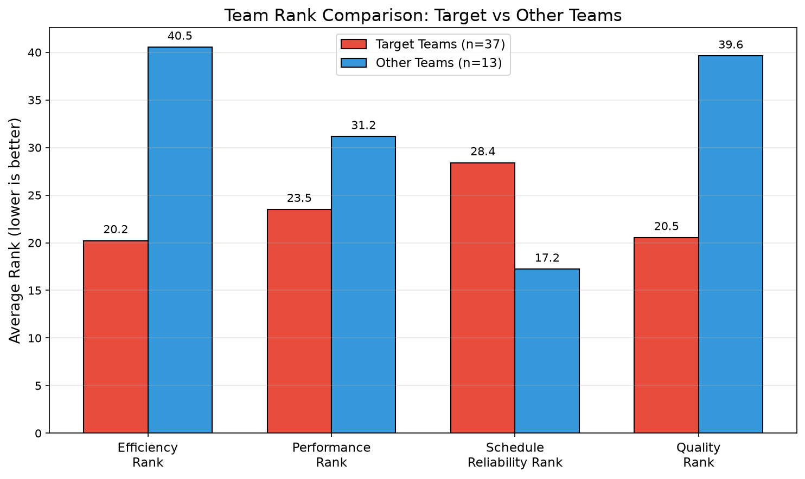
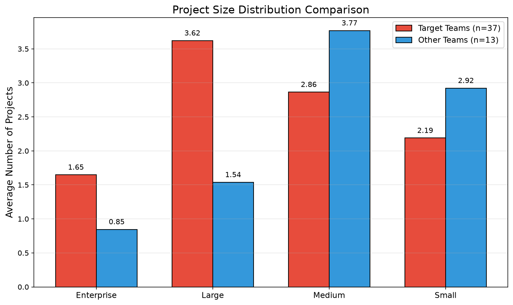
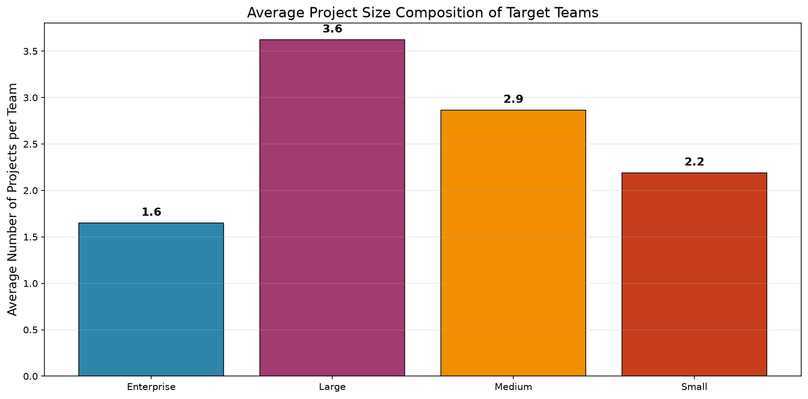
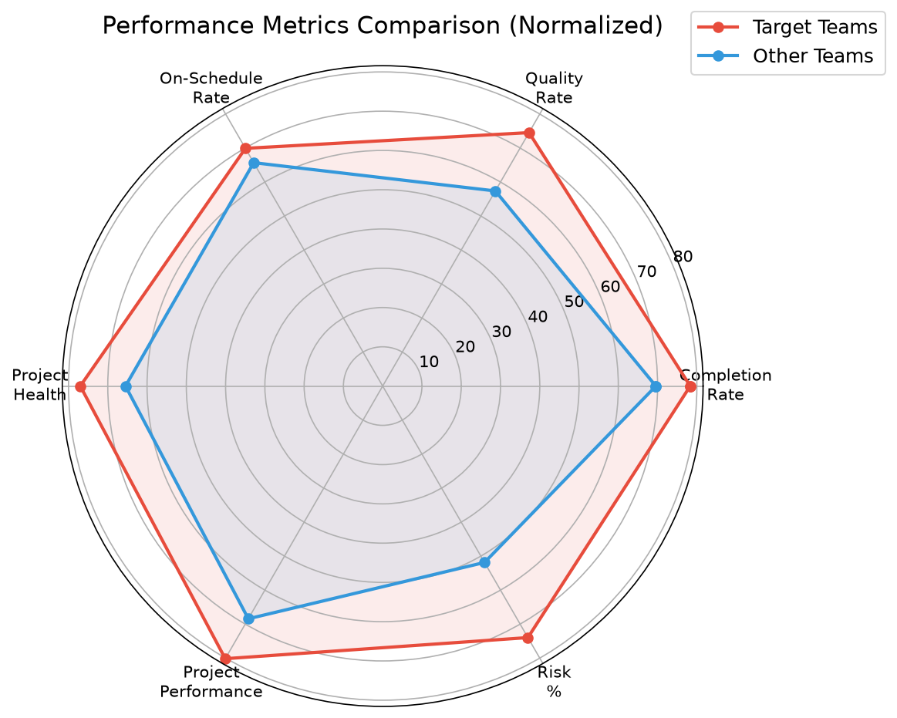
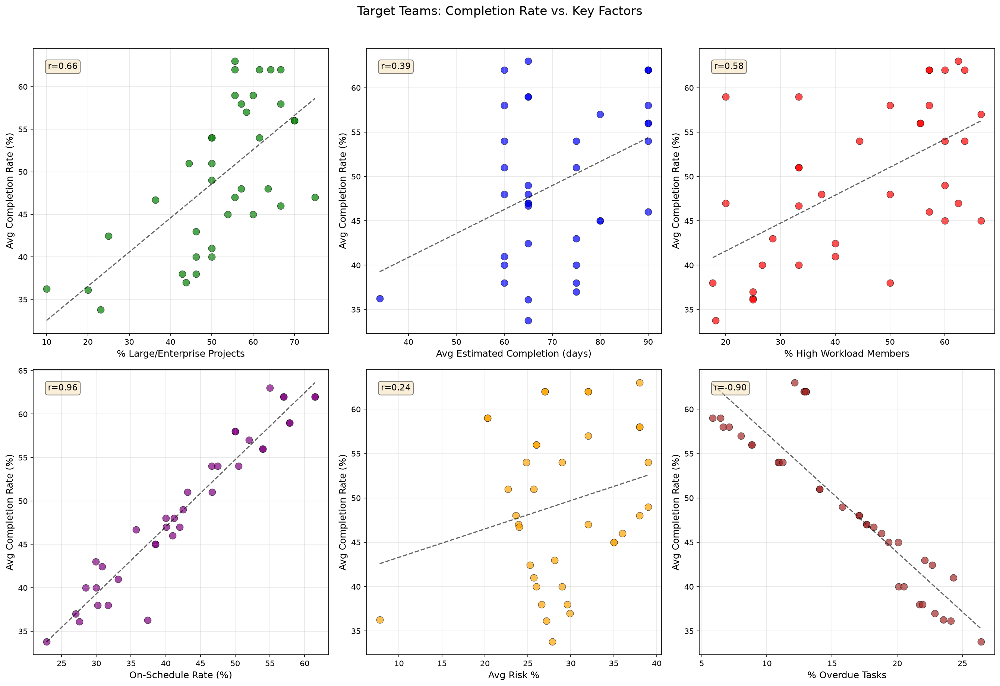
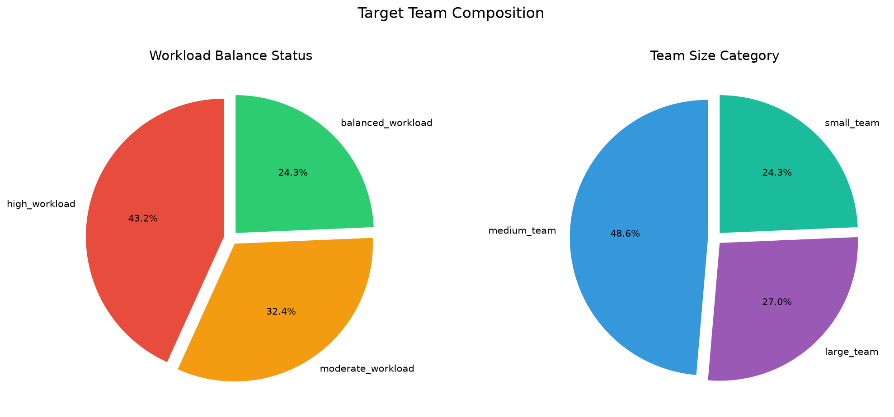
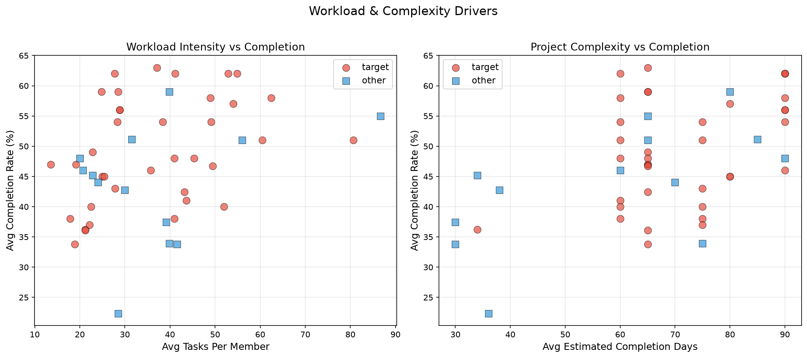

# Analysis Report: Mismatch Between Health Scores and Actual Completion Rates

## Executive Summary

This analysis examines **37 teams** from the `asana__team_efficiency_metrics` table that exhibit high **collaboration efficiency scores (≥8)** and **resource optimization scores (≥8)** yet have **avg_completion_rate below 70%** (all teams in the dataset fall below 70%, with the target group averaging 49.3%). These teams are compared against the remaining 13 teams to identify root causes of the performance gap.

**Primary Finding:** The mismatch stems from a **project portfolio imbalance** — target teams manage a disproportionately high share of enterprise and large-scale projects (51.9% of their portfolio vs. 27.9% for comparison teams) without corresponding enhancements in schedule planning and capacity management. While their collaboration and quality management are strong, **schedule reliability is their critical weakness**.

---

## 1. Identification of Target Teams

**Criteria:** `collaboration_efficiency_score >= 8 AND resource_optimization_score >= 8 AND avg_completion_rate < 70`

| Metric | Target Teams (37) | Other Teams (13) |
|--------|:-----------------:|:----------------:|
| Avg Collaboration Efficiency Score | 8.59 | 7.15 |
| Avg Resource Optimization Score | 8.32 | 6.69 |
| Avg Quality Management Score | 8.46 | 5.62 |
| Avg Project Management Score | 6.54 | 5.85 |
| **Avg Completion Rate** | **49.3%** | **43.8%** |
| **Avg Schedule Reliability Rank** | **28.4** (worse) | **17.2** (better) |



**Key insight:** Target teams rank well on efficiency (20.2) and quality (20.5) but **poorly on schedule reliability (28.4)** — the worst of the four rank dimensions. The comparison group shows the opposite pattern: poor efficiency/quality ranks but better schedule reliability.

---

## 2. Root Cause Analysis

### 2.1 Project Portfolio Imbalance (Primary Driver)



| Metric | Target Teams | Other Teams |
|--------|:-----------:|:----------:|
| Avg Enterprise Projects | 1.65 | 0.85 |
| Avg Large Projects | 3.62 | 1.54 |
| Avg Medium Projects | 2.86 | 3.77 |
| Avg Small Projects | 2.19 | 2.92 |
| **% Large/Enterprise Projects** | **51.9%** | **27.9%** |

- **70.3%** of target teams (26/37) have ≥50% of their projects classified as enterprise or large.
- Enterprise and large projects inherently require longer timelines, more coordination, and greater resource commitment.
- Target teams average **71.3 estimated completion days** vs. 58.3 for comparison teams — a **22% longer** estimated duration.



### 2.2 Schedule Reliability Breakdown



| Metric | Target | Other |
|--------|:-----:|:-----:|
| Avg On-Schedule Rate | 43.0% | 40.4% |
| Avg Overdue Tasks (as % of total) | 15.9% | 19.6% |
| Tasks Completed (% of total) | 49.3% | 43.8% |
| Tasks Active (% of total) | 34.7% | 36.6% |

- **64.9%** of target teams (24/37) have an on-schedule rate below 50%.
- **Correlation between on-schedule rate and completion rate: r = 0.962** — the strongest predictor of completion performance.
- **Correlation between overdue tasks and completion rate: r = -0.896** — the strongest negative predictor.
- This indicates that **schedule management failures** are the most direct cause of low completion rates.



### 2.3 Workload and Capacity Constraints

| Metric | Target | Other |
|--------|:-----:|:-----:|
| Avg Unique Team Members | 8.14 | 6.38 |
| Avg High Workload Members | 3.51 | 2.62 |
| % High Workload Members | 44.6% | 44.6% |
| Avg Tasks Per Member | 36.66 | 36.98 |
| Avg High Risk Members | 2.51 | 2.00 |

- **51.4%** of target teams have ≥50% of their members classified as high workload.
- **43.2%** of target teams are in "high_workload" balance status (vs. 38.5% for others).
- Target teams have **10 large teams** (27%) vs. **0 large teams** in the comparison group.
- Larger teams introduce coordination overhead that can impede completion rates despite strong collaboration scores.



### 2.4 Task Complexity and Risk Profile

| Metric | Target | Other |
|--------|:-----:|:-----:|
| Avg Estimated Completion Days | 71.3 | 58.3 |
| Avg Risk Percentage | 28.8% | 20.2% |
| Avg Project Velocity | 0.51 | 0.53 |
| Avg Project Health | 54.38 | 46.24 |
| Avg Project Performance | 57.72 | 49.27 |

- Target teams have **higher risk percentages** (28.8% vs 20.2%) despite having better health scores.
- The correlation between estimated completion days and completion rate is **r = 0.395** — moderately positive within the target group, suggesting that teams with longer projects are more structured in their tracking but still underperform on completion.
- **45.9%** of target teams (17/37) have estimated completion days ≥ 75 — indicating very long project cycles.



### 2.5 Performer Distribution

| Category | Target (avg) | Other (avg) |
|----------|:----------:|:----------:|
| Top Performers | 1.51 | 1.46 |
| High Performers | 1.03 | 0.77 |
| Solid Performers | 2.97 | 2.38 |
| Developing Performers | 2.54 | 2.15 |
| Underperformers | 1.59 | 1.08 |

Target teams have slightly more performers in each category, but also more underperformers, suggesting that team growth has outpaced the development of consistent performance.

---

## 3. Systematic Improvement Recommendations

### 3.1 Portfolio Rebalancing (High Priority)

**Problem:** 70% of target teams have ≥50% large/enterprise projects, which are significantly harder to complete.

**Recommendations:**
- **Right-size project portfolio:** Actively manage the mix of enterprise/large vs. medium/small projects. Target a maximum of 35-40% large/enterprise projects to improve completion rates.
- **Phase large projects:** Break enterprise projects into smaller, independently deliverable milestones with intermediate completion checkpoints.
- **Implement project intake gates:** Establish criteria for accepting new large projects based on current capacity and in-progress workload.

### 3.2 Schedule Planning Enhancement (High Priority)

**Problem:** 32 of 37 target teams (86.5%) already have the improvement recommendation "Enhance planning accuracy and deadline management."

**Recommendations:**
- **Adopt evidence-based scheduling:** Use historical velocity data (avg velocity = 0.51 for target teams) to set realistic deadlines rather than aspirational targets.
- **Implement buffer management:** Add 15-20% schedule buffers for enterprise projects to account for the observed 22% longer durations.
- **Reduce WIP (Work in Progress):** With 34.7% of tasks active and only 49.3% completed, limit the number of active projects per team member to reduce context switching and improve completion rates.

### 3.3 Workload Distribution (Medium Priority)

**Problem:** 44.6% of members are high workload, and 51.4% of teams have ≥50% high workload members.

**Recommendations:**
- **Capacity-based assignment:** Match project assignments to individual member capacity rather than distributing work evenly.
- **Create a workload dashboard:** Identify members exceeding 80% capacity utilization before assigning new work.
- **Cross-train resources:** Reduce dependency on individual high performers (avg 1.51 per team) by developing solid and developing performers (avg 5.51 combined).

### 3.4 Risk Management Integration (Medium Priority)

**Problem:** Target teams have 28.8% avg risk percentage despite high health scores.

**Recommendations:**
- **Proactive risk monitoring:** Schedule regular risk review sessions for enterprise/large projects, as these have the highest risk exposure.
- **Link risk to schedule:** When risk flags are raised, automatically adjust project timelines and communicate revised completion estimates.

### 3.5 Maturity Development (Long-term Priority)

**Problem:** 75.7% of target teams (28/37) are at "emerging" maturity level.

**Recommendations:**
- **Structured project management training:** Invest in PM methodologies (Agile/Scrum for medium projects, Waterfall with milestones for large projects).
- **Mentorship programs:** Pair emerging teams with the 9 developing teams to share best practices.
- **Standardize completion criteria:** Define clear "done" criteria for each project size category to reduce the 15.9% overdue task rate.

---

## 4. Summary of the Mismatch Mechanism

The data reveals a clear pattern:

```
High Collaboration & Resource Scores (Perceived Health)
          ↓
Teams take on more complex, large-scale projects (51.9% large/ent)
          ↓
Longer estimated completion times (71.3 days)
          ↓
Inadequate schedule planning (43.0% on-schedule rate)
          ↓
High overdue task rate (15.9%) → Low completion rate (49.3%)
          ↓
Schedule reliability rank (28.4) — worst dimension
          ↓
Despite high quality output (70.8% quality rate), work stacks up
```

The **collaboration and resource optimization scores accurately reflect** that these teams communicate well, collaborate effectively, and optimize their resources. However, these strengths do not compensate for **systemic under-planning of schedules** and **over-commitment to large-scale projects**. The quality of completed work is high, but the volume of work-in-progress and overdue tasks prevents the completion rate from reaching healthy levels.

## 5. Limitations

- The entire dataset has completion rates below 70%, so the "low completion" criterion applies to all 50 teams. The analysis focuses on the 37 teams with high scores as the target group.
- Team names are duplicated across different team IDs (e.g., multiple "Design" teams), suggesting different organizational units with the same functional name.
- The `schedule_reliability_rank` interpretation (lower is better) is assumed based on pattern analysis; the database schema does not explicitly define rank direction.
- The analysis is correlational; causal mechanisms are inferred from observed patterns and domain reasoning.