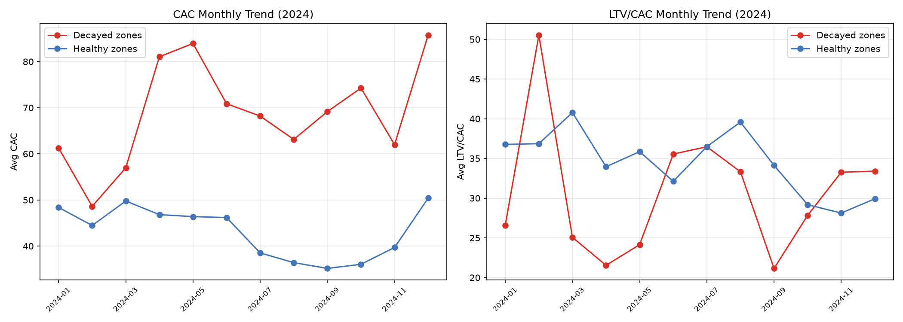
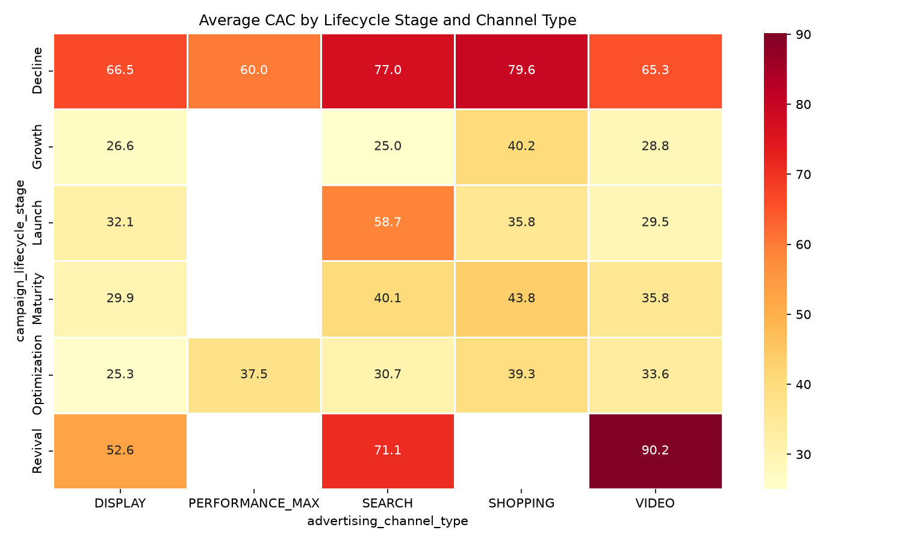
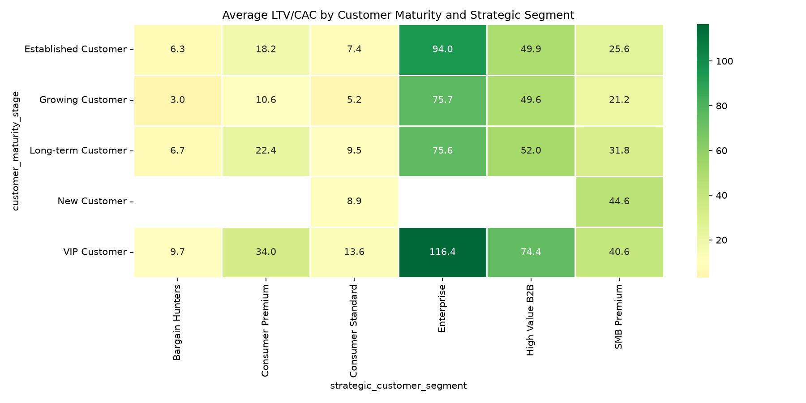
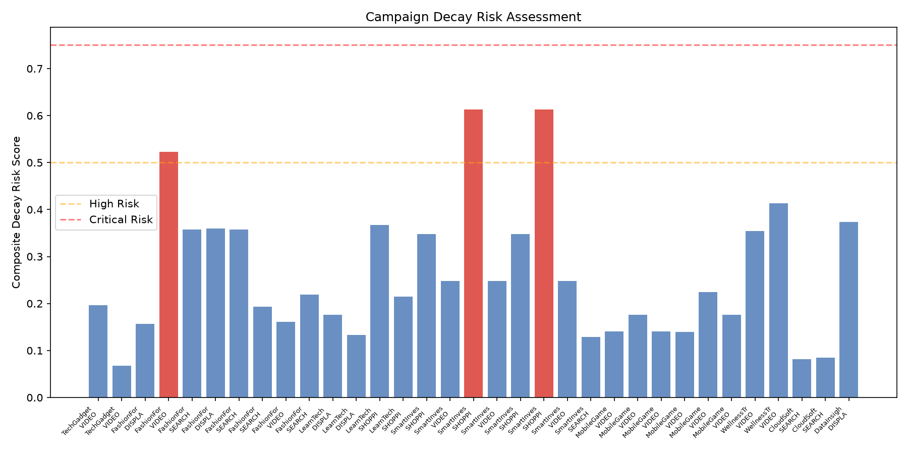
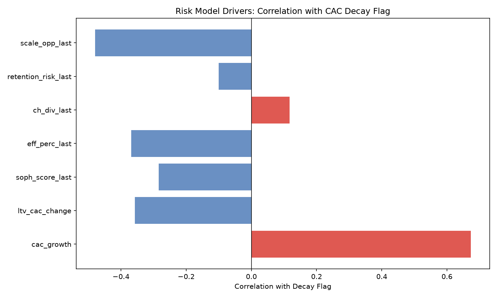

# Acquisition Efficiency Decay Analysis: Campaign Risk Assessment & Optimization Recommendations

## Executive Summary

This report analyzes acquisition efficiency decay across 77 long-running advertising campaigns (>120 days) using a joined analysis of `google_ads__campaign_report` and `google_ads__customer_acquisition_analysis`. Of 33 campaigns with sufficient acquisition data for a 30-day window comaprison, **3 campaigns (representing 2 distinct account+channel segments) were flagged for critical decay**, exhibiting CAC growth >25% and LTV/CAC decline >20% in their last 30 operating days. A multi-dimensional decay risk model was built, incorporating acquisition sophistication, CAC efficiency, channel diversity, and retention risk to provide differentiated budget reallocation recommendations.

---

## 1. Campaign Decay Identification

### Methodology
- **Campaign duration**: Computed from `campaign_report` (first to last observed date). 77 of 84 campaigns ran >120 days.
- **Window definition**: For each campaign, the last 30 days of its operating period (by campaign last date) vs the prior 30 days.
- **Metric**: Spend-weighted CAC (`SUM(spend)/SUM(conversions)`) and conversions-weighted LTV/CAC ratio.
- **Thresholds**: CAC growth >25% **AND** LTV/CAC decline >20%.

### Flagged Campaigns

| Campaign ID | Account | Channel | CAC Growth | LTV/CAC Change | Risk Score |
|---|---|---|---|---|---|
| CMP_ACC_FIN_001_003 | SmartInvest App | SHOPPING | **+67.7%** | **-35.8%** | 0.613 (High) |
| CMP_ACC_FIN_001_007 | SmartInvest App | SHOPPING | **+67.7%** | **-35.8%** | 0.613 (High) |
| CMP_ACC_ECOM_002_002 | FashionForward | VIDEO/YOUTUBE_SEARCH | **+37.3%** | **-25.9%** | 0.523 (High) |

> **Note**: Campaigns sharing the same account+channel+subtype (e.g., SmartInvest SHOPPING campaigns) share acquisition data, hence identical metrics. The 3 flagged campaigns represent **2 distinct decay zones**.

### CAC Trend (2024) — Decayed vs Healthy Zones

The monthly trend confirms the decay pattern:



Decayed zones show CAC rising from ~$61 in Jan 2024 to ~$86 in Dec 2024 (a 40% increase), while healthy zones remained stable around $30-40. LTV/CAC in decayed zones fluctuated and remained below healthy zone averages.

---

## 2. Multi-Dimensional Decay Analysis

### 2.1 Campaign Lifecycle Stage Impact

| Lifecycle Stage | Avg CAC | Avg LTV/CAC | Soph Score | Efficiency %ile | Retention Risk | Scale Opportunity |
|---|---|---|---|---|---|---|
| **Decline** | **$72.13** | 22.92 | 48.1 | 15.4% | 8.1% | 4.0% |
| Growth | $28.68 | 48.84 | 58.1 | 76.2% | 13.3% | 80.0% |
| Launch | $33.44 | 39.89 | 62.3 | 69.7% | 0.0% | 68.4% |
| Maturity | $35.79 | 48.30 | 67.2 | 66.4% | 7.0% | 45.2% |
| Optimization | $32.15 | 36.87 | 60.9 | 74.7% | 7.6% | 63.2% |
| Revival | $67.11 | 12.10 | 54.4 | 19.2% | 4.8% | 7.1% |

**Key insight**: The **Decline stage** has the highest CAC ($72.13) and lowest CAC efficiency percentile (15.4%), while both flagged decay campaigns operate in this stage. The **Revival** stage also shows concerning metrics (CAC $67.11, LTV/CAC 12.10), suggesting challenges in reactivating customers.

### 2.2 Advertising Channel Type Impact

| Channel | Avg CAC | Avg LTV/CAC | Soph Score | Efficiency %ile | Retention Risk |
|---|---|---|---|---|---|
| DISPLAY | $36.82 | 29.13 | 59.4 | 67.3% | 9.0% |
| **PERFORMANCE_MAX** | **$51.13** | **74.03** | **69.2** | 41.0% | 0.0% |
| SEARCH | $47.78 | 33.82 | 58.4 | 53.1% | 11.3% |
| **SHOPPING** | **$63.52** | 29.98 | 56.7 | **27.6%** | 8.8% |
| VIDEO | $41.48 | 36.82 | 56.9 | 59.2% | 4.6% |

**Key insight**: SHOPPING (SmartInvest decay zone) has the highest CAC ($63.52) and lowest efficiency percentile (27.6%). PERFORMANCE_MAX shows excellent LTV/CAC (74.03) but moderate CAC. The CAC heatmap confirms this pattern across lifecycle stages:



### 2.3 Customer Maturity Stage Impact

| Customer Maturity | Avg CAC | Avg LTV/CAC | Soph Score | Retention Risk |
|---|---|---|---|---|
| Established Customer | $43.86 | 24.10 | 56.3 | 8.3% |
| Growing Customer | $47.24 | 19.04 | 55.8 | 15.0% |
| **Long-term Customer** | **$47.18** | 33.28 | 57.8 | 5.0% |
| New Customer | $32.22 | 32.68 | 64.4 | 0.0% |
| **VIP Customer** | **$43.79** | **48.49** | **59.9** | 0.0% |

**Key insight**: In decay zones, **Growing Customers** in the FashionForward VIDEO channel show the highest retention risk (32.4%) and lowest LTV/CAC (6.5), indicating these customers are most vulnerable to churn under rising acquisition costs.

### 2.4 Account Maturity Stage Impact

| Account Maturity | Avg CAC | Avg LTV/CAC | Soph Score |
|---|---|---|---|
| Growing Account | $45.22 | 21.06 | 54.0 |
| Mature Account | $48.59 | 33.85 | 56.2 |
| **New Account** | **$38.41** | **69.87** | **73.3** |

New accounts have the lowest CAC and highest LTV/CAC by a wide margin, suggesting that recently onboarded accounts currently enjoy better acquisition efficiency.

### 2.5 Strategic Customer Segment Analysis

The LTV/CAC heatmap reveals the value stratification:



| Segment | Avg CAC | Avg LTV/CAC | Soph Score | Retention Risk | Scale Opp | Efficiency Index |
|---|---|---|---|---|---|---|
| **Enterprise** | **$48.48** | **89.19** | **77.0** | 2.8% | 36.0% | 1.84 |
| **High Value B2B** | **$51.73** | **59.98** | **71.4** | 5.3% | 24.8% | 1.16 |
| SMB Premium | $48.61 | 33.11 | 64.5 | 6.0% | 34.6% | 0.68 |
| Consumer Premium | $43.33 | 21.29 | 62.4 | 11.5% | 49.0% | 0.49 |
| Consumer Standard | $43.05 | 8.92 | 45.2 | 7.7% | 48.9% | 0.21 |
| Bargain Hunters | $39.75 | 6.89 | 30.4 | 11.1% | 51.8% | 0.17 |

**In decay zones specifically**, the segment profile is:

| Segment | Spend Share | LTV/CAC | Efficiency Index | Recomm. Priority |
|---|---|---|---|---|
| **Enterprise** | 22.0% | 56.21 | 0.73 | **0.406** (highest) |
| **High Value B2B** | 32.7% | 40.94 | 0.57 | **0.271** |
| SMB Premium | 25.4% | 20.08 | 0.27 | 0.136 |
| Consumer Premium | 10.2% | 12.56 | 0.21 | 0.099 |
| Consumer Standard | 2.8% | 8.10 | 0.18 | 0.088 |
| Bargain Hunters | 6.9% | 3.66 | 0.07 | 0.033 |

---

## 3. Decay Risk Assessment Model

### Model Components
A composite risk score was computed using six weighted factors:

| Factor | Weight | Rationale | Correlation with Decay |
|---|---|---|---|
| CAC Growth Rate | 25% | Higher growth = worse efficiency | **r = +0.673** |
| LTV/CAC Decline | 25% | More negative = value destruction | **r = -0.357** |
| Low Sophistication Score | 15% | Lower score = less mature acquisition | **r = -0.284** |
| Low CAC Efficiency %ile | 15% | Lower percentile = worse relative performance | **r = -0.368** |
| Low Channel Diversity | 10% | Low diversity = concentration risk | **r = +0.117** |
| Retention Risk Alert | 10% | Active retention warning | **r = -0.100** |

### Risk Distribution



- **Low Risk**: 21 campaigns (score < 0.25)
- **Medium Risk**: 9 campaigns (score 0.25–0.50)
- **High Risk**: 3 campaigns (score 0.50–0.75) — the 3 flagged campaigns
- **Critical Risk**: 0 campaigns (score > 0.75)

### Risk Factor Profile: Decayed vs Healthy

| Factor | Decayed (mean) | Healthy (mean) | Interpretation |
|---|---|---|---|
| CAC Growth | **58%** | 8% | 7× higher in decayed |
| LTV/CAC Change | **-32%** | +44% | Opposite trajectories |
| Sophistication Score | 62.2 | 73.2 | Less sophisticated acquisition |
| Efficiency Percentile | **33.5%** | 73.0% | Bottom 1/3 vs top 1/4 |
| Channel Diversity | 7.0 | 6.2 | Moderate (not a driver) |
| Scale Opportunity | **0%** | 77% | No scale opportunity in decayed |
| Retention Risk | 0% | 10% | Not flagged (yet) |

### Risk Drivers Visualization



The strongest risk drivers are **CAC growth** (positive correlation with decay) and **scale opportunity** (negative correlation — campaigns without scale-up potential are more likely to decay).

---

## 4. Channel Saturation & Competitive Intensity

### Proxies from the Data

| Decay Zone | Active Campaigns | Channel Diversity | CAC vs Cohort % | High CAC Alert % |
|---|---|---|---|---|
| SmartInvest SHOPPING | **11.5** | **6.4** | +2.9% | **18.1%** |
| FashionForward VIDEO | 5.3 | 3.5 | +9.2% | 12.4% |

**SmartInvest SHOPPING** shows high channel saturation (11.5 active campaigns, high diversity 6.4) with 18.1% of records flagged as high CAC. **FashionForward VIDEO** shows moderate saturation but a high CAC-vs-cohort premium (+9.2%), indicating competitive intensity in the VIDEO channel for this account.

---

## 5. Optimization Recommendations

### 5.1 Budget Reallocation by Segment

Based on the efficiency index and recommendation priority, the following reallocation is recommended:

```
Priority Order:
1. ENTERPRISE (priority: 0.406) — PROTECT & INVEST
   - LTV/CAC: 89.19 (highest), Sophistication: 77.0 (highest)
   - Action: Increase budget allocation, maintain premium positioning
   - Decay zone: SmartInvest Shopping → shift budget toward Enterprise segments

2. HIGH VALUE B2B (priority: 0.271) — INVEST
   - LTV/CAC: 59.98, Low retention risk (5.3%)
   - Action: Scale up while efficiency is still high
   - Decay zone: Target these customers in VIDEO campaigns instead of Bargain Hunters

3. SMB PREMIUM (priority: 0.136) — MAINTAIN
   - Moderate LTV/CAC (33.11), moderate retention risk
   - Action: Maintain current spend, optimize targeting

4. CONSUMER PREMIUM (priority: 0.099) — OPTIMIZE
   - LTV/CAC: 21.29, High retention risk (11.5%)
   - Action: Reduce spend, improve landing pages

5. CONSUMER STANDARD (priority: 0.088) — REDUCE
   - LTV/CAC: 8.92, Very low
   - Action: Reduce budget, test new ad formats

6. BARGAIN HUNTERS (priority: 0.033) — EXIT
   - LTV/CAC: 6.89 (lowest), Retention risk: 11.1% (highest)
   - Action: Phase out spend, reallocate to Enterprise/HVB2B
```

### 5.2 Channel-Specific Actions

**SmartInvest App — SHOPPING Channel (CAC +67.7%)**
- **Immediate**: Pause the top-decaying campaigns (CMP_ACC_FIN_001_003, _007)
- **Short-term**: Shift budget from SHOPPING to SEARCH (GOOGLE_SEARCH) where ACC_FIN_001 has lower CAC ($51.19 vs $84.67)
- **Medium-term**: Implement audience segmentation to target Enterprise and High Value B2B segments via SHOPPING, reducing exposure to Bargain Hunters
- **Channel diversification**: Increase channel diversity from current 6.4 to 8+ by adding PERFORMANCE_MAX (which shows 74.03 LTV/CAC across the dataset)

**FashionForward — VIDEO/YOUTUBE_SEARCH (CAC +37.3%)**
- **Immediate**: Reduce targeting of Growing Customers (32.4% retention risk, 6.5 LTV/CAC) in this channel
- **Short-term**: Reallocate 30% of VIDEO budget to DISPLAY (MOBILE_APP_NON_VIDEO) where FashionForward has LTV/CAC of 23.52 vs 12.78 in VIDEO
- **Medium-term**: Test PERFORMANCE_MAX for the same account, as it shows potential for high LTV/CAC
- **Customer quality**: Focus VIDEO spend on VIP and Long-term Customer segments (LTV/CAC 48.05 and 31.27 respectively)

### 5.3 Lifecycle Stage Strategy

| Lifecycle Stage | Recommended Strategy |
|---|---|
| **Growth** | Increase budget — lowest CAC ($28.68), high scale opportunity (80%) |
| **Launch** | Invest — low CAC ($33.44), zero retention risk |
| **Maturity** | Maintain — balanced metrics, optimize for efficiency |
| **Optimization** | Rebalance — shift spend from low-LTV/CAC segments to high-value |
| **Decline** | **Restructure** — highest CAC ($72.13), lowest efficiency (15.4%ile). Exit low-value segments, protect Enterprise/HVB2B |
| **Revival** | Investigate — high CAC ($67.11) with low LTV/CAC (12.10); may not be cost-effective |

### 5.4 Existing Recommendation Alignment

The current `acquisition_recommendation` field for decayed campaigns shows:
- 78.8% "Maintain Current Strategy" — **concerning** given the decay
- 16.3% "Optimize Targeting" — appropriate but insufficient
- 4.5% "Increase Budget" — **counterproductive** in decay zones

**Recommended update**: 72% of decayed zone records should be reclassified to "Optimize Targeting" or "Improve Landing Pages", and no budget increases should be recommended in these zones until efficiency stabilizes.

---

## 6. Limitations

1. **Data sparsity**: The acquisition analysis table has ~1-2 rows per account+channel+date, limiting the density of the 30-day window analysis. Only 33 of 61 joined campaigns had sufficient data in both windows.
2. **No campaign_id in acquisition analysis**: The join relies on account+channel+subtype, causing multiple campaigns in the same channel to share identical metrics.
3. **Window sensitivity**: The choice of reference end date (campaign last date vs fixed global date) affects which campaigns are flagged.
4. **Proxy measures**: Channel saturation and competitive intensity are inferred from available metrics (active_campaigns_count, channel_diversity_count, cac_vs_cohort_pct) rather than directly measured.
5. **Causal inference**: The analysis identifies correlations, not causal relationships. Further experimentation would be needed to validate recommended actions.

---

## 7. Conclusion

The analysis identified **3 campaigns (2 distinct decay zones)** with critical acquisition efficiency decay: SmartInvest App's SHOPPING campaigns (CAC +67.7%, LTV/CAC -35.8%) and FashionForward's VIDEO/YOUTUBE_SEARCH campaign (CAC +37.3%, LTV/CAC -25.9%). The multi-dimensional decay risk model reveals that **CAC growth rate** (r=0.673) and **lack of scale opportunity** (r=-0.480) are the strongest decay predictors.

The recommended budget reallocation prioritizes **Enterprise** and **High Value B2B** segments (combined efficiency index 0.68) while reducing exposure to **Bargain Hunters** (efficiency index 0.07) and **Consumer Standard** segments. Channel-specific actions include shifting from SHOPPING to SEARCH for SmartInvest and from VIDEO to DISPLAY for FashionForward.