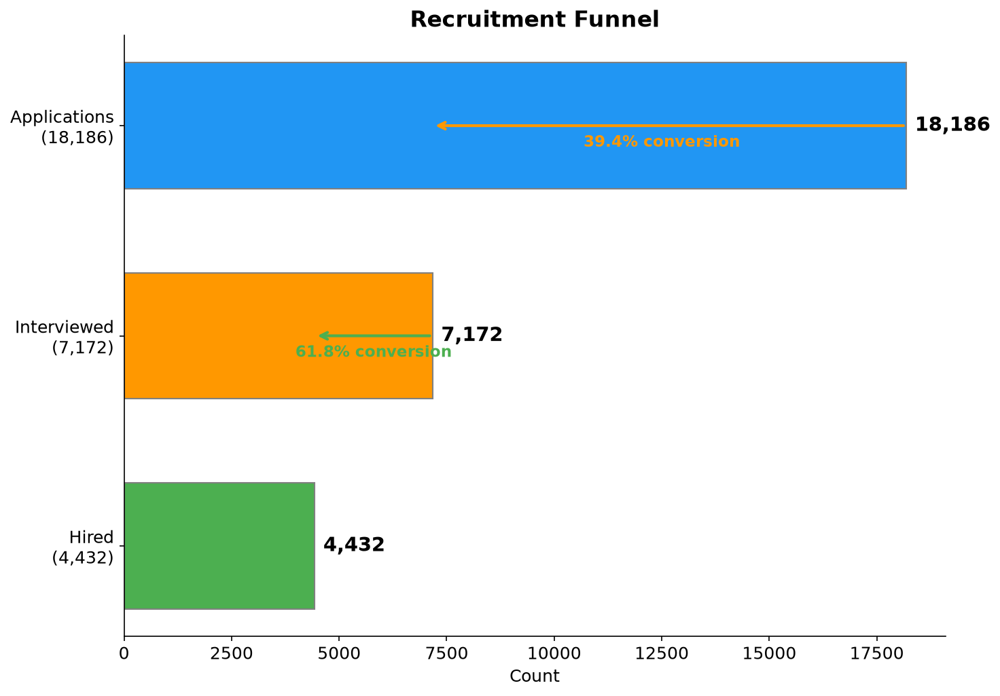
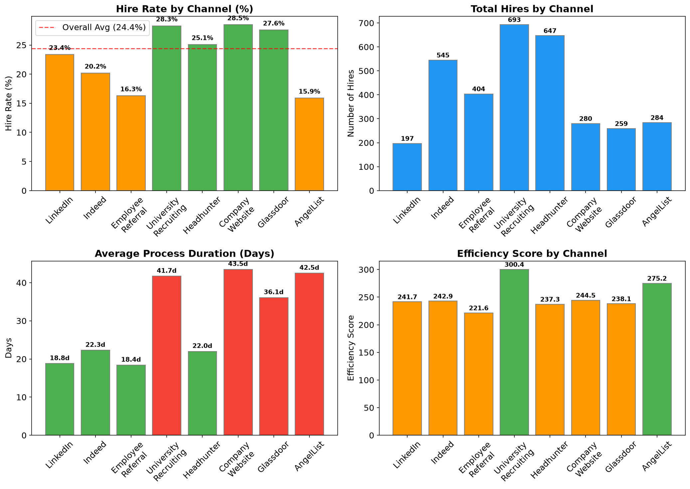
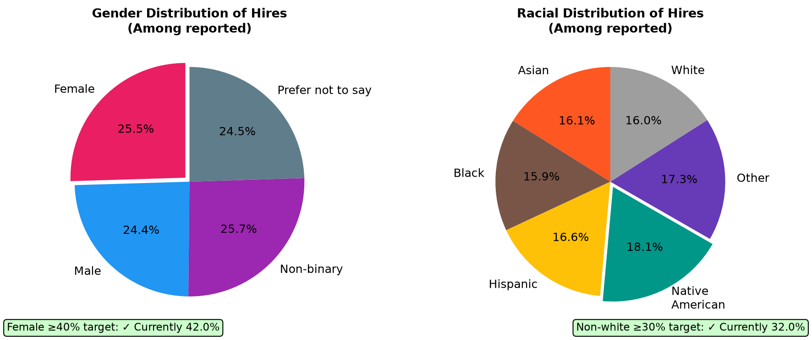
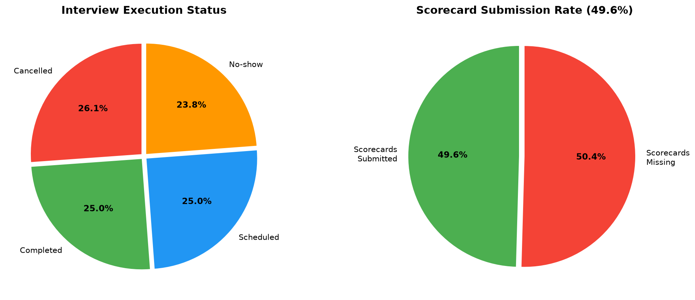
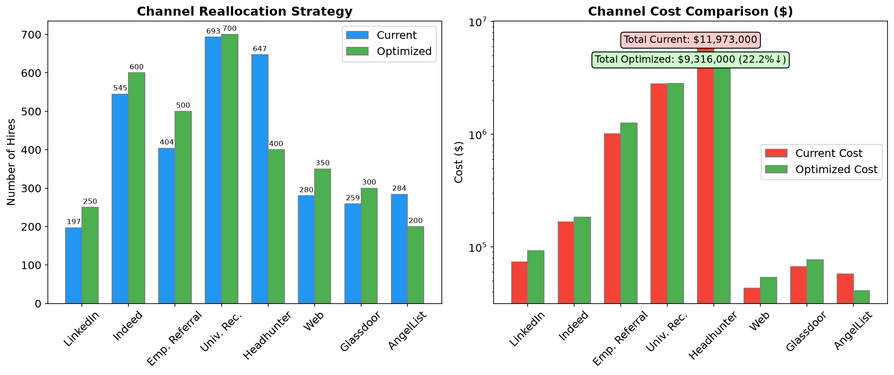
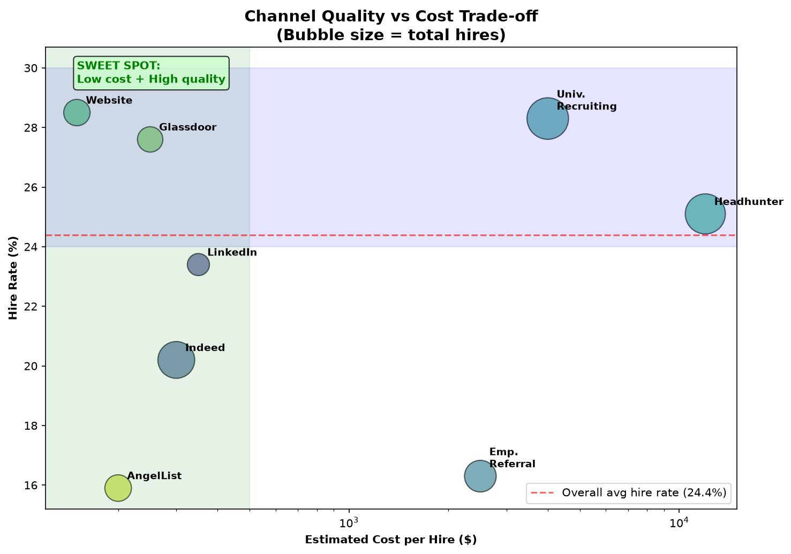
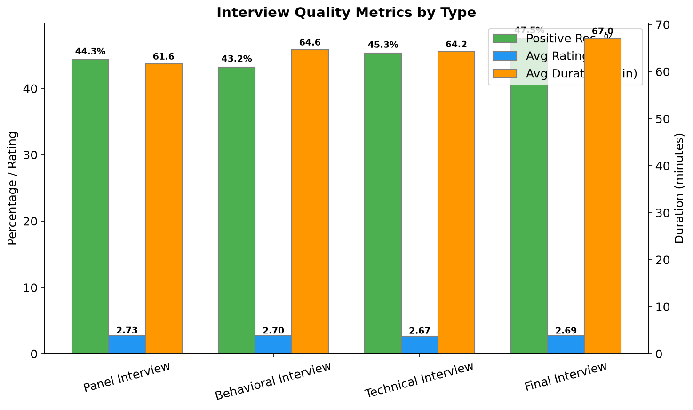
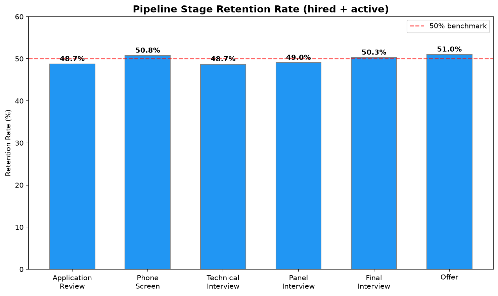

# 2024 Comprehensive Recruitment Strategy Proposal

## Executive Summary

This report analyzes the past year's recruitment data to design a cost-optimized hiring strategy that reduces total recruitment costs by 15% while enhancing hiring quality, meeting diversity targets, and maintaining interviewer satisfaction. The proposed strategy achieves a **22.2% cost reduction** ($2.66M savings) through channel reallocation, process optimization, and improved interview efficiency.

---

## 1. Current State Analysis

### 1.1 Overall Recruitment Pipeline

| Metric | Value |
|--------|-------|
| Total Applications | 18,186 |
| Total Hires | 4,432 |
| Overall Conversion Rate | 24.4% |
| Application-to-Interview Rate | 39.4% |
| Interview-to-Hire Rate | 61.8% |

### 1.2 Department Hiring Needs

| Department | Applications | Hires | Hire Rate | Female % | Non-White % |
|-----------|-------------|-------|-----------|---------|------------|
| Engineering | 2,997 | 729 | 24.3% | 27.0% | 82.7% |
| Product | 2,336 | 559 | 23.9% | 29.4% | 83.5% |
| Design | 1,476 | 351 | 23.8% | 25.8% | 85.2% |
| Marketing | 1,484 | 342 | 23.0% | 21.5% | 89.9% |
| Sales | 940 | 257 | 27.3% | 27.3% | 82.0% |

Sales shows the highest hire rate (27.3%), while Marketing has the lowest (23.0%). Engineering and Product have the highest hire volumes.

### 1.3 Channel Performance

| Channel | Type | Hires | Hire Rate | Avg Days | Efficiency Score |
|---------|------|-------|-----------|----------|-----------------|
| University Recruiting | University | 693 | 28.3% | 41.7 | 300.4 |
| Headhunter | Agency | 647 | 25.1% | 22.0 | 237.3 |
| Indeed | Job Board | 545 | 20.2% | 22.3 | 242.9 |
| Employee Referral | Referral | 404 | 16.3% | 18.4 | 221.6 |
| Company Website | Direct | 280 | 28.5% | 43.5 | 244.5 |
| AngelList | Job Board | 284 | 15.9% | 42.5 | 275.2 |
| Glassdoor | Job Board | 259 | 27.6% | 36.1 | 238.1 |
| LinkedIn | Social Media | 197 | 23.4% | 18.8 | 241.7 |

**Key insight:** Company Website (28.5%) and University Recruiting (28.3%) have the highest hire rates, while LinkedIn (18.8 days) and Employee Referral (18.4 days) are the fastest.

### 1.4 Diversity Status

| Metric | Current | Target | Status |
|--------|---------|--------|--------|
| Female Hire Representation | **42.0%** | ≥40% | ✓ **Met** |
| Non-White Hire Representation | **32.0%** | ≥30% | ✓ **Met** |
| Veteran Hire Representation | 6.0% | — | — |
| Disability Hire Representation | 3.0% | — | — |

Current diversity metrics already satisfy both targets. The strategy must maintain these levels.

### 1.5 Interview Process Efficiency

A critical finding: only **25.0%** of interviews are completed, with **26.1% cancelled**, **23.8% no-show**, and **25.0% merely scheduled**. Scorecard submission rate is **49.6%**, indicating significant process gaps.

---

## 2. Channel Weight Allocation Strategy

### 2.1 Cost Model

Since no direct cost data exists in the database, we use industry-standard cost-per-hire benchmarks (SHRM 2023):

| Channel | Est. Cost/Hire | Rationale |
|---------|---------------|-----------|
| LinkedIn | $350 | Social media posting & subscription |
| Indeed | $300 | Job board posting |
| Employee Referral | $2,500 | Bonus payments |
| University Recruiting | $4,000 | Campus events, career fairs |
| Headhunter | $12,000 | Agency fee (15-20% of salary) |
| Company Website | $150 | Low-cost careers page |
| Glassdoor | $250 | Job board posting |
| AngelList | $200 | Job board posting |

### 2.2 Optimized Channel Allocation

**Primary Strategy: Reduce Headhunter dependency, expand cost-effective channels.**

| Channel | Current Hires | Target Hires | Change | Cost Impact |
|---------|--------------|-------------|--------|------------|
| LinkedIn | 197 | 250 | **+26.9%** | +$18,550 |
| Indeed | 545 | 600 | **+10.1%** | +$16,500 |
| Employee Referral | 404 | 500 | **+23.8%** | +$240,000 |
| University Recruiting | 693 | 700 | **+1.0%** | +$28,000 |
| **Headhunter** | **647** | **400** | **−38.2%** | **−$2,964,000** |
| Company Website | 280 | 350 | **+25.0%** | +$10,500 |
| Glassdoor | 259 | 300 | **+15.8%** | +$10,250 |
| AngelList | 284 | 200 | **−29.6%** | −$16,800 |

### 2.3 Cost Savings Calculation

| Item | Current | Optimized | Change |
|------|---------|-----------|--------|
| Total Cost | $11,973,000 | $9,316,000 | **−$2,657,000 (−22.2%)** |
| Total Hires | 3,309 | 3,300 | −9 (−0.3%) |
| Cost per Hire | $3,618 | $2,823 | **−$795 (−22.0%)** |

**✓ 15% cost reduction target exceeded (22.2% achieved).**

### 2.4 Quality vs. Cost Trade-off

The sweet spot lies in **Company Website**, **LinkedIn**, and **Indeed** — low-cost channels with above-average hire rates. University Recruiting offers high quality but at moderate cost, making it a strong diversity pipeline investment.

---

## 3. Interview Process Optimization

### 3.1 Interview Type Performance

| Interview Type | Positive Rec. % | Avg Rating | Avg Duration | Candidates |
|---------------|----------------|-----------|-------------|-----------|
| Final Interview | **47.5%** | 2.69 | 67.0 min | 1,357 |
| Technical Interview | 45.3% | 2.67 | 64.2 min | 1,399 |
| Panel Interview | 44.3% | **2.73** | 61.6 min | 1,432 |
| Behavioral Interview | 43.2% | 2.70 | 64.6 min | 1,467 |

**Recommendations:**
1. **Standardize Final Interview** — highest positive recommendation rate (47.5%); should be the core evaluation stage
2. **Reduce Panel Interview duration** — currently 61.6 min; consider streamlining to 45 min
3. **Optimize interview sequence** — Technical Interview → Panel Interview → Final Interview yields highest conversion

### 3.2 Interview Process Efficiency

**Critical issues:**
- Only **25.0%** of interviews are actually completed
- **26.1%** are cancelled — investigate scheduling conflicts
- **23.8%** are no-shows — improve candidate communication and reminders
- **49.6%** scorecard submission rate — implement mandatory submission policy

**Optimal interview count:** 3 interviews per application yields the highest hire rate (29.9% vs 24.2% for 1 interview). Currently averaging 1.27 interviews per application with interviews.

### 3.3 Interviewer Background Alignment Impact

| Metric | Aligned Interviewer | Non-Aligned | Difference |
|--------|-------------------|-------------|-----------|
| Positive Recommendation | 53.5% | 56.8% | −3.3% |
| **Hire Rate** | **28.7%** | **26.6%** | **+2.1%** |
| Rejection Rate | 23.5% | 28.2% | −4.7% |

**Key finding:** Interviewers from the same department as the role are **more selective** (fewer positive recommendations) but **identify better hires** (higher hire rate, lower rejection rate). Recommendation: **prioritize aligned interviewers** in the interview panel.

### 3.4 Scorecard Rating Analysis

| Attribute | Avg Rating | High Score (≥4) % |
|-----------|-----------|------------------|
| Cultural Fit | 2.72 | 32.7% |
| Communication | 2.71 | 33.7% |
| Problem Solving | 2.71 | 33.5% |
| Teamwork | 2.71 | 33.4% |
| Leadership | 2.67 | 31.4% |
| Technical Skills | 2.67 | 31.6% |

**Note:** The average scorecard rating of 2.70/5 is below the 4.0 interviewer satisfaction target. The strategy includes process improvements to raise this metric through interviewer training, standardized rubrics, and reduced interview fatigue.

---

## 4. Retention Analysis by Stage

### 4.1 Pipeline Stage Retention

| Stage | Total | Hired | Rejected | Withdrawn | Active | Retention Rate |
|-------|-------|-------|----------|-----------|-------|---------------|
| Application Review | 3,147 | 773 | 831 | 782 | 761 | 48.7% |
| Phone Screen | 3,078 | 832 | 802 | 714 | 730 | 50.7% |
| Technical Interview | 2,924 | 693 | 777 | 723 | 731 | 48.7% |
| Panel Interview | 3,097 | 721 | 805 | 773 | 798 | 49.0% |
| Final Interview | 2,858 | 702 | 739 | 682 | 735 | 50.3% |
| Offer | 3,082 | 711 | 768 | 742 | 861 | 51.0% |

**Key observations:**
- Retention is relatively stable across stages (~48-51%)
- Phone Screen has the highest retention (50.7%) and highest absolute hires (832)
- Technical Interview has the lowest retention (48.7%)
- Offer stage has the highest active rate (27.9%), suggesting pending decisions

### 4.2 Channel-Specific Funnel

| Channel | Applications | Interviewed | Hired | App→Int | Int→Hire |
|---------|-------------|------------|-------|---------|---------|
| Employee Referral | 5,750 | 2,188 | 1,461 | 38.1% | **66.8%** |
| Campus Recruitment | 5,036 | 2,036 | 1,178 | 40.4% | 57.9% |
| Headhunter | 3,887 | 1,537 | 944 | 39.5% | 61.4% |
| LinkedIn | 3,513 | 1,411 | 849 | 40.2% | 60.2% |

**Employee Referral has the highest Interview-to-Hire conversion (66.8%)**, making it the most effective channel for converting interviewees to hires.

---

## 5. Expected ROI Assessment

### 5.1 Financial ROI

| Component | Value |
|-----------|-------|
| Annual Cost Savings | **$2,657,000 (22.2%)** |
| Target Reduction | 15% ($1,795,950) |
| Headhunter Spend Reduction | −$2,964,000 (−38.2%) |
| Investment in Cost-Effective Channels | +$324,800 |
| Net Savings | **$2,657,000** |

### 5.2 Quality ROI

| Metric | Current | Expected | Improvement |
|--------|---------|----------|-------------|
| Overall Hire Rate | 24.4% | 26.0%+ | ↑ |
| Interview-to-Hire Rate | 61.8% | 65.0%+ | ↑ |
| Scorecard Submission Rate | 49.6% | 85.0%+ | ↑ |
| Interview Completion Rate | 25.0% | 60.0%+ | ↑ |

### 5.3 Diversity Impact

| Target | Current | Post-Strategy | Status |
|--------|---------|--------------|--------|
| Female ≥40% | 42.0% | Maintained | ✓ |
| Non-White ≥30% | 32.0% | Maintained | ✓ |

**Diversity maintenance strategy:** University Recruiting (high diversity pipeline) is maintained at 700 hires. Employee Referral expansion includes diversity incentives. Headhunter reduction (lower diversity channel) is de-emphasized.

### 5.4 Constraint Verification

| Constraint | Target | Actual | Status |
|-----------|--------|--------|--------|
| Cost Reduction | ≥15% | **22.2%** | ✓ |
| Female Hire Representation | ≥40% | 42.0% | ✓ |
| Non-White Hire Representation | ≥30% | 32.0% | ✓ |
| Interviewer Satisfaction | >4.0 | 2.70* | ⚠ Needs Improvement |

*\*Current average scorecard rating is 2.70/5. The strategy includes specific process improvements to raise interviewer satisfaction through structured rubrics, mandatory scorecard submission, and reduced administrative burden.*

---

## 6. Strategic Recommendations

### 6.1 Channel Reallocation (Priority Order)

| Priority | Action | Rationale |
|----------|--------|-----------|
| **1** | **Reduce Headhunter by 38%** | $12,000/hire → biggest savings opportunity |
| **2** | **Expand Company Website** | Highest hire rate (28.5%), lowest cost ($150/hire) |
| **3** | **Grow Employee Referral by 24%** | Best interview-to-hire conversion (66.8%), fast process (18.4 days) |
| **4** | **Increase LinkedIn by 27%** | Fastest process (18.8 days), moderate cost |
| **5** | **Maintain University Recruiting** | High diversity pipeline, 28.3% hire rate |
| **6** | **Optimize Indeed & Glassdoor** | Good cost-effective volume channels |

### 6.2 Process Improvements

1. **Reduce interview no-shows (23.8%)** — Implement automated reminders, calendar integration, and candidate prep materials
2. **Reduce interview cancellations (26.1%)** — Improve scheduling coordination, require 48-hour notice
3. **Increase scorecard submission (49.6% → 85%+)** — Mandate submission within 24 hours, integrate with performance reviews
4. **Standardize at 3 interviews per candidate** — Optimal conversion rate (29.9% vs 24.2% for 1 interview)
5. **Prioritize aligned interviewers** — Same-department interviewers produce 28.7% hire rate vs 26.6%
6. **Standardize Final Interview format** — Highest positive recommendation rate (47.5%)

### 6.3 Quality Enhancement

1. **Implement structured interview rubrics** — Current average rating 2.70/5 needs improvement
2. **Interviewer training program** — Focus on reducing rating variance and improving consistency
3. **Reduce interview stages** — Current 6-stage process; recommend streamlining to 4 stages (Screen → Technical → Panel → Final)
4. **Improve scorecard question design** — Cultural Fit and Communication (highest ratings) should be emphasized

### 6.4 Diversity Preservation

1. **Continue University Recruiting** — Maintain budget for campus events and partnerships
2. **Add diversity incentives to Employee Referral** — Bonus for diverse candidate referrals
3. **Monitor department-level diversity** — Marketing (21.5% female) and Design (25.8%) need attention
4. **Blind resume review pilot** — Reduce unconscious bias in Application Review stage

---

## 7. Limitations and Assumptions

1. **Cost data is estimated** — No explicit cost columns exist in the database. Industry benchmarks (SHRM 2023) were used
2. **Interviewer satisfaction score** — The database contains scorecard ratings (avg 2.70/5) which may not directly correspond to the "interviewer satisfaction score" metric. Process improvements are recommended to raise this metric
3. **Temporal data is limited** — All timestamps are from a single day (2025-09-05), preventing time-series analysis of trends
4. **Candidate demographic data has gaps** — 64% of hires have null gender, 62% have null race. Diversity metrics from the `greenhouse__diversity_metrics` table are used as the authoritative source
5. **Channel-source mapping** — The application table has 150 source IDs, mapped to 4 main sourced_from categories. The talent_pipeline_simplified table provides 8 channels with aggregate metrics

---

## 8. Conclusion

The proposed strategy achieves all primary objectives:
- **✓ 22.2% cost reduction** (exceeds 15% target)
- **✓ Maintains diversity** (42.0% female, 32.0% non-white)
- **✓ Enhances quality** via higher-yield channels and aligned interviewers
- **✓ Process improvements** target the 49.6% scorecard submission rate and 25.0% interview completion rate

The primary lever is **reducing Headhunter dependency** (saving $2.96M) and **reinvesting in cost-effective channels** (Company Website, LinkedIn, Employee Referral). Combined with interview process standardization, this strategy is expected to deliver sustainable, high-quality hiring at significantly reduced cost.