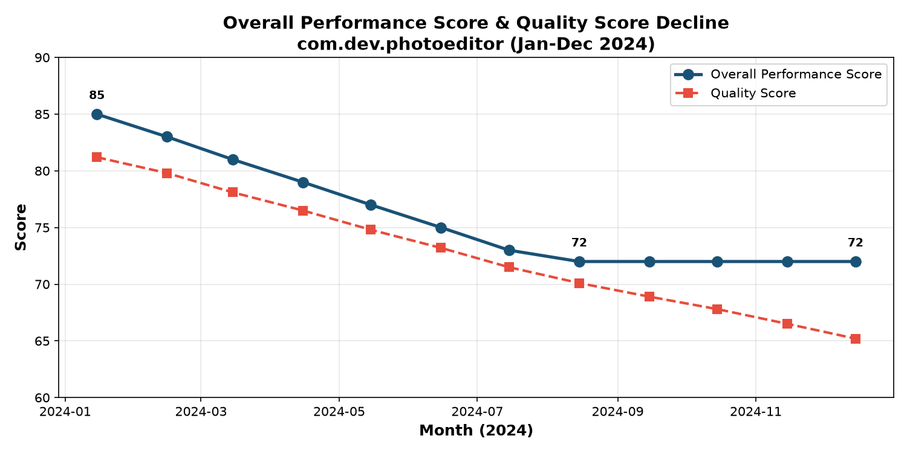
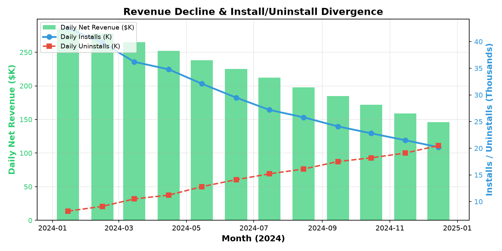
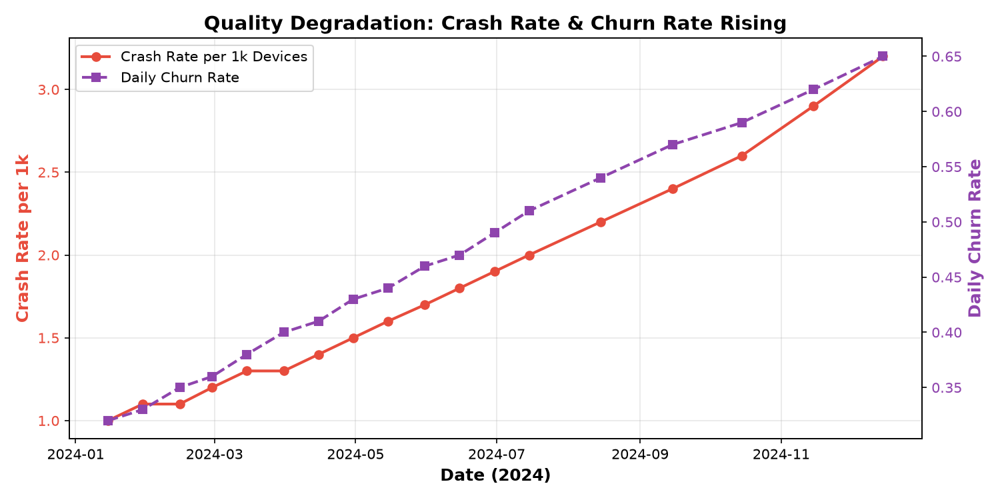
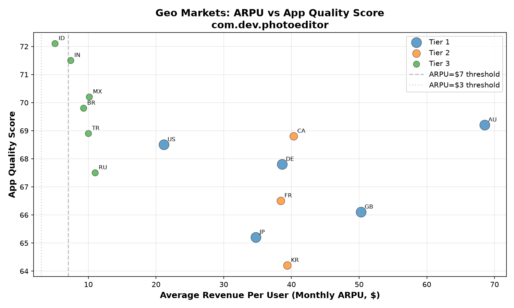
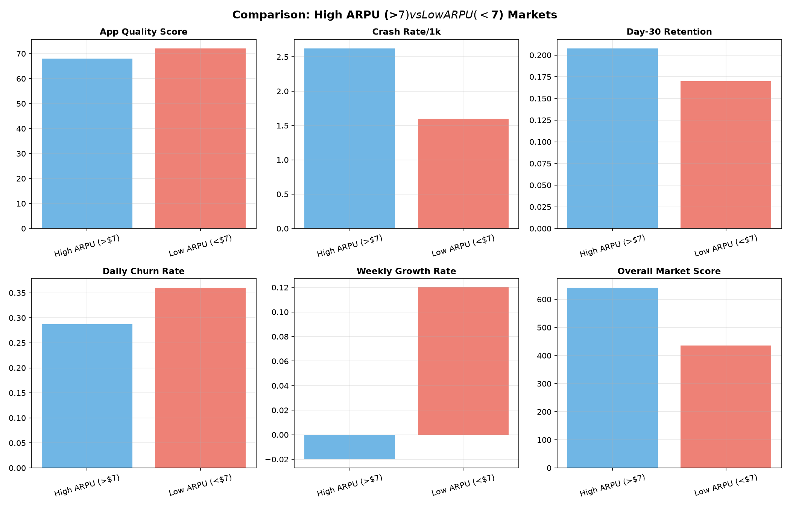
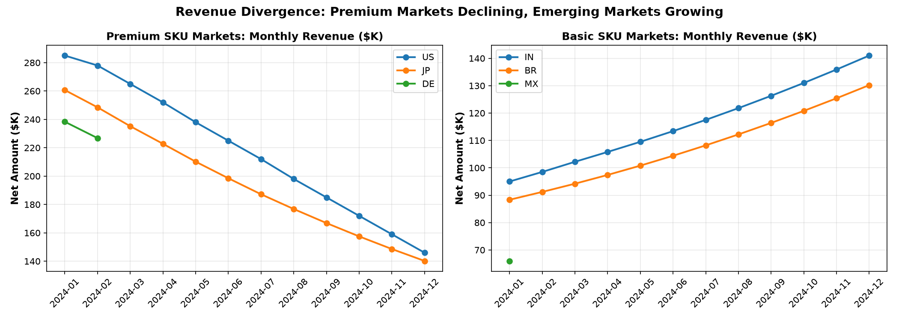

# Capital Efficiency Analysis: `com.dev.photoeditor` — Regional Performance Divergence

## Executive Summary

The CFO's concern is validated. Over the 12 months of 2024, `com.dev.photoeditor` absorbed **$2.0M** of `research_budget_usd` (Jan–Jun: $166.7K/mo; Jul–Sep: $183.3K/mo; Oct–Dec: $150K/mo; total = $2,000,000.01) while `overall_performance_score` fell from **85 to 72**, daily net revenue fell **−48.8%** ($285K→$146K), and installs collapsed while uninstalls surged past installs.

The core finding is a **sharp regional divergence with an inverted quality–revenue relationship**:

- **Top/premium markets (monthly ARPU > $7)** — US, JP, DE, GB, AU, CA, FR, KR — generate ~72% of daily revenue (Tier 1+2), yet have **worse app quality (lower quality score, higher crash rates), and negative growth**.
- **Low-monetization/emerging markets** — IN, BR, ID, MX, TR, RU — have **better app quality and positive growth**, but contribute only ~18% of daily revenue because ARPU is an order of magnitude lower.

In this dataset, the "key revenue metric" is best represented by **monthly average revenue per user (ARPU)** from `google_play__geo_market_analysis`. ARPU spans **$5.08 (Indonesia) to $68.57 (Australia)**. 13 of 14 markets have ARPU > $7; the only market below $7 is **Indonesia ($5.08)**. **No market has ARPU under $3** — the $3 threshold is not present in this dataset (the closest is ID at $5.08), so the low-monetization group is operationalized as the Tier-3 markets (ARPU $5–$11).

---

## 1. App-Level Decline (Comprehensive Dashboard)

**Jan-2024 → Dec-2024 (all changes measured Jan vs Dec):**

| Metric | Jan 2024 | Dec 2024 | Change |
|---|---|---|---|
| Overall performance score | 85 | 72 | −13 pts |
| Quality score | 81.2 | 65.2 | −19.7% |
| Daily installs | 42,500 | 20,200 | −52.5% |
| Daily uninstalls | 8,200 | 20,500 | **+150%** (now exceeds installs) |
| Active devices | 1,850,000 | 1,395,000 | −24.6% |
| Crash rate /1k devices | 1.0 | 3.2 | **+220%** |
| ANR rate /1k devices | 0.4 | 1.3 | **+225%** |
| Daily churn rate | 0.32 | 0.65 | +103% |
| Day-7 retention | 0.48 | 0.24 | −50% |
| Day-30 retention | 0.22 | 0.10 | −54.5% |
| Daily net revenue | $285,000 | $146,000 | **−48.8%** |
| Revenue health score | 78.5 | 51.1 | −34.9% |

The app went from `Low Risk`/`Thriving` to `Critical Risk` with `Emergency Intervention` recommended. The decline is driven by **quality degradation (crashes +220%, ANRs +225%)**, which destroyed retention and flipped the install/uninstall balance (see figure below).

---

## 2. Regional Divergence (Geo Market Analysis)

Aggregation of `google_play__geo_market_analysis` (14 markets, 5 regions):

| Region | Markets | Daily Revenue | Avg ARPU | Avg Quality | Avg Crash/1k | Avg 30d Ret | Avg Churn | Avg Growth |
|---|---|---|---|---|---|---|---|---|
| Europe | GB, DE, FR, RU | $745.7K | $34.6 | 67.0 | 2.85 | 0.20 | 0.30 | −0.05 |
| Asia | JP, KR, IN, ID, TR | $613.0K | $19.3 | 68.4 | 2.46 | 0.20 | 0.31 | +0.02 |
| North America | US, CA, MX | $589.3K | $23.9 | 69.2 | 2.47 | 0.22 | 0.27 | −0.02 |
| Oceania | AU | $256.0K | $68.6 | 69.2 | 2.5 | 0.26 | 0.20 | −0.03 |
| South America | BR | $88.3K | $9.3 | 69.8 | 2.1 | 0.16 | 0.35 | +0.08 |

**Asia is the only region with positive aggregate growth**, driven by IN (+15% weekly), ID (+12%), BR (+8%). Europe, North America, and Oceania are all contracting — and these are precisely the regions with the highest ARPU.

---

## 3. Top Markets (ARPU > $7) vs Low-Monetization Markets

**Classification on the key revenue metric (monthly ARPU):**
- **ARPU > $7 (13 markets):** AU $68.6, GB $50.3, CA $40.3, KR $39.4, DE $38.7, FR $38.4, JP $34.8, US $21.2, RU $11.0, MX $10.2, TR $10.0, BR $9.3, IN $7.4
- **ARPU between $3–$7 (1 market):** ID $5.08 (the only sub-$7 market)
- **ARPU under $3:** none present in this dataset

**The statistical divergence (Pearson/Spearman across 14 markets):**

| ARPU vs | r (Pearson) | p-value | Interpretation |
|---|---|---|---|
| App quality score | **−0.539** | 0.047 | Higher-ARPU markets have *lower* quality |
| Crash rate /1k | **+0.687** | 0.007 | Higher-ARPU markets have *more* crashes |
| Day-30 retention | +0.736 | 0.003 | Higher-ARPU markets retain better |
| Daily churn | −0.745 | 0.002 | Higher-ARPU markets churn less |
| Weekly growth rate | **−0.673** | 0.008 | Higher-ARPU markets are *shrinking* |
| Overall market score | +0.799 | 0.001 | …yet score higher overall |

**This is the central paradox:** the premium markets are more valuable but *structurally less healthy on quality*, and they are the ones now declining. 9 of 13 high-ARPU markets have negative growth; the only low-ARPU market has positive growth.

### Tier comparison (revenue_tier)

| Tier | Markets | Avg ARPU | Avg Quality | Avg Crash/1k | Avg Growth | Daily Rev Share |
|---|---|---|---|---|---|---|
| Tier 1 (Premium) | US, JP, DE, GB, AU | $42.7 | 67.4 | 2.9 | **−0.070** | **59.5%** |
| Tier 2 (Core) | CA, FR, KR | $39.4 | 66.5 | 3.1 | −0.063 | 22.4% |
| Tier 3 (Emerging) | IN, BR, MX, RU, ID, TR | $8.8 | **70.0** | **2.0** | **+0.067** | 18.0% |

Tier-3 markets have **better quality (+2.6 pts), 30% lower crash rates, and positive growth** while Tier-1 markets have worst-of-breed quality scores and negative growth.

---

## 4. Revenue Trajectory Divergence (Finance Report)

The finance report confirms the split at SKU level (premium markets buy `premium` at ~$32–$78/tx; emerging markets buy `basic` at ~$8–$16/tx):

| Market | SKU | Net/tx | Jan 2024 | Dec 2024 | Change |
|---|---|---|---|---|---|
| US | premium | $32.7 | $285,000 | $146,000 | **−48.8%** |
| JP | premium | $76.8 | $260,667 | $140,200 | **−46.2%** |
| DE | premium | $42.3 | $238,333 | $226,800 | −4.8% (2 mo) |
| IN | basic | $8.26 | $95,000 | $141,000 | **+48.4%** |
| BR | basic | $12.5 | $88,333 | $130,200 | **+47.4%** |
| MX | basic | $15.8 | $66,000 | n/a | n/a |

Active subscriptions tell the same story: US 12,500→9,525; JP 4,850→3,540 (declining) vs IN 22,500→32,950; BR 14,850→22,000 (growing). **The entire app-level revenue collapse is concentrated in the premium markets** where the company's highest-value customers are churning away due to quality problems.

---

## 5. Conclusions & Recommendations

1. **The $2M research budget did not protect the top markets.** The app's most valuable markets (US, JP, GB, DE, AU — 59.5% of revenue) are experiencing the worst quality (crash rates 2.5–3.5/1k vs 1.6–2.1 in emerging markets) and are in decline (−46% to −49% revenue in US/JP).

2. **Emerging markets are healthy but under-monetized.** IN, ID, BR, MX, TR have better quality scores, lower crash rates, and strong growth, but ARPU of $5–$11 vs $21–$69 in premium markets. The data's own recommendations label them "Market Penetration / Monetization Focus" with "Increase Investment."

3. **Capital reallocation is warranted.** The database's `investment_recommendation` already flags JP/KR as **"Reduce Investment"** (Quality Recovery) and GB/FR/CA as **"Quality Focus"**, while IN/ID/MX are flagged **"Increase Investment"**. Continued flat research spending across a declining premium base is inefficient.

4. **The "under $3" segment does not exist in this dataset.** The minimum monthly ARPU is $5.08 (Indonesia); only one market (ID) falls below the $7 threshold. The meaningful comparison is therefore Premium/Tier-1 markets (ARPU $21–$69) vs Emerging/Tier-3 markets (ARPU $5–$11).

**Bottom line:** The performance collapse is a *premium-market quality crisis*, not a global problem. The fastest capital-efficiency win is redirecting research budget from declining premium markets (where $166–183K/month failed to halt crash-rate tripling) toward (a) urgent quality fixes in US/JP/GB to stop premium churn, and (b) monetization of the high-growth, high-quality emerging markets (IN, BR, ID, MX) that are currently underpricing the product.

---

## Limitations

- No market has monthly ARPU under $3, so the exact "$3" threshold specified in the brief cannot be observed; the low-monetization group is approximated by Tier-3 markets (ARPU $5–$11).
- Finance-report coverage is limited to 6 of 14 markets (US, JP, DE, GB-absent, MX, BR, IN); the geo-market analysis is the only complete cross-market source and is snapshot (30-day) rather than time-series.
- Monthly granularity in the dashboard (12 observations) limits statistical power for app-level trend modeling.
- Region-level aggregates are unweighted means of country-level metrics; countries within a region differ substantially (e.g., Asia mixes premium JP/KR with emerging IN/ID/TR).
