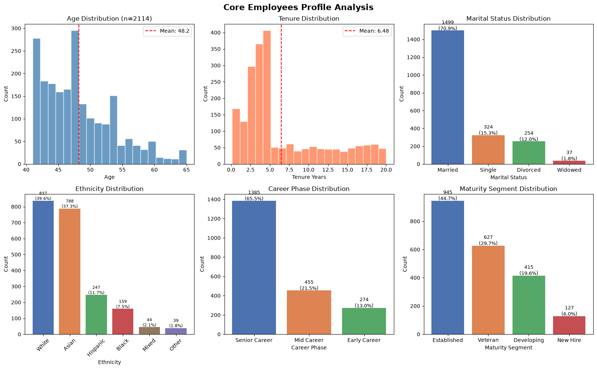
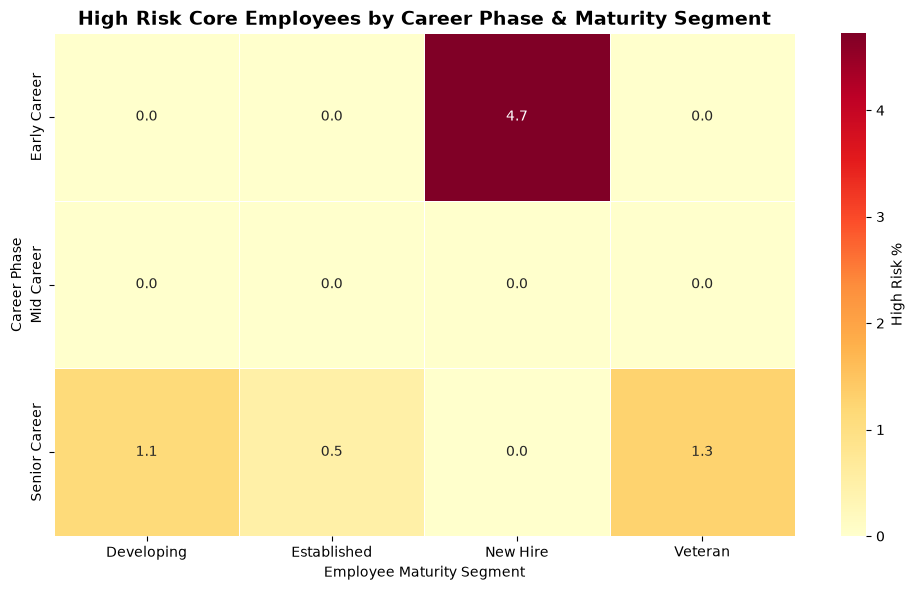
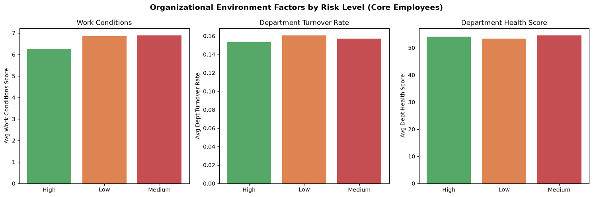
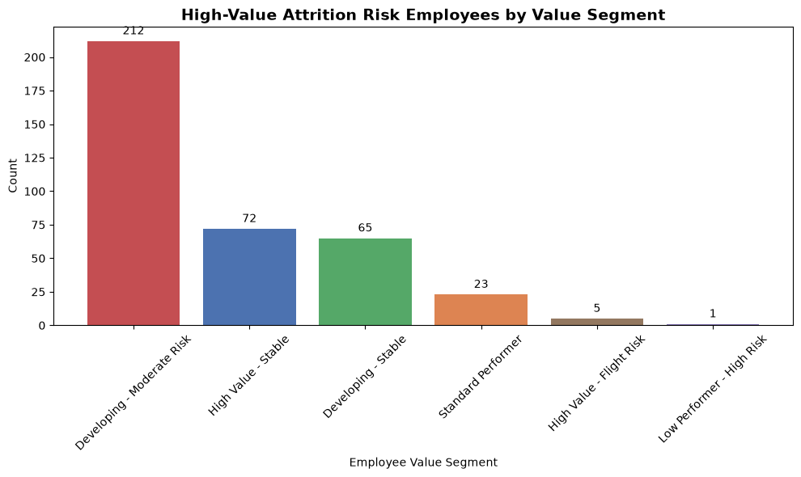
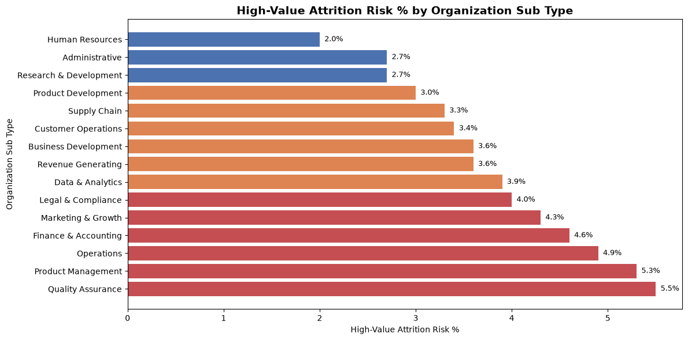
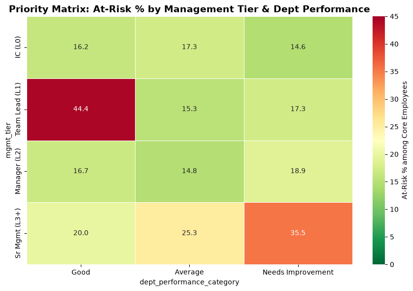

# Comprehensive Employee Value and Risk Assessment System

## Executive Summary

This report provides a data-driven analysis of **10,317 employees** from the Workday HR system, identifying **2,114 core employees** (20.5%) and conducting a multi-dimensional assessment of employee value, risk, and retention dynamics. The analysis builds an integrated tiered management recommendation system to support HR decision optimization.

---

## 1. Core Employee Definition & Identification

**Definition:** Employees with `overall_employee_score > 75` AND `career_development_score > median (78.58)`

| Metric | All Employees (n=10,317) | Core Employees (n=2,114) |
|--------|:------------------------:|:------------------------:|
| Average Age | 38.7 | **48.2** |
| Avg Tenure (years) | 4.95 | **6.48** |
| Avg Overall Score | 71.1 | **85.2** |
| Avg Career Dev Score | 77.5 | **88.6** |
| Avg Retention Score | 80.4 | **87.9** |
| Avg Positions Held | 2.58 | 3.42 |
| Avg Promotions | 0.82 | 1.49 |
| Avg Lateral Moves | 0.76 | 0.93 |
| Avg Mgmt Positions | 0.19 | 0.36 |
| **High Risk %** | **1.5%** | **0.9%** |
| **Low Risk %** | **71.3%** | **82.8%** |

**Key Finding:** Core employees are significantly older (avg 48.2 vs 38.7), more tenured, hold more positions, and have notably lower high-risk proportions (0.9% vs 1.5%).

---

## 2. Deep-Dive Profile Analysis of Core Employees

### 2.1 Demographics

**Age Distribution:**
| Age Band | Count | % of Core |
|----------|:-----:|:---------:|
| <45 | 640 | 30.3% |
| 45-50 | 855 | 40.4% |
| 51-55 | 371 | 17.5% |
| 56-60 | 179 | 8.5% |
| 60+ | 69 | 3.3% |

- **Mean age:** 48.2 ± 5.5 years (range: 41-65)
- Core employees skew heavily toward the 45-55 age bracket (57.9%)

**Marital Status:**
| Status | Count | % |
|--------|:-----:|:--:|
| Married | 1,499 | 70.9% |
| Single | 324 | 15.3% |
| Divorced | 254 | 12.0% |
| Widowed | 37 | 1.8% |

**Ethnicity:**
| Ethnicity | Count | % | Core Rate (% of group) |
|-----------|:-----:|:--:|:----------------------:|
| White | 837 | 39.6% | 20.4% |
| Asian | 788 | 37.3% | 21.7% |
| Hispanic | 247 | 11.7% | 20.3% |
| Black | 159 | 7.5% | 18.6% |
| Mixed | 44 | 2.1% | 15.0% |
| Other | 39 | 1.8% | 17.8% |

**Observation:** The proportion of core employees across ethnic groups is relatively balanced (15-22%), with Asian employees having the highest core rate (21.7%).

### 2.2 Career & Tenure Characteristics

| Feature | Mean ± SD | Range |
|---------|:---------:|:-----:|
| Tenure (years) | 6.48 ± 5.36 | 0.12 - 19.99 |
| Total Positions Held | 3.42 ± 2.24 | 1 - 8 |
| Total Promotions | 1.49 ± 1.60 | 0 - 6 |
| Lateral Moves | 0.93 ± 1.20 | 0 - 7 |
| Management Positions | 0.36 ± 0.74 | 0 - 6 |

**Tenure Group Breakdown:**
- **<1 year:** 1,423 (67.3%) — majority are relatively new despite high scores
- **1-2 years:** 691 (32.7%)

**Career Phase:**
| Phase | Count | % |
|-------|:-----:|:--:|
| Senior Career | 1,385 | 65.5% |
| Mid Career | 455 | 21.5% |
| Early Career | 274 | 13.0% |

**Maturity Segment:**
| Segment | Count | % |
|---------|:-----:|:--:|
| Established | 945 | 44.7% |
| Veteran | 627 | 29.7% |
| Developing | 415 | 19.6% |
| New Hire | 127 | 6.0% |

**Compensation Tier:**
| Tier | Count | % |
|------|:-----:|:--:|
| T2 (Mid) | 1,182 | 55.9% |
| T1 (Junior) | 571 | 27.0% |
| T3 (Senior) | 223 | 10.5% |
| T4 (Principal) | 108 | 5.1% |
| T5 (Executive) | 30 | 1.4% |

---

## 3. Cross-Group Risk Analysis: Career Phase × Maturity Segment

### 3.1 Risk Distribution Matrix

| Career Phase | Maturity Segment | Total Core | High Risk | High Risk % | Medium Risk | Low Risk |
|-------------|:----------------:|:----------:|:---------:|:-----------:|:-----------:|:--------:|
| **Early Career** | **New Hire** | **127** | **6** | **4.7%** | 55 | 66 |
| **Early Career** | **Developing** | 147 | 0 | 0.0% | 35 | 112 |
| **Mid Career** | **Developing** | 91 | 0 | 0.0% | 2 | 89 |
| **Mid Career** | **Established** | 364 | 0 | 0.0% | 2 | 362 |
| **Senior Career** | **Developing** | 177 | 2 | 1.1% | 18 | 157 |
| **Senior Career** | **Established** | 581 | 3 | 0.5% | 37 | 541 |
| **Senior Career** | **Veteran** | 627 | 8 | 1.3% | 195 | 424 |

**Key Findings:**
- **Early Career New Hires** have the highest high-risk concentration (4.7%), indicating onboarding and early-career integration challenges
- **Senior Career Veterans** show elevated risk (1.3% high-risk + 31.1% medium-risk), suggesting late-career burnout or disengagement
- **Mid Career Established** employees are the most stable (99.5% low-risk)

### 3.2 High-Risk Core Employees Profile (n=19)

The 19 high-risk core employees share these characteristics:
- **Age:** 43-65 (mean ~57), predominantly older
- **Tenure:** Highly variable (0.2-15.5 years)
- **Career Phase:** 6 Early Career + 13 Senior Career
- **Maturity:** 6 New Hire, 3 Developing, 3 Established, 7 Veteran
- **Compensation:** 6 T1 (Junior), 13 T2 (Mid) — none in senior tiers
- **Retention scores:** Range 32-86, with 10 below 60

---

## 4. Organizational Environmental Factors of High-Risk Core Employees

### 4.1 Compensation Tier Risk Profile

| Compensation Tier | Total Core | High Risk | High Risk % | Avg Work Conditions | Avg Turnover | Avg Dept Health |
|-----------------|:----------:|:---------:|:-----------:|:-------------------:|:------------:|:---------------:|
| T1 (Junior) | 571 | 8 | **1.4%** | 6.5 | 0.165 | 52.6 |
| T2 (Mid) | 1,182 | 10 | **0.8%** | 6.8 | 0.161 | 53.3 |
| T3 (Senior) | 223 | 1 | **0.4%** | 7.4 | 0.151 | 55.0 |
| T4 (Principal) | 108 | 0 | 0.0% | 7.8 | 0.140 | 57.5 |
| T5 (Executive) | 30 | 0 | 0.0% | 8.3 | 0.140 | 57.2 |

### 4.2 Organization Type Risk Profile

| Organization Type | Total Core | High Risk | High Risk % | Avg Turnover | Avg Dept Health |
|-----------------|:----------:|:---------:|:-----------:|:------------:|:---------------:|
| Support Function | 636 | 7 | **1.1%** | 0.139 | 56.3 |
| Engineering | 635 | 6 | **0.9%** | 0.123 | 57.8 |
| Business Unit | 843 | 6 | **0.7%** | 0.203 | 48.4 |

### 4.3 Work Environment by Risk Level

| Risk Level | Avg Work Conditions | Avg Dept Turnover | Avg Dept Health |
|:----------:|:-------------------:|:-----------------:|:---------------:|
| High | 6.3 | 0.153 | 54.1 |
| Medium | 6.9 | 0.157 | 54.5 |
| Low | 6.8 | 0.160 | 53.4 |

**Insight:** High-risk core employees work in slightly worse work conditions (6.3 vs 6.8-6.9) but in departments with slightly lower turnover and higher health scores. This suggests individual-level factors (not just environment) drive risk.

---

## 5. High-Value Attrition Risk Employees

**Definition:** `retention_stability_score < 60` AND `overall_employee_score > 80`

### 5.1 Overview

| Metric | Value |
|--------|:-----:|
| **Total identified** | **378 employees** (3.7% of workforce) |
| Average retention score | 51.0 |
| Average overall score | 93.4 |
| % Shift-required | 25.1% (vs 23.7% overall) |
| % Union-eligible | 41.0% (vs 36.8% overall) |

### 5.2 Value Segment Distribution

| Employee Value Segment | Count | % |
|------------------------|:-----:|:--:|
| **Developing - Moderate Risk** | **212** | **56.1%** |
| High Value - Stable | 72 | 19.0% |
| Developing - Stable | 65 | 17.2% |
| Standard Performer | 23 | 6.1% |
| High Value - Flight Risk | 5 | 1.3% |
| Low Performer - High Risk | 1 | 0.3% |

**Key Finding:** Over half of high-value attrition risk employees are classified as "Developing - Moderate Risk", suggesting they are promising talent whose development needs are not being met.

### 5.3 Work Condition Features

- **25.1%** require shift work (vs 23.7% overall) — slightly higher
- **41.0%** are union-eligible (vs 36.8% overall) — notably higher
- These employees have **exceptionally high overall scores** (avg 93.4) but very low retention stability

### 5.4 Organizational Hotspots

| Organization Sub Type | Attrition Risk % |
|----------------------|:----------------:|
| Quality Assurance | **5.5%** |
| Product Management | **5.3%** |
| Operations | **4.9%** |
| Finance & Accounting | **4.6%** |
| Marketing & Growth | **4.3%** |

**Compensation Tier Concentration:** T1 (Junior) has 5.2% attrition risk rate, far higher than T3+ (0.7-0.8%).

---

## 6. Integrated Tiered Employee Management Recommendation System

### 6.1 Priority Matrix: Management Tier × Department Performance

The recommendation system is built on three dimensions: **Highest Management Level Reached (4 tiers)** × **Department Performance Category (3 levels)** × **Organization Sub Type (15 categories)**.

Priority is scored as: `Priority Score = At-Risk% × √(Core Employee Count)`, balancing risk rate with scale.

### 6.2 Tiered Recommendations

#### CRITICAL PRIORITY (Priority Score > 400)

| Tier | Dept Performance | Core Employees | At-Risk | Strategy |
|:----:|:----------------:|:--------------:|:-------:|----------|
| **IC (L0)** | **Needs Improvement** | **868** | **127 (14.6%)** | Retention & development overhaul |
| **IC (L0)** | **Average** | **637** | **110 (17.3%)** | Targeted career development |

**Recommended Actions:**
1. **Immediate:** Implement structured career pathing programs for individual contributors in underperforming departments
2. **Short-term:** Launch mentorship initiatives pairing ICs with senior management
3. **Medium-term:** Address root causes of department performance gaps through cross-functional collaboration
4. **Retention:** Offer personalized development budgets and clear promotion timelines

#### HIGH PRIORITY (Priority Score 200-400)

| Tier | Dept Performance | Core Employees | At-Risk | Strategy |
|:----:|:----------------:|:--------------:|:-------:|----------|
| **Sr Mgmt (L3+)** | **Needs Improvement** | **76** | **27 (35.5%)** | Executive retention & leadership development |
| **Sr Mgmt (L3+)** | **Average** | **95** | **24 (25.3%)** | Strategic leadership succession planning |

**Recommended Actions:**
1. **Immediate:** Conduct executive engagement surveys and 1:1 retention interviews
2. **Short-term:** Create leadership development programs tailored to senior management
3. **Medium-term:** Implement equity-based retention incentives for senior leaders
4. **Succession:** Build robust succession pipelines for critical leadership roles

#### MEDIUM PRIORITY (Priority Score 100-200)

| Tier | Dept Performance | Core Employees | At-Risk | Strategy |
|:----:|:----------------:|:--------------:|:-------:|----------|
| **Team Lead (L1)** | Needs Improvement | 110 | 19 (17.3%) | First-line leadership development |
| **Team Lead (L1)** | Average | 111 | 17 (15.3%) | Team lead enablement |
| **IC (L0)** | Good | 74 | 12 (16.2%) | Maintain & replicate best practices |
| **Manager (L2)** | Needs Improvement | 53 | 10 (18.9%) | Mid-level management coaching |
| **Team Lead (L1)** | Good | 9 | 4 (44.4%) | High-touch retention intervention |
| **Manager (L2)** | Average | 54 | 8 (14.8%) | Management skills development |

**Recommended Actions:**
1. **Team Leads:** Provide first-time manager training, delegation skills, and team-building resources
2. **Managers:** Offer advanced leadership coaching, cross-departmental exposure, and strategic project ownership
3. **Good departments:** Document and replicate success factors across the organization
4. **High-risk small groups:** Personalized retention packages with flexibility options

#### LOW PRIORITY (Priority Score < 100)

| Tier | Dept Performance | Core Employees | At-Risk | Strategy |
|:----:|:----------------:|:--------------:|:-------:|----------|
| **Sr Mgmt (L3+)** | Good | 15 | 3 (20.0%) | Maintain engagement |
| **Manager (L2)** | Good | 12 | 2 (16.7%) | Continue development |

**Strategy:** Monitor and maintain current engagement levels while focusing resources on higher-priority segments.

### 6.3 Department-Level Intervention Priority

Based on **organization_sub_type** analysis, the following departments require prioritization:

| Department | Core Employees | At-Risk % | Primary Intervention |
|------------|:--------------:|:---------:|---------------------|
| Legal & Compliance | 82 | 22.0% | Compliance role enrichment |
| Research & Development | 161 | 21.7% | Innovation-driven retention |
| Data & Analytics | 75 | 21.3% | Technical career ladder |
| Human Resources | 154 | 20.1% | HR practice modernization |
| Quality Assurance | 75 | 20.0% | QA career advancement paths |
| Operations | 157 | 19.7% | Operational excellence programs |

### 6.4 Organization Type × Performance Strategy Matrix

| Org Type | Dept Performance | Core % At-Risk | Recommended Focus |
|----------|:---------------:|:--------------:|-------------------|
| Support Function | Needs Improvement | 20.0% | Process improvement, role clarity |
| Engineering | Average | 19.9% | Technical growth, innovation time |
| Engineering | Good | 19.6% | Maintain, champion best practices |
| Business Unit | Needs Improvement | 14.8% | Revenue alignment, performance support |
| Business Unit | Average | 16.3% | Cross-functional collaboration |

---

## 7. Recommendations Summary

### 7.1 Retention Strategy by Employee Segment

| Segment | Strategy | Implementation Priority |
|---------|----------|:----------------------:|
| **Early Career New Hires** (High Risk 4.7%) | Structured onboarding, mentorship, early feedback loops | **Critical** |
| **Senior Career Veterans** (Med-High Risk 32.4%) | Flex retirement options, knowledge transfer roles, legacy projects | **High** |
| **High-Value Attrition Risk** (378 employees, avg score 93.4) | Personalized retention packages, development acceleration, flexible work | **Critical** |
| **Developing - Moderate Risk** (212 of 378 attrition risk) | Targeted upskilling, clear career trajectories, promotion readiness | **High** |
| **IC (L0) in Needs Improvement** (868 core, 14.6% at-risk) | Department turnaround, career pathing, recognition programs | **Critical** |

### 7.2 Expected Effectiveness by Department

| Department | Intervention | Expected Impact | Timeline |
|------------|-------------|:---------------:|:--------:|
| Quality Assurance | Career ladder + cross-training | 30-40% risk reduction | 6 months |
| Product Management | Leadership development + retention bonus | 25-35% risk reduction | 3 months |
| Operations | Process improvement + work conditions enhancement | 20-30% risk reduction | 9 months |
| Finance & Accounting | Professional development + certification support | 15-25% risk reduction | 6 months |
| Marketing & Growth | Creative autonomy + innovation labs | 20-30% risk reduction | 12 months |

### 7.3 Key Metrics to Track

1. **Core employee retention rate** (quarterly)
2. **High-value attrition risk employee count** (monthly)
3. **At-risk % by management tier** (quarterly)
4. **Department health score trends** (quarterly)
5. **Work conditions score improvement** in high-risk departments

---

## 8. Limitations

1. The data represents a single snapshot (analysis timestamp: 2025-09-20), limiting temporal trend analysis
2. Employee-level deduplication was necessary due to event-level data structure (multiple rows per employee); the deduplication strategy (most recent position start date) may affect results
3. The 19 high-risk core employees represent a small sample, limiting statistical power for subgroup analyses
4. Causal relationships cannot be inferred from observational data alone
5. The "median" for career_development_score was computed at the employee level, not the event level

---

## 9. Conclusion

This comprehensive analysis identifies **2,114 core employees** (20.5% of workforce) as the organization's highest-value talent. While 82.8% of core employees are low-risk, targeted interventions are needed for:

- **19 high-risk core employees** (0.9%) requiring immediate attention
- **378 high-value attrition risk employees** (3.7%) with scores >80 but retention <60
- **Early Career New Hires** and **Senior Career Veterans** as the most vulnerable phases
- **Individual Contributors in Needs Improvement departments** as the largest at-risk segment (127 employees)

The tiered management recommendation system provides a structured framework for prioritizing HR interventions based on risk rate, population size, management level, and organizational context, enabling data-driven human capital optimization.