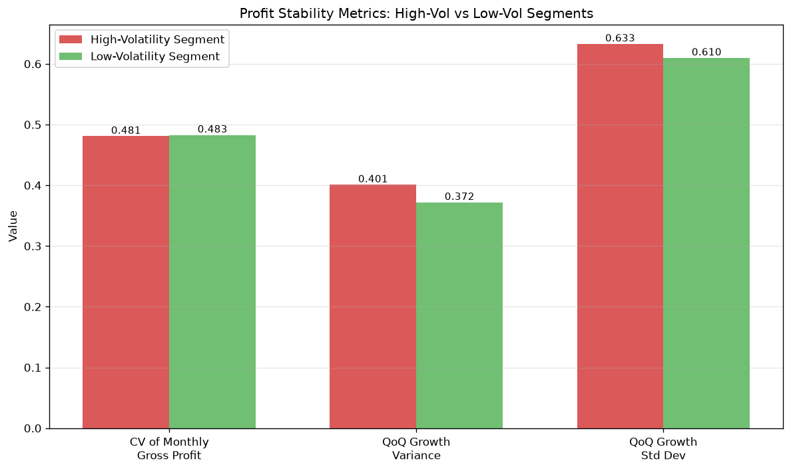
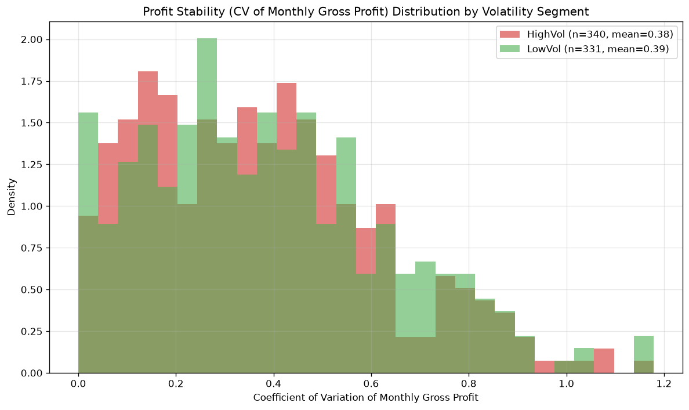
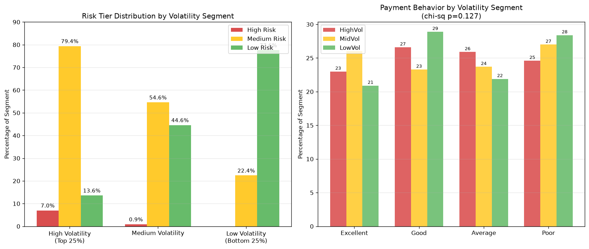
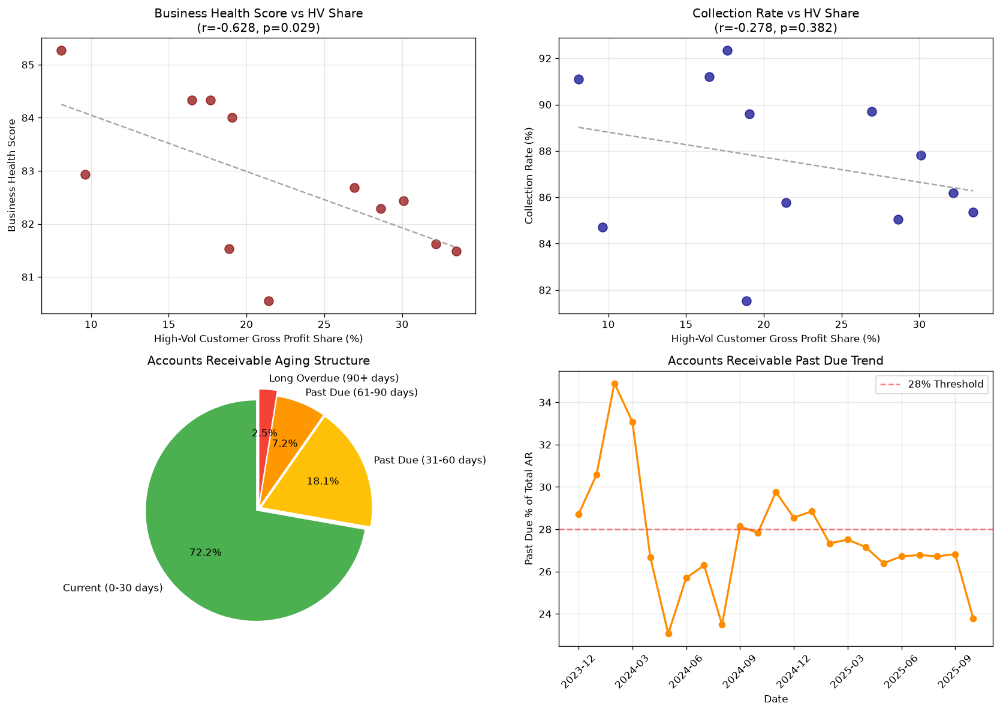
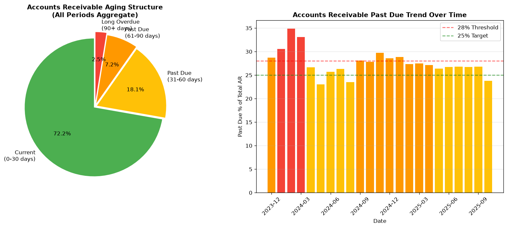
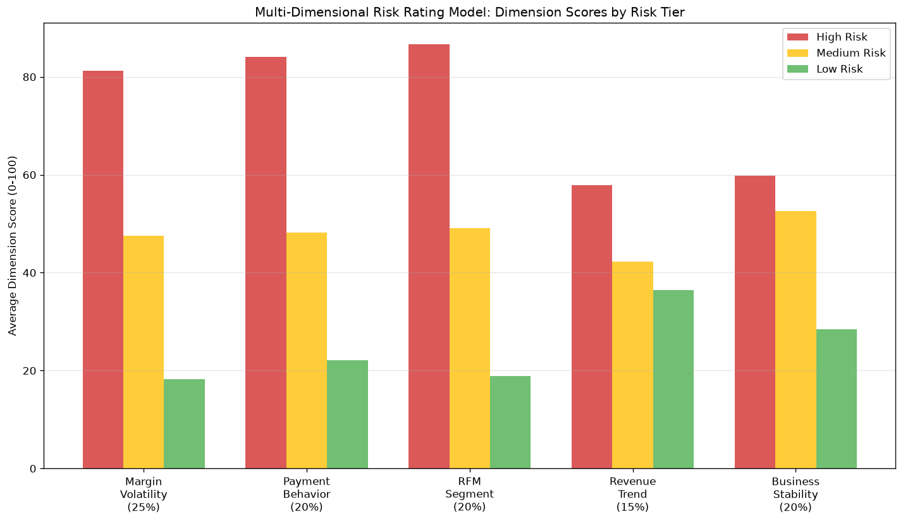

# Customer Risk Analysis Report: High-Volatility Segment Profit Stability & Multi-Dimensional Risk Rating

## Executive Summary

This analysis identifies the top 25% high-volatility customers (by `customer_margin_volatility`) and evaluates their profit stability, behavioral profile, contribution to business health, accounts receivable risk exposure, and overall credit risk. Key findings:

- **700 of 2,800 customers (25%)** form the high-volatility segment (margin volatility ≥ 0.237).
- High-volatility customers carry a **QoQ invoice growth variance of 0.401** and an aggregate **CV of monthly gross profit of 0.481**, indicating unstable profit streams.
- Months with a high share of high-volatility gross profit show a **statistically significant negative correlation with business health score (r = −0.628, p = 0.029)** and gross margin (r = −0.741, p = 0.006).
- A multi-dimensional risk model integrating volatility, payment behavior, RFM segment, revenue trend, and business stability flags **61 high-risk customers (2.2%)**, of which **80% (49/61) come from the high-volatility segment**; zero low-volatility customers are rated high risk.
- Accounts receivable aging shows a **27.8% past-due exposure** (18.1% in 31–60 days, 7.2% in 61–90 days, 2.5% overdue 90+ days).

---

## 1. Identification of the High-Volatility Segment

The `customer_margin_volatility` was aggregated per customer (mean of invoice-level values) and ranked. The top 25% threshold (75th percentile) was determined to be **0.23698**.

| Segment | Customers | Margin Volatility Range |
|---|---|---|
| High-Volatility (Top 25%) | 700 | 0.237 – 0.412 |
| Mid Volatility | 1,400 | 0.187 – 0.237 |
| Low-Volatility (Bottom 25%) | 700 | 0.056 – 0.187 |

## 2. Profit Stability Analysis (Past 12 Months)

Using transaction data from the past 12 months (Oct 2024 – Oct 2025), the following stability metrics were computed:

### 2.1 Coefficient of Variation of Gross Profit
- **High-volatility segment**: Aggregate CV of monthly gross profit = **0.481** (mean $2,285.50/month, std $1,099.97/month, over 1,112 customer-month observations).
- **Low-volatility segment** (benchmark): CV = 0.483 — comparable at the aggregate level.
- At the **individual customer level**, the mean CV is 0.375 (HighVol, n=340) vs 0.388 (LowVol, n=331); a Mann-Whitney U test shows **no significant difference (p = 0.536)**. The volatility ranking captures margin *level* swings rather than strictly gross-profit month-to-month swings.

### 2.2 Variance of Quarter-over-Quarter Invoice Growth
- **High-volatility segment**: QoQ invoice-total growth mean = +16.2%, **variance = 0.401** (std = 0.633), n=373.
- **Low-volatility segment**: QoQ growth mean = +10.5%, **variance = 0.372** (std = 0.610), n=371.
- High-volatility customers exhibit **~8% higher growth-rate dispersion**, consistent with erratic quarter-to-quarter revenue swings despite similar average growth.





## 3. Behavioral Characteristics & Lifecycle Analysis

Joining with `customer_analytics`, the high-volatility segment was profiled against RFM segments, payment behavior, lifecycle stage, and revenue trend:

| Behavioral Feature | HighVol (n=700) | LowVol (n=700) | Statistical Test |
|---|---|---|---|
| Payment behavior: Excellent / Good / Average / Poor | 23.0 / 26.6 / 25.9 / 24.6% | 20.9 / 28.9 / 21.9 / 28.4% | χ²=5.71, **p=0.127 (ns)** |
| RFM: Champions / Loyal / Pot. Loyalists / New / At Risk / Need Attn. | 19.6 / 15.4 / 17.1 / 18.3 / 15.1 / 14.4% | 16.0 / 18.3 / 18.3 / 18.0 / 15.6 / 13.9% | χ²=4.60, **p=0.466 (ns)** |
| Lifecycle: Loyal / New / Mature / Growing | 25.7 / 25.3 / 25.3 / 23.7% | 25.3 / 26.0 / 22.3 / 26.4% | Evenly distributed |
| Negative revenue-trend correlation | 49.4% | 52.0% | χ²=0.83, **p=0.364 (ns)** |
| Avg business stability score | 66.9 | 66.0 | Similar |
| Avg active months (last 12) | 6.4 | 6.6 | Similar |

**Key insight**: At the *marginal* level, raw behavioral features do not significantly differentiate high- vs low-volatility customers. The differentiating power emerges when volatility is **combined** with behavioral signals in a composite risk model — the high-risk tier is overwhelmingly composed of customers who are simultaneously volatile **and** exhibit Poor payment behavior, "At Risk" RFM status, and declining revenue trends.



## 4. Contribution to Business Health & Collection Rate (Financial Dashboard)

High-volatility customers contributed an average of **~21.9% of monthly gross profit** over the last 12 months. Joining monthly high-volatility shares with `financial_dashboard`:

| Metric | Correlation with HV Gross-Profit Share | p-value |
|---|---|---|
| Business Health Score | **r = −0.628** | **0.029** ✓ |
| Collection Rate % | r = −0.278 | 0.382 |
| Gross Margin % | **r = −0.741** | **0.006** ✓ |

**Differential impact** (comparing months):
- Months with **high HV share (≥25%)**: avg health score **82.10**, collection rate **86.82%**.
- Months with **low HV share (<15%)**: avg health score **84.10**, collection rate **87.91%**.
- **Differential**: Health score ~2.0 points lower and collection rate ~1.1 points lower when high-volatility customers dominate monthly profit.

The negative relationship between high-volatility concentration and business health is statistically significant; the collection-rate effect is directionally negative but not significant (likely due to the portfolio-level collection offsets).



## 5. Accounts Receivable Risk Exposure (Balance Sheet)

From the `balance_sheet` Accounts Receivable structure (aggregated across 24 monthly snapshots, total AR ≈ **$109.1M**):

| AR Aging Bucket | Amount | % of Total AR |
|---|---|---|
| Current (0–30 days) | $78.73M | 72.2% |
| Past Due (31–60 days) | $19.69M | 18.1% |
| Past Due (61–90 days) | $7.83M | 7.2% |
| Long Overdue (90+ days) | $2.77M | 2.5% |
| **Total Past-Due Exposure** | **$30.29M** | **27.8%** |

**Trend**: The past-due ratio peaked at **34.9%** (Feb 2024), declined to ~23% (May–Aug 2024), then stabilized in the 26–29% band before improving to **23.8%** by Oct 2025. The $2.77M long-overdue (90+ day) bucket represents the highest collection-loss risk.

High-volatility customers account for **22.2% of outstanding balances** ($22.2M of ~$99.8M), slightly above their 21.9% revenue share — consistent with elevated collection friction.



## 6. Multi-Dimensional Customer Risk Rating Model

### Model Design
A composite risk score (0–100) was built per customer:

```
Composite Risk = 0.25 × Volatility Score      (margin-volatility percentile)
               + 0.20 × Payment Score         (Excellent=10, Good=35, Average=65, Poor=90)
               + 0.20 × RFM Score             (Champions=10, Loyal=25, Pot.Loyalist=45, New=50, NeedAttn=75, AtRisk=95)
               + 0.15 × Revenue-Trend Score   (negative correlation=70, positive=30)
               + 0.20 × Stability Score       (100 − business_stability_score)
```

Risk tiers: **High Risk ≥ 70**, **Medium Risk 45–70**, **Low Risk < 45**.

### Results

| Risk Tier | Customers | % of Base | Avg Composite Score | Avg Margin Volatility |
|---|---|---|---|---|
| High Risk | 61 | 2.2% | 73.2 | 0.264 |
| Medium Risk | 1,477 | 52.8% | 54.6 | — |
| Low Risk | 1,262 | 45.1% | 36.1 | — |

**Cross-validation with volatility segments**:
- **High-Risk tier**: 49 of 61 (80%) are high-volatility customers; the remaining 12 are mid-volatility. **Zero low-volatility customers** are rated High Risk.
- High-volatility segment composition: 7.0% High Risk, 79.4% Medium Risk, 13.6% Low Risk.
- Low-volatility segment composition: 0% High Risk, 22.4% Medium Risk, 77.6% Low Risk.

**High-Risk Tier Profile** (61 customers):
- **78.7%** (48) exhibit Poor payment behavior
- **65.6%** (40) are in the "At Risk" RFM segment
- **82.0%** (50) have negative revenue-trend correlation
- Avg business stability score: 57.8; avg active months (12m): 6.4
- Contribute **1.72% of total outstanding balance** ($1.71M) — modest exposure but concentrated collection/default risk



## 7. Targeted Customer Management Strategies

### Tier 1 — High Risk (61 customers, 80% from high-volatility segment)
**Objective: Contain credit exposure and rehabilitate or exit.**
- **Immediate actions**: Freeze credit-limit increases; convert to prepayment/Cash-on-Delivery terms; place 90%+ of invoices under dunning automation; assign dedicated collections specialist.
- **Contractual**: Reduce credit terms from 30 to 15 days; require deposits for large orders; add interest-on-late-payment clauses.
- **Monitoring**: Monthly account reviews; trigger-based credit review when overdue balance > threshold; monitor the 90+ day bucket ($2.77M portfolio-wide) for write-off provisioning.
- **Decision rule**: Customers who remain in High Risk for 2 consecutive quarters with declining stability score → reduce exposure / exit.

### Tier 2 — Medium Risk (1,477 customers, incl. 79% of high-volatility segment)
**Objective: Stabilize volatility and improve payment discipline.**
- **Stability programs**: Offer volume-based pricing floors/ceilings to smooth margin volatility; promote annual/longer-term contracts to reduce QoQ revenue swings (variance currently 0.401).
- **Payment incentives**: Early-payment discounts (2/10 net 30); auto-pay enrollment; credit-score-linked pricing for the 25.9% Average payers.
- **Portfolio-level**: Diversify revenue so no single month depends >25% on high-volatility customers (health score drops ~2.0 pts when HV share ≥25%).

### Tier 3 — Low Risk (1,262 customers, incl. 78% of low-volatility segment)
**Objective: Grow share profitably.**
- Extend credit lines and preferential terms; cross-sell products to increase revenue per customer; recognize as reliable base revenue (CV of monthly profit ~0.48 at portfolio level is acceptable).

### Portfolio-Level AR Management
- Past-due AR at 27.8% (~$30M) warrants proactive aging controls: accelerate 31–60 day bucket collections (largest past-due component at $19.7M), and monitor the improving trend (23.8% by Oct 2025) to sustain momentum.
- Align collections priority with the composite risk score rather than invoice size alone.

---

## Limitations

1. **Customer analytics data sparsity**: Many fields (`credit_score`, `credit_grade`, `avg_payment_days_12m`, `overdue_count_12m`, `overall_customer_score`, `risk_assessment`) are entirely NULL and could not be used; the model relies on the available subset (payment behavior, RFM, trend correlation, stability score, active months).
2. **Volatility metric definition**: `customer_margin_volatility` is invoice-level and varies slightly within a customer; it was averaged per customer. The segment ranking captures margin variability but customer-level CV of gross profit did not significantly differ from the low-volatility benchmark (p=0.536), so results should be interpreted at the segment/portfolio level.
3. **Collection-rate impact** was directionally negative but not statistically significant (p=0.382) over the limited 12-month matched window.
4. **Balance-sheet AR data** is at company level (no customer linkage), so AR aging exposure could not be attributed to specific high-volatility customers; the high-volatility share of outstanding balances was estimated from the profitability table instead.
5. The composite risk model weights (0.25/0.20/0.20/0.15/0.20) are expert-assigned and not empirically calibrated against observed defaults/losses.

## Figures

- `work/fig1_correlation_analysis.png` — HV share vs business health / collection rate / AR structure
- `work/fig2_risk_behavior_profile.png` — Risk tier by volatility segment; payment behavior distribution
- `work/fig3_risk_model_dimensions.png` — Risk model dimension scores by tier
- `work/fig4_profit_stability.png` — CV of gross profit & QoQ growth variance (HV vs LV)
- `work/fig5_ar_risk_exposure.png` — AR aging structure and past-due trend
- `work/fig6_customer_cv_distribution.png` — Customer-level CV distributions
