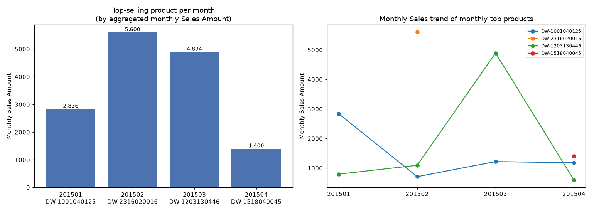
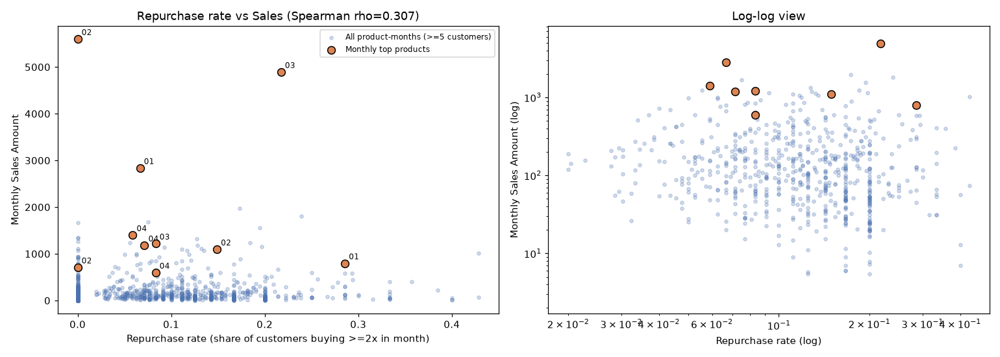
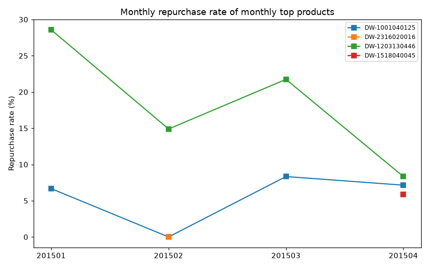

# Monthly Top-Selling Products & Repurchase-Rate Analysis

## 1. Data overview

- Table `sheet1` contains **42,816 transactions** from **2,612 customers** and **6,142 distinct products**.
- The data covers **4 months: 2015-01 to 2015-04**.
- Monthly totals: Jan ¥117,708.72 (12,300 txns) · Feb ¥141,065.00 (9,951) · Mar ¥94,888.77 (9,847) · Apr ¥103,727.90 (10,718). February is the biggest month overall.

## 2. Top product per month (by aggregated monthly Sales Amount)

Sales Amount was aggregated per product per month (`SUM("Sales Amount")` grouped by month and Product Code); the product with the highest monthly total is the monthly winner:

| Month | Product Code | Category | Spec | Txns | Customers | Sales Amount | Share of month |
|---|---|---|---|---|---|---|---|
| 201501 | **DW-1001040125** | Pork bones (pork) | loose, by weight | 48 | 45 | ¥2,836.46 | 2.41% |
| 201502 | **DW-2316020016** | Domestic cigarettes (out-of-province) | 20 sticks | 2 | 2 | ¥5,600.00 | 3.97% |
| 201503 | **DW-1203130446** | Other fruits (fruit) | loose, by weight | 222 | 161 | ¥4,893.62 | 5.16% |
| 201504 | **DW-1518040045** | Tetra Pak brick acidified milk drink (shelf-stable dairy) | 205 ml | 36 | 34 | ¥1,400.30 | 1.35% |

Runners-up: Jan DW-1203090210 (¥1,966.86), Feb DW-2311010018 (¥5,340.00), Mar DW-1521010005 (¥1,558.49), Apr DW-1203070022 (¥1,241.44).

Notes:
- No single product dominates a month (max share 5.16%) — the assortment is very long-tail (2,800–3,200 products sold per month).
- February's winner and runner-up are both tobacco/liquor items driven by very few, very large transactions (¥2,800 average per transaction for the winner). If "highest Sales Amount" is interpreted as the largest *single transaction* instead of the monthly aggregate, the winners would be: Jan DW-1002020061 (¥481.60), Feb DW-2311010018 (¥5,340.00), Mar DW-2316010028 (¥450.00), Apr DW-2316010005 (¥480.00).
- **All monthly winners were sold entirely at full price** — none of their transactions were flagged promotional, so the top spots are not promotion-driven.

## 3. How the monthly winners perform across months

| Product | Months present | 4-month sales | 4-month customers | 4-month repeat customers | Overall repurchase rate* |
|---|---|---|---|---|---|
| DW-1001040125 (pork bones) | 4 | ¥5,948.88 | 112 | 7 | 6.3% |
| DW-1203130446 (other fruits) | 4 | ¥7,384.83 | 260 | 52 | 20.0% |
| DW-1518040045 (milk drink) | 1 (Apr only) | ¥1,400.30 | 34 | 2 | 5.9% |
| DW-2316020016 (cigarettes) | 1 (Feb only) | ¥5,600.00 | 2 | 0 | 0.0% |

\* Repurchase rate = customers who bought the product ≥2 times within a month ÷ distinct customers of that product-month, summed across months.

Monthly trajectories:

- **DW-1001040125 (pork bones):** peaked in Jan (¥2,836, its winning month), collapsed ~75% in Feb (¥711), then partially recovered (Mar ¥1,221, Apr ¥1,181). Repurchase rate stayed low throughout (0–8.3%). Likely a Chinese-New-Year demand spike (Jan–Feb 2015) for soup/bone ingredients.
- **DW-1203130446 (other fruits):** the only winner that is a genuine, recurring best-seller. Sold all 4 months with by far the strongest customer base: Jan ¥798 (28 customers, 28.6% repurchase) → Feb ¥1,095 (47, 14.9%) → **Mar ¥4,894 (161 customers, 35 repeat buyers, 21.7% repurchase — its winning month)** → Apr ¥598 (24, 8.3%). The March spike came from a ~5x jump in customer count, not promotions (all full price), suggesting a seasonal fruit launch (e.g., a new fruit arriving in March).
- **DW-2316020016 (cigarettes):** one-off — 2 transactions by 2 customers totaling ¥5,600 in Feb, never sold otherwise. Its "win" is pure bulk purchase, not customer demand.
- **DW-1518040045 (milk drink):** appears only in April; with 34 customers and ¥1,400 it wins a weak month (Apr top share is only 1.35%, the lowest of the four months).

## 4. Relationship between repurchase rate and Sales Amount

Using all **1,519 product-months with ≥5 customers** (to avoid noise from tiny samples):

- **Repurchase rate vs monthly sales: weak-to-moderate positive relationship** — Pearson r = **0.176** (p = 5.3e-12), Spearman ρ = **0.307** (p = 1.8e-34); vs log₁₀(sales) r = 0.238.
- The **count of repeat customers** correlates more strongly with sales (Pearson r = **0.478**, p = 1.4e-87), and distinct-customer count correlates at r = 0.486 — i.e., sales are driven mainly by *how many customers* a product attracts; repeat buying adds only a modest extra lift on top.
- **Among the 10 product-month observations of the four monthly winners, there is no correlation** between repurchase rate and sales (Pearson r = −0.07, p = 0.85; Spearman ρ = −0.22, p = 0.54). The winners illustrate both paths to the top: DW-1203130446 won via high repurchase and broad demand, while DW-2316020016 won with 0% repurchase via two bulk transactions.

**Interpretation:** across the whole assortment, products that customers come back for do tend to post higher sales, but the relationship is weak because sales are mostly a function of customer reach. The monthly #1 spot is frequently decided by atypical events — holiday spikes (pork bones, January), one-off bulk purchases (cigarettes, February), or a seasonal launch (fruits, March) — rather than by steady repurchase behavior.

## 5. Limitations

- Only 4 months of data; seasonality and trend conclusions are tentative.
- "Repurchase" is defined within a calendar month (≥2 transactions by the same customer); customers buying once per month every month are not counted as repeat buyers, so the rates are conservative.
- Sales Amount appears to be line-level revenue; no quantity or price-per-unit columns exist, so basket-size effects cannot be separated.
- Correlations are observational; no causal link between repurchase and sales is claimed.
