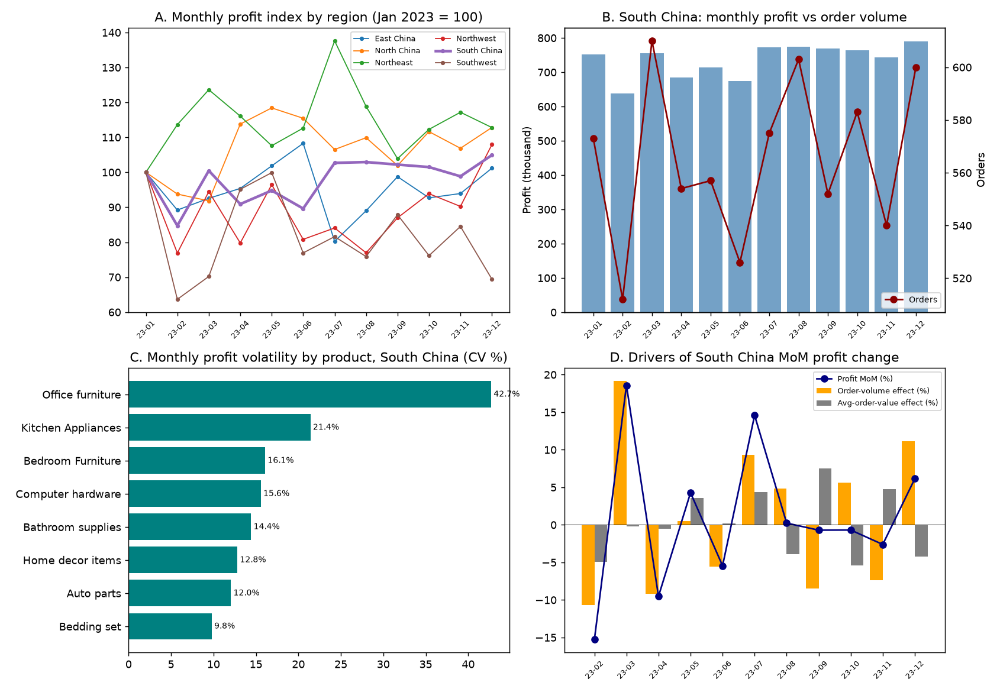

# Why Is Monthly Total Profit in South China Unstable?

**Data:** 18,250 waybills (Jan–Dec 2023), 6,785 of them in "South China" (rows whose `Destination` starts with `South China-`).

## 1. How unstable is it, really?

South China monthly profit ranged from ¥637,737 (Feb) to ¥789,694 (Dec); mean ¥736,146, standard deviation ¥47,676 → **CV 6.5%**, max/min ratio 1.24. The sharpest month-on-month swings were:

| MoM change | Feb | Mar | Apr | Jul |
|---|---|---|---|---|
| Profit Δ | **−15.3%** (−¥114,974) | **+18.6%** (+¥118,464) | −9.5% | +14.6% |

Context: South China is actually the **least** volatile region by CV (East China 7.8%, North China 7.9%, Northeast 8.4%, Northwest 11.0%, Southwest 14.7%). The perceived instability comes from a handful of ±10–19% monthly swings, not from chronic erraticism.

## 2. Root cause: order-volume (demand) swings, not pricing or cost

- Profit = Revenue − Cost, and cost is only **6.2–7.1% of revenue** and moves with it. **99.5% of the variance in monthly profit is explained by revenue variance** (Var decomposition: Var(profit) 2.27B vs Var(revenue) 2.52B, Var(cost) only 0.011B).
- Monthly profit correlates almost perfectly with list-price revenue (r = **0.999**), and strongly with **sales quantity (r = 0.875)** and **order count (r = 0.802)**.
- MoM profit change tracks MoM **order-count** change at r = **0.881**, but MoM **average-order-value** change at only r = 0.256. E.g., Feb: orders −10.6% (573→512) drove profit −15.3%; Mar: orders +19.1% (512→610) drove profit +18.6%.

Meanwhile every unit-economics ratio stayed tight all year, so none of them explain the swings:

| Metric | Monthly range |
|---|---|
| Avg logistics unit price | ¥26.70 – ¥28.42 |
| Avg quantity per order | 48.5 – 51.9 |
| Discount rate (% of list revenue) | 0.68% – 0.76% |
| Freight cost ratio (% of revenue) | 3.56% – 4.18% |
| Cost / revenue | 6.2% – 7.1% |

**Conclusion:** the instability is a volume/demand problem flowing ~1:1 through revenue into profit; pricing, discounts, VAS revenue and cost ratios are stable and are *not* the cause.

## 3. Which products drive the swings?

Contribution to South China's total monthly profit variance (covariance with the total ÷ Var(total)):

| Product | Share of annual profit | CV of own monthly profit | Share of total variance |
|---|---|---|---|
| **Kitchen Appliances** | 12.6% | 21.4% | **26.7%** |
| Auto parts | 14.6% | 12.0% | 18.7% |
| Bedroom Furniture | 11.9% | 16.1% | 16.8% |
| Bathroom supplies | 14.9% | 14.4% | 12.8% |
| Bedding set | 19.3% | 9.8% | 11.2% |
| Home decor items | 13.3% | 12.8% | 8.0% |
| Computer hardware | 11.6% | 15.6% | 4.6% |
| Office furniture | 1.8% | **42.7%** | 1.3% |

- **Kitchen Appliances is the single biggest destabilizer**: it supplied 58% of the February drop (−¥66,650 of −¥114,974; 87→57 orders) and 35% of the March rebound (+¥41,098). Its monthly profit swung between ¥60,725 (Feb) and ¥127,375 (Jan) — over 2×.
- **Office furniture** has the wildest percentage swings (CV 42.7%, ¥6,689–¥27,992/month) but is only 1.8% of profit, so it barely moves the total.
- Bedding set, the largest product (19.3% of profit), is also the most stable (CV 9.8%) and dampens overall volatility.

## 4. Which geographies drive the swings?

| Province (as labeled) | Share of SC profit | CV of monthly profit | Share of SC variance |
|---|---|---|---|
| Guangdong | 42.7% | 8.9% | 33.6% |
| Guangxi | 25.8% | 9.8% | 29.3% |
| Hainan | 7.8% | 20.9% | 13.8% |
| Hubei | 6.5% | **23.9%** | 13.7% |
| Henan | 11.7% | 17.4% | 12.9% |
| Hunan | 5.5% | 20.1% | −3.2% |

Guangdong + Guangxi contribute ~63% of the variance simply because they are ~68% of the business; the smaller provinces (Hubei, Hainan, Hunan, Henan) are individually 2–2.5× more volatile (CV 17–24%) and inject outsized noise relative to their size.

## 5. Things that are NOT causing the instability

- **Loss-making waybills:** 235 orders (3.5% of SC orders) had negative profit, but the total loss is only ≈ −¥10.5k for the whole year (worst single order −¥138) — immaterial against ±¥100k monthly swings. Loss rates are uniform across products (2.6%–4.4%).
- **Cost spikes:** freight/warehousing/other-cost ratios are stable (see table in §2); no month shows a cost-driven margin collapse.
- **Discounting:** discount rate varied only 0.68%–0.76% of list revenue.

## 6. Data-quality notes / limitations

- The `Destination` label "South China" also covers **Henan, Hubei and Hunan** (conventionally Central China); they make up ~25.7% of "South China" profit and, being volatile (CV 17–24%), add to the region's measured instability.
- Only one year (2023) is available, so seasonality (e.g., the Feb trough around Chinese New Year) cannot be confirmed against prior years.
- `Profit Margin` values are inconsistent in places (some |margin| ≫ 1, e.g. Oct average 1.23); this analysis therefore uses absolute `Profit` throughout.
- With only 12 monthly points, variance shares and correlations are indicative, not statistically ironclad.

## Bottom line

South China's monthly profit instability is **demand-volume driven**: monthly order counts swing ±10–19% and, because unit economics (price, discount, cost ratios) are essentially constant, those swings pass straight into profit. The swings are concentrated in **Kitchen Appliances** (≈27% of total variance despite 12.6% of profit; it drove most of the Feb crash and Mar rebound), followed by **Auto parts** and **Bedroom Furniture**, and geographically in **Guangdong/Guangxi by sheer size** plus the small but highly volatile **Hubei/Hainan/Henan/Hunan** lanes. Stabilizing order volume for Kitchen Appliances and the smaller provinces would remove most of the month-to-month fluctuation.
